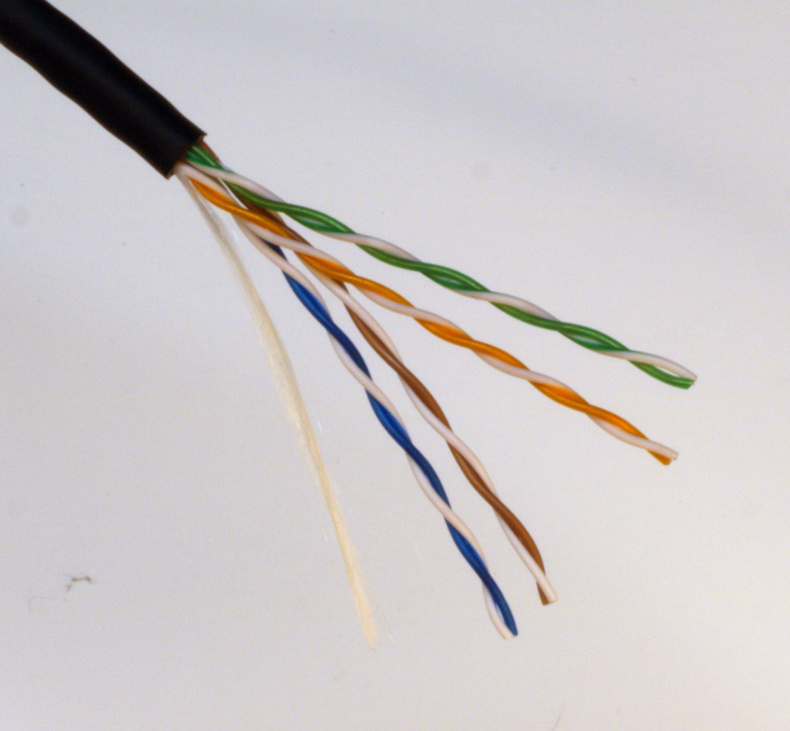
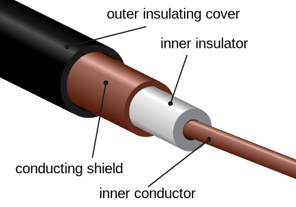
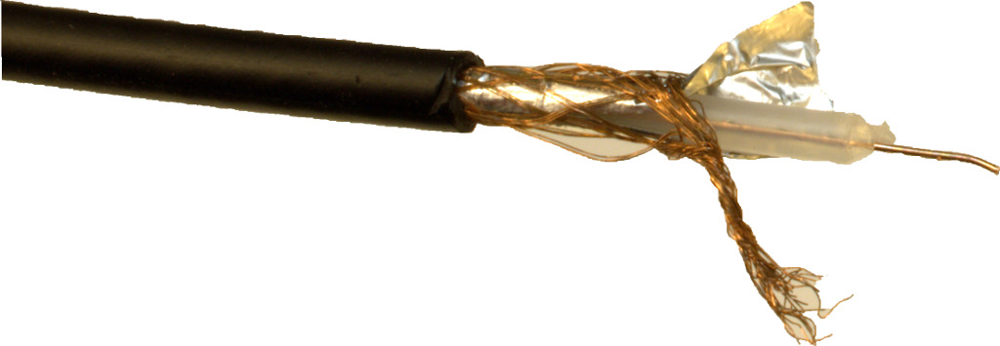
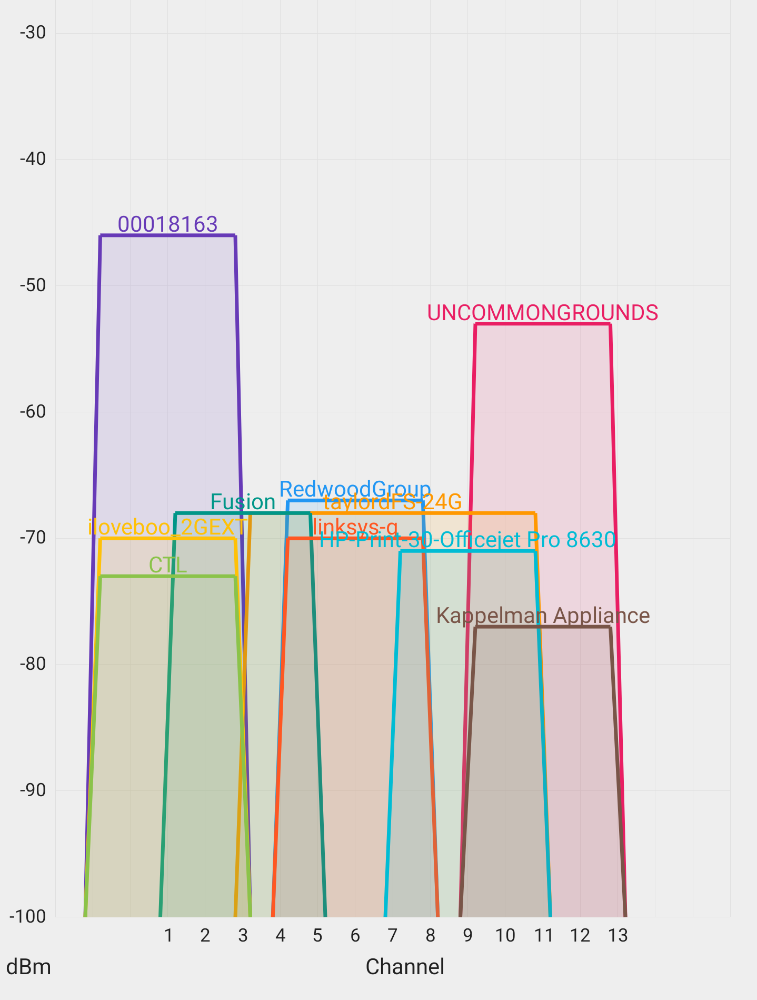
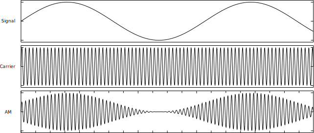
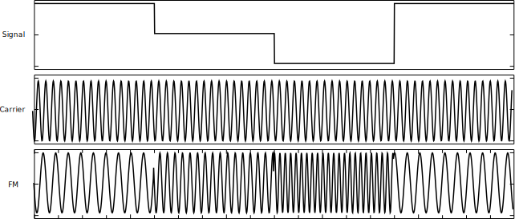
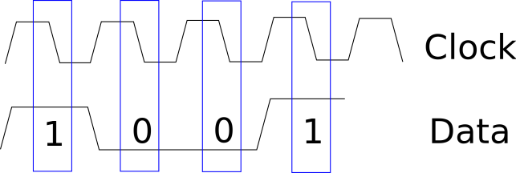

Physical Layer Theory
*********************

The first layer in the networking stack is the *physical* layer, which
takes pulses of electricity, light, or radio waves, and translates them
into the 1s and 0s computers use to store data. Once the physical layer
receives new data, it passes that data up to the next layer in the
stack: the *data-link* layer. In this chapter, we discuss the theory
behind how the physical layer does this translation. We'll look at the
different types of media the physical layer might have to deal with and
how to transfer one type to another with modulation.

Communication Media
===================

The channel or system through which a sender transmits a message to a
receiver is the *communication medium*. For example, when we communicate
by talking, sound waves are the medium that carries our message.
Communications can be one of two forms: *digital signals*, which can
have only one of two values (on or off), or *analog signals*, which can
have a continuous range of values. In general, computers work with
digital data, whereas humans and the very physics of the world work with
analog data, so we'll be converting a lot between digital signaling and
analog signaling in this layer.

In computer networking, the three types of communication media we most
frequently use are:

-  Electricity transmitted over a wire
-  Radio waves, either broadcast everywhere with an antenna or directed
   with a dish
-  Light transmitted over fiber optics

Let's consider each of these in more detail.

Wire as a Medium
----------------

When we use *wire* as a communication medium, we transmit signals by
sending electrical pulses along a *conductor*, which is a material that
conducts electricity, like copper. A *cable* refers to an entire bundle
of wires (or fiber optics) and may include several wires, plastic
insulation and shielding. It's not unusual to hear the terms wire and
cable used interchangeably, although they're different.

We need at least two conductors, because electricity works better when
it has a closed path for the electricity to flow. This is why batteries
have both a positive and negative side: electrons flow out of the
negative side and into the positive side.

:numref:`digital_signal_on_a_wire` shows two ways we can encode the 1s and 0s on a wire.

.. _digital_signal_on_a_wire:

   Digital signal on a wire

The electricity turns on for a 1 and turns off for a 0, or the direction
of electricity alternates.

Accounting for Problems with Wire as a Medium
^^^^^^^^^^^^^^^^^^^^^^^^^^^^^^^^^^^^^^^^^^^^^

Wire isn't a perfect conductor; electricity is prone to signal loss and
interference, with some energy lost in the form of heat. In addition,
electricity flowing through a wire creates a magnetic field, which can
transfer the energy to a different conductor or smooth out the signal.
This can result in signal loss, also known as *attenuation*. Magnetic
fields from other sources can generate additional electricity in wires,
which introduces signals on the wire we don't want; these signals are
known as *noise* or *interference*.

To minimize attenuation and interference, engineers have developed a
neat trick: first, we start with two wires with electricity flowing in
opposite directions (see :numref:`opposite_flowing_signal`).

.. _opposite_flowing_signal:

   Two signal wires where the second line has an inverted voltage compared
   to the first

When we get interference on our cable, it affects both wires. For
example,  :numref:`noise_in_signal` shows noise that caused a -1 volt spike in our
signal.

.. _noise_in_signal:

   Balanced line with noise

When we receive our signal, we invert the signal on one of the wires
(see :numref:`noise_inverted`).

.. _noise_inverted:

   Balanced line after de-inverting the second line

We've inverted the noise so that it spikes down to 0 volts on one line
and up to +2 volts on the other line. When we add the signal on both
wires, we get a value of +2 volts—the same value it would have been
without the noise. By inverting the noise, we've canceled it, as shown
in the final signal in :numref:`signals_combined`. This process is called *differential
signaling*. Unlike this text-book example, real-world noise may not
affect both wires exactly the same, so some noise may still be left
over. Even if it is not a perfect system, differential signaling
significantly reduces the amount of noise we receive.

.. _signals_combined:
.. figure:: media/signals_combined.svg
   :alt: Signals Combined

   Final signal with noise canceled

We can further improve our signal by twisting together the two wires in
the balanced line to create a *twisted pair (TP*) and get an even
cleaner signal (see :numref:`tp_cable`).

.. _tp_cable:

   Twisted pair cable

Any noise introduced to a twisted pair will be more likely to affect the
wires equally. Without twisting, the wire closer to the noise could pick
up more noise and preventing us from completely cancelling it out.

Twisting also helps reduce loss of signal by electromagnetic radiation.
Electricity traveling through a wire creates a magnetic field, the
polarity of which is dependent on the direction of the flow. If we twist
a second wire with electricity going in the opposite direction, we set
up an opposite field to cancel out the first, which reduces signal loss.

Types of Cables
^^^^^^^^^^^^^^^

The American National Standards Institute (ANSI) and Telecommunications
Industry Association (TIA) have put together standards for creating TP
cable. You can buy cable from any vendor that meets one of their
standards and know that it will meet that standard for limited signal
loss. Over time, these standards have evolved. We've gone through
standards named Level 1, Level 2, Cat 3, and Cat 4 that we no longer use
(*Cat* is short for *category*). The current standard categories are Cat
5 (100 megabits per second), Cat 5e (1Gb per second), and Cat 6 (10Gb
per second). The faster cables have more twists per inch to reliably
support the higher speeds.

.. note::
  Over a short distance with good equipment and connectors, you
  could likely get higher speeds on lower-rated cable. Things aren't black
  and white.

The plastic plugs at the end of the cable that makes it easy to hook and
unhook your device to the network are called *RJ45* connectors. Since
the 1930s, analog phones typically used four wires. In the 1970s,
customers were allowed to purchase their own phones (before they had to
be rented from the phone company), and plugs were standardized using the
Registered Jack (RJ) set of specifications—typically, the RJ11
specification for analog voice phones. For the last several decades,
networks using TP cable normally have the eight-wire RJ45 plug.

Cat 5 cable has four twisted pairs for a total of eight wires; see
:ref:`cat5_cable_table` for a description of each.

.. _cat5_cable_table:

.. table:: The Eight Wires of a Cat 5 Cable

   +-----------+-------------------+-------------------+-----------------+
   | Wire      | Color             | PC                | Hub             |
   +===========+===================+===================+=================+
   | Wire 1    | Green Striped     | Transmit +        | Receive +       |
   +-----------+-------------------+-------------------+-----------------+
   | Wire 2    | Green             | Transmit -        | Receive -       |
   +-----------+-------------------+-------------------+-----------------+
   | Wire 3    | Orange Striped    | Receive +         | Transmit +      |
   +-----------+-------------------+-------------------+-----------------+
   | Wire 4    | Blue              | Unused            | Unused          |
   +-----------+-------------------+-------------------+-----------------+
   | Wire 5    | Blue Striped      | Unused            | Unused          |
   +-----------+-------------------+-------------------+-----------------+
   | Wire 6    | Orange            | Receive -         | Transmit -      |
   +-----------+-------------------+-------------------+-----------------+
   | Wire 7    | Brown Striped     | Unused            | Unused          |
   +-----------+-------------------+-------------------+-----------------+
   | Wire 8    | Brown             | Unused            | Unused          |
   +-----------+-------------------+-------------------+-----------------+

The Cat 5 standard only uses two of the four pairs of wires: one pair
for communication from the computer to the networking hub, another pair
for the hub to transmit back to the PC. The remaining wires were meant
to be used for old-style analog phone communications. As many office
phones now often run on the network using Voice over IP (VoIP), these
extra wires are left unused. The more recent standard for Gigabit
Ethernet uses Cat 6 cable, and those extra wires are utilized to push
through more data by transmitting two bits at a time rather than one.

Ethernet cable can not only carry data, but can also power devices. The
Power over Ethernet (PoE) standards use Cat 5 or Cat 6 cable to combine
power and data delivery. This can be useful for devices such as security
cameras, because only one cable is needed.

Cables can be made out of solid-core wire or stranded wire. *Solid-core
wire* is a single strand of wire of a specified diameter. *Stranded
wire* is made up of many thin strands of wire bundled together to make
the desired diameter. Solid-core wire transmits signal better than
stranded wire and is usually the better choice. However, stranded wire
is more flexible and bends easier, so it can be a great option for short
patch cables that you coil and uncoil frequently. You can also buy
*shielded cable* that has foil wrapped around it to reduce interference.

Another popular type of cable is *coaxial cable* (or *coax*), which uses
a center conductor (wire) surrounded by an insulator, surrounded by an
outer conductor (see :numref:`coax_cable_diagram`).

.. _coax_cable_diagram:

   Diagram of coaxial cable. Image by user Tkgd2007, modified by author,
   distributed under CC-BY 3.0 license.

:numref:`coax_cable_photo` shows a photo of a real coaxial cable.

.. _coax_cable_photo:

   Photo of coaxial cable

While a twisted pair transmits digital (on/off) signals, coax transmits
analog signals with high frequencies; this is the type of signal that we
can transmit over radio waves. In fact, coax can carry radio signals
directly to an antenna for broadcast. However, some encoding of the
original signal onto these high-frequency radio signals needs to be
done.

Radio as a Medium
-----------------

We can communicate with radio waves based on their *frequency*, which is
determined by how fast the radio wave cycles up and down. We measure
frequency in Hertz (Hz), with 1 Hz being one cycle up and down per
second (see :numref:`one_hz`).

.. _one_hz:

   One Hertz (Hz) cycle

For example, you might tune in to an FM music radio station broadcasting
at a frequency of 90.1 MHz (90.1 million cycles per second) or an AM
radio at 1040 kHz (1,040 thousand cycles per second); your Wi-Fi might
run at 2.5 GHz (2.5 billion cycles per second).

When a radio station broadcasts at 100.1 MHz, it also intentionally
broadcasts a bit above and below that frequency. We call this range of
frequencies the *bandwidth* and use this bandwidth to encode our audio
data. The radio goes about 90 kHz above and 90 kHz below 100.1 MHz, for
a total width of 180 kHz. We'll give more detail on how this works later
in this chapter.

Radio Frequencies and Standards
^^^^^^^^^^^^^^^^^^^^^^^^^^^^^^^

Radio waves act differently depending on their frequency. Lower
frequencies tend to travel farther than higher frequency waves because
they bend and bounce off the atmosphere. It is possible to transmit from
one side of the Earth to the other because of this. Lower frequencies
also penetrate walls and are harder to block than high frequencies. On
the other hand, higher frequencies have more bandwidth for faster data
transmission. Because they don't travel as far, you don't have to worry
about interference from the other side of the globe. The term for how
these radio waves travel, bounce, and get absorbed is known as *radio
wave* *propagation*.

.. sidebar:: Electromagnetic Spectrum

  Radio frequencies fall on the *electromagnetic spectrum*. Parts of the
  spectrum are set aside for different uses to make sure people and
  devices don't interfere with each other. The United States Spectrum
  Allocation Chart describes how we divide up the spectrum in the US.
  See the link below for a zoomable PDF that shows how things are
  allocated:
  `Spectrum Wall Chart <https://www.ntia.doc.gov/files/ntia/publications/january_2016_spectrum_wall_chart.pdf>`_

The Institute of Electrical and Electronics Engineers (IEEE) develops a
broad array of standards, many of which cover how to create
interchangeable electronic parts and devices. The IEEE numbers its
standards sequentially, and when it came time to create standards for
local area networks, the IEEE used the number 802 as a *family* to group
them. Each standard in the family gets its own *working group* number;
the standard for wired Ethernet is 802.3, and for wireless Ethernet is
802.11. As wireless Ethernet evolves, faster standards are invented. To
accommodate these updated standards, IEEE adds letters to the end of the
802.11, such as 802.11b or 802.11n. For computers, the frequencies and
standards in the United States are 2.4 GHz (802.11b/g/n/ax and
Bluetooth) and 5 GHz (802.11a/h/j/n/ac/ax).

These ranges of frequencies have smaller ranges within them called
*channels*. The 2.4 GHz range goes from 2.401 GHz up to 2.495 GHz. There
are 11 channels in the US (and 13 or 14 in many other countries), each
separated by about 5 MHz. However, the channel bandwidth is 22 MHz, so
the channels overlap.

When setting up wireless routers, you can select the channel you want to
use. You can use tools like the Net Analyzer Pro app (see :numref:`net_analyzer`)
to find out which routers are running on the same channel.

.. _net_analyzer:

   Net Analyzer Pro app for Android showing crowded channels on 2.4 GHz
   Wi-Fi space

If you're having problems with wireless connectivity, it may be because
too many other nearby wireless routers are running on the same channel.
Try using tools like the Net Analyzer Pro app to choose a channel that
has less interference.

Satellite Communications
^^^^^^^^^^^^^^^^^^^^^^^^

Another method of communicating data by radio is *satellite
communications*, where any two points can communicate if they can see
any satellite that's part of a network. With satellite communications,
you can communicate from the middle of the ocean, from a rural area, or
while travelling where it's impractical to get a wired connection.

Satellites used for communication often are in *geosynchronous orbit*,
orbiting at exactly the same speed of the Earth's rotation. To a person
on Earth, a satellite in geosynchronous orbit always appears to be in
the same spot in the sky, which is useful because you can aim a dish at
the satellite and not have to keep moving that dish.

However, there are disadvantages to this. To get a geosynchronous orbit,
the satellite must be about 35,786 km (22,236 mi) above sea level. The
round-trip time to get there and back is 0.24 seconds, based on the
formula 2d/c where *d* is distance (35,786,000 m) and *c* is the speed
of light (299,792,458 m/s).

This means any time you want to do something over the network, it takes
an extra quarter second for the signal to get from you to the server
because of the satellite, and it takes an extra half second if you want
a reply from that server. This isn't a problem with types of
communication that are mostly one-way, like TV shows, but it is if you
have to wait an extra half second for every mouse click or any time you
speak into the phone.

One current solution to this delay is having not just one satellite in a
geosynchronous orbit, but a whole network of satellites zooming around
closer to the Earth in *Low Earth Orbit* *(LEO)*. Because the satellites
are closer, there's not as much delay. But since the satellites are
closer to the Earth, their locations in the sky will change, so you need
to launch and maintain a lot more satellites to make sure there is
always one above in the sky. This is what SpaceX is trying to do.
Starting in 2019 they have been launching thousands of Starlink
satellites to provide internet globally, and with only about a 0.03
second delay.

There's a lot more to radio waves as a medium than I can cover in this
book. If you want to learn more, I suggest getting an amateur radio
license in your country and finding books that cover projects you can do
with radio waves, such as building your own antenna for long-distance
communication.

Light as a Medium
-----------------

Light can also act as a communication medium for computer networking. We
can use several different kinds of light to communicate, such as
Infra-Red (IR) for remote control devices.

.. sidebar:: Fiber Optics

  We usually direct the light with *fiber optics*, which uses a long
  glass strand called a fiber, and we can bounce a laser light down that
  fiber until it reaches the end. Alternatively, a regular LED light
  shining through plastic fiber can work, but not at the same speeds or
  distances. Try searching for videos that show “how fiber optics work,”
  as a visual explanation works best for this subject. In particular,
  this video is quite good:
  `Understanding Fiber Optics <https://www.youtube.com/watch?v=0MwMkBET_5I>`_

Fiber optics provide a few advantages over wire: they don't lose signal
by electromagnetic loss, nor do they pick up noise from stray magnetic
fields. Because of this, they can send a signal farther. Bundling
multiple fibers together into one cable requires very little extra space
compared to copper wire. Fiber optics do require more electronic
components to send or receive the signal, which makes them more costly
than copper wire, so if you don't need the additional speed and
distance, you can save money and go with wire.

How far fiber sends a signal depends on the speed, quality of cable, and
quality of equipment. It's common to get a fast data connection with
fiber that goes a mile (1.6 km), while Cat 6 cable limits us to around
300 feet. With higher quality fiber and electronics, it's possible to
get a decent signal at runs of about 50 miles (about 80 km), which is
particularly useful for undersea cables.

.. note::

   To learn more about the undersea fiber optic cables in use,
   check out this fascinating website:
   `Submarine Cable Map <https://www.submarinecablemap.com/>`_.
   If you want to know more about how
   the backbone of the US internet is put together on land, consider
   reading this paper:
   `InterTubes:AStudyoftheUSLong-haulFiber-optic Infrastructure <http://pages.cs.wisc.edu/~pb/tubes_final.pdf>`_

Types of Communicating
======================

A channel of communication can send a signal in only one direction at
any given time. To send and receive signals at the same time, you need
two channels, whether it be two sets of wires, two different fibers, or
two different radio channels. Given this, there are generally three
types of communication:

Simplex
-------
transmits in one direction using one channel, such as broadcast radio.

Half duplex
-----------
transmits in two directions but uses only one channel, preventing you
from talking and listening at the same time. Think old-style
walkie-talkies or CB radio.

Full duplex
-----------
transmits in two directions using two channels, letting you talk and
listen at the same time, like talking on the phone.

Types of Modulation
===================

When communicating, we often need to take data or a signal and put it on
a different medium in a process called *modulation*. For radio, we take
an audio signal and modulate it to a radio signal. The process of taking
the data or signal off that new medium and back into the original signal
is called *demodulation*. A device that does both of those is called a
*modulator/demodulator*, or *modem* for short. For many years, digital
communication was done with a modem over phone lines. Now modems are
used for cable, DSL, and fiber optics as well. Because these modern
modems are often part of devices that also serve as network routers and
Wi-Fi access points, they go by various names.

Radio Modulation
----------------
For music and voice radio, we need to take an audio signal and modulate
it to a radio signal. We can hear audio signals from about 20 Hz to 20
kHz, but we need to modulate this audio signal to a radio frequency of
1,000 kHz or 100 MHz. The following are some forms of radio modulation
that let us accomplish this.

Amplitude Modulation
^^^^^^^^^^^^^^^^^^^^

*Amplitude Modulation* *(AM)* takes a lower frequency audio signal,
shown at the top of :numref:`amplitude_modulation`, and combines it with a higher frequency
radio signal (such as 1,040 kHz), which we call the *carrier frequency*,
shown in the middle of :numref:`amplitude_modulation`.

.. _amplitude_modulation:

   Amplitude Modulation

To carry our audio, we vary (modulate) the amplitude of the carrier
signal so that we can combine it with the audio signal. When the audio
signal is at the low part of the wave, we don't transmit the carrier
signal, resulting in a wave with an amplitude of 0. When the audio
signal is at the height of the wave, we transmit the carrier signal at
full strength, resulting in a wave with a high amplitude. This leaves us
with our resulting Amplitude Modulated signal, shown at the bottom of
Figure 2-11.

AM was the earliest form of modulation invented for transmitting voice
by radio and is still used today in AM radio. Unfortunately, AM wastes a
lot of power, and rather than ignoring any electromagnetic noise from
sources like old electric motors or storm lightning, they are decoded as
pops and crackles.

Frequency Modulation
^^^^^^^^^^^^^^^^^^^^

*Frequency Modulation* *(FM)* changes the frequency of the carrier,
rather than the amplitude, based on the signal we want to modulate (see
:numref:`frequency_modulation`).

.. _frequency_modulation:

   Frequency Modulation

Our carrier frequency might go between 90.0 MHz to 90.2 MHz. With FM, if
we get spikes from extra radio noise, it doesn't come across as noise on
our speakers, since the noise affects the amplitude, not the frequency.
Although FM is noise-free, it takes more bandwidth. AM radio channels
take up 10 kHz each, while FM radio channels take 200 kHz. FM is only
appropriate to use at higher frequencies where more bandwidth exists.

Analog and Digital Modulation
-----------------------------

In addition to modulating radio signals to work for us, we can also
modulate computer signals. Radio works by controlling high frequency
electromagnetic waves. Computers work by using 1s and 0s. To move
between analog signals like our voice and the binary on/off signals that
computers use, we use two methods: pulse code modulation and pulse width
modulation.

Pulse Code Modulation
^^^^^^^^^^^^^^^^^^^^^

*Pulse code modulation* *(PCM)* allows us to take an analog signal with
a range of values and encode it for a computer that runs digitally with
only 1s and 0s, and vice versa. Any time we store an analog signal, such
as voice or music on a computer, we use PCM to do an *analog to digital*
*(AD)* conversion. When we play back audio, we use PCM to do a *digital
to analog* *(DA)* conversion.

PCM samples an analog frequency at regular intervals and converts the
current analog signal of each sample into a number. The *sample
frequency* is how often we sample the analog frequency, and the *sample
depth* is the potential range of the converted number. A sample depth of
8 bits (eight 1s or 0s) has 2\ :sup:`8` (256) different levels going
from –128 to +127. Increasing the sample depth to 12 bits would give
2\ :sup:`12` (4,096) levels going from –2,048 to +2,047.

A CD uses a sample frequency of 44.1 kHz and a sample depth of 16 bits,
so in one second, the PCM stream records 44,100 numbers that can span
2\ :sup:`16` (65,536) different levels from –32,768 to +32,767.

:numref:`pcm_sampling` shows an example of taking an analog wave and sampling it
with PCM.

.. _pcm_sampling:

   PCM sample (stepped wave) of an analog signal (smooth wave)

The resulting wave looks like :numref:`pcm`.

.. _pcm:

   Resulting PCM wave only

The faster the sample frequency, the higher the frequency we can store.
The higher the sample depth, the more accurately we can represent the
signal. :numref:`pcm_double` shows how much closer to the original the wave looks
if you double both the frequency and sample depth, making it more
accurate to the original signal.

.. _pcm_double:

   Resulting PCM wave with double the sample frequency and double the
   sample depth

The better the PCM signal, the more data it takes to store it, so :numref:`pcm_double`
takes four times the data storage that :numref:`pcm` does. In
general, PCM takes so much data that streaming and downloading music
wasn't reasonable until data compression algorithms like MP3 came along.

Pulse Width Modulation
^^^^^^^^^^^^^^^^^^^^^^

Another way to represent an analog signal with a digital one is to use
*pulse width modulation* *(PWM)*.

PWM is an efficient way to manipulate the brightness of lights or the
speed of a motor. To dim an LED light, rather than turning it on 100
percent of the time or changing the voltage going to the light, we very
quickly turn it on and off at a certain proportion. We can dim the light
by half by turning it on and off incredibly fast, so that it's on 50
percent of the time and off 50 percent of the time. For this proportion
of on and off, we say that the LED has a *duty cycle* of 50 percent.
:numref:`pwm` shows a diagram of PWM.

.. _pwm:

   Pulse Width Modulation

PWM signals allow us to drive motors and use lights efficiently. A light
running at 75 percent uses only 75 percent of the electricity. We also
use PWM signals to drive *servos*, which are robotic motors whose
position we can control. Robotics, drones, and other automation projects
make heavy use of PWM.

Clock and Data Lines
--------------------

One of the simplest communication methods at the physical layer is to
transfer 1s and 0s from one spot to another by turning the voltage on a
wire on or off. If we stream the bits one after another, we call it a
*serial communication* line. Streaming multiple bits in parallel, each
on their own wire, is called a *parallel communication* line. Serial
communication is more common than parallel communication, as fewer wires
in a cable makes it cheaper.

We can move the 1s and 0s across a wire (called the *data line*) by
rapidly switching the voltage on or off. A positive voltage is a 1; no
voltage is a 0. The two most common standard voltage levels for a 1 are
+5v and +3.3v. You can convert between the two standards using a *level
shifter*.

In addition to the data line, several serial communication protocols use
a serial clock line. The *serial clock (SCLK)* line tells us when to
read the data line by keeping a common clock between both devices. The
clock regularly alternates between on and off. Each time the clock
voltage falls from positive to no voltage, that tells the receiving
computer to read from the data line. If the data line is positive, we
have a 1. If the data line has no voltage, we have a 0.

:numref:`scl` shows a serial clock line working in conjunction with a
communication line transmitting data.

.. _scl:

   Encoding data with a serial clock line

On the *rising edge* of the clock signal, the data line voltage
transitions to either high or low, depending on the data. We don't read
the data during the rising edge of the clock because the data is still
transitioning. When the clock signal falls, we hold the data signal at
the proper value. The receiver reads from the data line whenever the
clock signal is in a falling state.

The clock line is necessary. If our message is a long string of 0s, the
receiver can't tell the difference between that and a wire that isn't
hooked up to anything. If we send 1,000 1s in a row and the clock on one
side is slightly faster, we might get 999 1s or 1,001 1s. With
high-speed communications, the clocks have to be synchronized exactly.
By sharing a clock on its own wire, we solve the issue of synchronizing
when to read the data.

Each 1 or 0 is a *bit*. Computers work with bits in groups of eight. A
group of eight bits is a *byte*, which can store 2\ :sup:`8` (256)
different combinations. We'll describe how to work with individual bits
coming from the physical layer and grouping them into bytes in the
tutorial on bit shifting in Chapter 3.

The physical layer is all about how to take pulses of electricity,
light, or radio and convert them back and forth between 1s and 0s. This
method of encoding the 1s and 0s onto a couple wires is simple and works
well; we'll use it in the project for Chapter 3.

Manchester Encoding
^^^^^^^^^^^^^^^^^^^

It's possible for one wire to fulfill the functions of both a clock line
and a data line. Engineers figured out how to do this with Manchester
code, a *self-clocking signal* that has regular transitions between on
and off regardless of what we're transmitting. A long string of 1s or 0s
won't throw off the receiver. We can use those transitions to
synchronize when to read rather than using a separate wire with a clock
signal, as shown in Figure 2-18.

.. _manchester:
.. figure:: media/manchester.svg
   :alt: Manchester encoding

   Manchester encoding

*Manchester encoding* divides each transmitted bit of data into a frame
of time. In the middle of that frame, we transition from low to high if
the bit is a 1, or from high to low if the bit is a 0. The transition
signifies whether we have a 1 or 0, rather than whether the line has a
voltage on it. Because every bit that transmits has a regular
transition, we don't need a separate clock line, since the transition
itself also acts as the clock.

At the beginning of the frame, we may or may not transition between low
and high depending on whether we need to transition to low or high to
get ready for the upcoming mid-transition. The pseudocode for the logic
used is as follows:

.. code-block:: text
   :caption: Manchester Encoding

    if clock signal is rising:
        if data = 1:
            transition low to high
        else if data = 0:
            transition high to low
    else if clock signal is falling:
        if data = 1 and current signal is high:
            transition high to low
        else if data = 0 and current signal is low:
            transition low to high
        else:
            do nothing

Because of the regular transitions, we don't have to worry about getting
desynced by a long series of 1s and 0s. In the next chapter, you'll
implement this code and use Manchester encoding to pass data between two
computers.

Review
======

A communication medium is the means by which we move a signal, usually
electricity on a wire, radio waves, or light on a fiber. The physical
layer is concerned with transmitting 1s and 0s from our source via the
medium and pulling them off once the signal arrives at its destination.

Signals can attenuate (or lose strength) as they travel over the medium
and pick up unwanted interference along the way. Using differential
signaling and twisted pair wire helps send signals more reliably and
over longer distances using wire. Fiber optics transmit signals by
light; they can transmit data farther and faster than wire, but at
greater cost.

Radio waves can transmit a signal without the use of cables. The greater
range of frequencies used, the more data can be transmitted. Wi-Fi has
evolved through several different versions under the IEEE 802.11 set of
standards. Each of the evolving standards are a step forward technology,
supporting faster and more reliable connections.

There are many ways of encoding signals and converting audio or digital
data so that we can transmit them through our desired medium. AM and FM
are commonly used for transmitting voice and music over radio. PCM
converts audio and music to the 1s and 0s that computers use. PWM
controls motors, servos, and lights. We use standards like using clock
and data lines and Manchester encoding to transmit digital data from one
spot to another.

In the next chapter, you'll get hands-on experience with signaling
through creating your own implementation of the physical layer by
directly controlling pulses of electricity with a Raspberry Pi computer.

