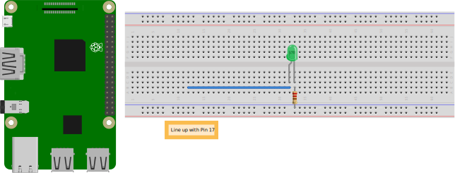

Projects: Physical Layer
************************

The Raspberry Pi is an inexpensive computer with a set of metal *general
purpose input output (GPIO)* pins. The GPIO pins either read on/off
voltages (input) or let us quickly control the voltage by turning them
on and off (output). A standard desktop or laptop computer doesn't have
GPIO pins. The ability to directly control voltage lets us create our
own projects at the physical layer and further understand how this layer
works.

For this project, we'll implement our own physical layer by setting up a
link between two Raspberry Pi computers. If you have only one Pi
available, you can connect the Raspberry Pi back to itself.

First, you'll need to purchase a kit, such as any of the following:

-  CanaKit Raspberry Pi 4 Ultimate Starter Kit
-  CanaKit Raspberry Pi 3 B+ (B Plus) Ultimate Starter Kit
-  Adafruit Budget Pack for Raspberry Pi 4, and a Raspberry Pi 4
-  Adafruit Raspberry Pi 3 Model B Starter Pack, and a Raspberry Pi 3
-  Adafruit Raspberry Pi 3 Model B Starter Pack

The instructions in this chapter assume you bought the CanaKit Raspberry
Pi 3, shown in :numref:`canakit`, but they should apply to the other kits just
as well.

.. _canakit:

   CanaKit Raspberry Pi

Make sure your kit includes a breakout board, a breadboard, and LEDs;
some kits do *not* include these parts.

Step 1: Getting Started with the Raspberry Pi
=============================================

To get your Raspberry Pi computer up and running, you'll need a
keyboard, monitor, and mouse. In addition to the instructions here, the
kit that your Raspberry Pi came in should have instructions specific to
your components for getting started. There is also the excellent
Raspberry Pi getting started guide here:

`Raspberry Pi: Getting Started <https://www.raspberrypi.com/documentation/computers/getting-started.html>`_

Pull out the Raspberry Pi motherboard and place it in the case. A
*motherboard* refers to the green circuit board, and *computer* refers
to the case and everything inside it. The kit also comes with a
*breadboard*, which is a white board with grids of holes that are sized
to allow easy insertion of wires. One of the long sides of the
breadboard should face you, and the top row on the board be the one
marked as positive, if the board includes those markings. Each column of
holes in the middle of the board are wired together. To connect two
wires, insert them in the same column. Soldering is not required. The
long rows at the bottom and top of the board are the positive and
negative (also known as *ground*) power rails. These are connected
horizontally.

Next, we need to plug in the memory card (:numref:`pi_parts`). Many kits come
have the memory card pre-installed with the Raspbian OS. If your card
does not, refer back to the Raspberry Pi getting started website on how
to set up a blank memory card. Plug in the memory card (:numref:`pi_parts`). If
the memory card doesn't fit, try flipping it over. The chips on the
computer can get hot while running, so heatsinks should be installed
before powering on the computer to help draw that heat out and prevent
damaging the chips. Install the heatsinks by peeling the paper stickers
off the back and pressing them on top of the indicated chips.

.. _pi_parts:

   Installing heat sinks and memory card on the Raspberry Pi

Get out the GPIO board, cable, and breadboard (:numref:`pi_ribbon`). Plug the
gray ribbon cable into the Raspberry Pi. Although you can insert it in
two different directions, the cable should point away from the Pi. Plug
the other end of the gray ribbon cable into the black GPIO board. The
cable should point away from the board and not cover up the pins.

.. _pi_ribbon:

   Installing GPIO breakout board

Plug the negative 5 V (5 volts) pin into the top row marked with a blue
line on the white breadboard (:numref:`power_rails`). Plug the positive 3V3 (3.3
volts) pin into the bottom red line on the board. The positive pin
always goes to red, while negative is either blue or black. Some boards
aren't labeled with positive or negative, but I recommend standardizing
on positive to the top, negative to the bottom.

.. _power_rails:

   Positive with red, negative with blue

Plug the network cable (or use Wi-Fi), keyboard, mouse, and monitor into
your Raspberry Pi board. Then, plug in the monitor with the HDMI cable.
The Raspberry Pi detects the monitor's resolution on start-up. Make sure
to plug in the monitor *before* you power the board, as plugging in the
power first will cause you to be stuck at a really low resolution.

Next, plug in the power supply. Your kit should come with a wall
transformer and a cable with a Micro USB port at the end, though you can
use any USB phone charger rated at 2.4 amps or more with a Micro USB
port.

Boot up the Pi and follow the prompts to configure the operating system.
Connect to your local Wi-Fi or plug in a networking cable. Select the
keyboard associated with your country and download any software updates.
Updates take a while, so make sure you can let the computer sit for an
hour or more before starting this process.

Using the Terminal
------------------

Once you've installed the operating system, you should be able to use
the Pi like any Linux system. You'll be typing in some commands rather
than using only the graphical user interface (GUI). To begin typing,
click the terminal icon—the black rectangle in the upper-left corner of
your screen (:numref:`terminal`).

.. _terminal:

   Terminal icon

You should see a terminal window (:numref:`terminal_window`). The ``pi@raspberrypi~ $``
that appears is the *command prompt*.

.. _terminal_window:

   Terminal window

You can enter commands for your project right after the command prompt,
which provides more control than using a GUI. We'll be issuing commands
this way throughout the book.

Shutdown and Reboot
-------------------

To properly shut down the Raspberry Pi using the GUI, click the
Raspberry icon in the upper-left corner of your screen and select
**Shutdown**. If you unplug the computer without shutting it down, you
run the risk of corrupting the filesystem.

You can also shut the computer down in the terminal:

.. code-block:: bash

    sudo shutdown -h now

To reboot the Pi, enter the command:

.. code-block:: bash

    sudo shutdown -r now

Using the terminal to shut down or reboot the computer is useful when
you're doing everything remotely, as we'll cover next.

Remote Access
-------------

You can set up the Raspberry Pi for remote use by connecting to a laptop
or desktop and entering commands on that computer instead. This is
convenient if you prefer working through a separate computer. First,
enable Secure Shell (SSH) for remote access on your Pi by launching
**Raspberry Pi Configuration** from the Preferences menu. Then navigate
to the Interfaces tab and select **Enabled** next to SSH and click
**OK**.

Next, to find your Raspberry Pi's IP address, enter ``ifconfig`` after
the command prompt. Search through the resulting output for the
computer's IP address, which should be right after the label ``inet`` (for
example, the line should look like ``inet 192.168.1.107``). You might see
multiple lines with inet that include a section for wired network (eth0)
and wireless (wlan0). If you're using Wi-Fi to connect your Pi, you'll
want the number after wlan0. If you're using a cable, the number after
eth0 will be the address you need. Ignore any entries under lo that have
0.0.0.0 or 127.0.0.1. (I'll explain how to read all the parts of this
output in Chapters 6 and 7.)

Once you find your Raspberry Pi's IP address, you'll need to perform a
few additional steps to set up your Pi as remote. If you are on a
Windows computer, open the Command Prompt program. If you're on a Mac,
open the Terminal program, which you can find under
**Applications**\ \ **Utilities**, or press cmd-spacebar and enter
**terminal**. For both Mac and Windows, enter ``ssh pi@`` followed by
your Raspberry Pi's IP address. For example, if your IP address is
192.168.1.107, enter ``ssh pi@ 192.168.1.107``.

Once you make the connection, the terminal should prompt you for a
password:

.. code-block:: text

    pi@192.168.1.107's password:

Unlike a GUI that tracks each letter you type, the terminal won't show
anything. Type in your password and press ENTER. The computer should
process your password and grant you remote access.

Step 2: Dual Blinking LEDs with GPIOs
=====================================
The next step is to blink a light using light emitting diodes (LEDs).
You'll use the GPIO pins to turn the power to the LEDs on and off. Being
able to visualize what's happening with your signal helps you understand
the process, so make sure this step is working successfully before
moving on.

Connect the Circuit
-------------------

First, you'll hook up your Raspberry Pi to an LED and control that LED
with a program. In this circuit, you'll need to use a *resistor*—which
restricts the flow of electricity—because hooking up the positive and
negative sides of a battery directly causes it to short-circuit. In a
*short circuit*, the battery discharges as fast as it can, which may be
more than the circuit can handle. If that happens, you'll end up melting
either the insulation off the wires or the connections themselves,
rendering them useless. However, if you put in a resistor, you can slow
the flow of electricity down to a reasonable amount.

Resistors have colored bands on them to tell how much electricity they
resist. Resistance is measured in ohms (Ω). If the resistance value is
too high, your LED will be dim because not enough electricity is
flowing; too low, and too much current will flow, which can heat up and
damage your electronics.

The first two color bands signify the first two digits of the resistance
value. The third band is the multiplier. The last band, the tolerance,
will usually be either silver (10 percent) or gold (5 percent). For
example, the resistor used in Figure 3-7 has two red bands, each of
which stands for 2. The third band is brown, which is a multiplier of
10, so the resistance is 22 × 10 = 220Ω. The fourth band is gold,
meaning it has a tolerance of 5 percent. If the tolerance is 10 percent,
the 220Ω resistor's actual resistance might be anything from 198Ω to
242Ω. The more accurate resistance, the more expensive it is to
manufacture.

.. note::

   To learn more about resistors and how to read their values, see
   `Sparkfun's Resistor Page <https://learn.sparkfun.com/tutorials/resistors/decoding-resistor-markings>`_.

To light an LED with the Raspberry Pi, pick any resistor with a brown
third band and a resistance between 100Ω to1,000Ω. The kits usually come
with 220Ω or 330Ω resistors, which work fine.

Set up your Raspberry Pi as shown in :numref:`led_setup`. You should already have
the breakout board plugged into the breadboard from the last step.

.. _led_setup:

   Photo of blinking LED setup

Using a male-to-male jumper wire, connect pin 17 on the breakout board
to any empty column on the right.

Now take your LED and look at the legs; the positive leg will be longer
than the other. In a different hole of the same column, plug in the
long, positive side of the LED to connect it to the jumper wire. Plug
the short, negative side of the LED into a different column to the
right. Don't mix up the positive and negative sides; the LED won't work
if inserted backward.

Place one leg of a 220Ω red-red-brown resistor in the same column as the
negative LED leg, then place the other resistor leg in the long
horizontal strip hooked to the negative power, also known as the *ground
rail*. Unlike LEDs, it doesn't matter what direction the resistor goes
in.

Your setup should look like :numref:`blinking_led_setup`.

.. _blinking_led_setup:

   Diagram of blinking LED setup

If your LED is dim, you might be using a resistor with different colors
that has too much resistance.

Program the LEDs
----------------

You can now write a Python program to blink the LED (:ref:`blink_led`). To
enter and run this on the Raspberry Pi, use the program Thonny, which
comes pre-installed on the Raspberry Pi. Click the Raspberry menu, then
click the Programming menu and select **Thonny Python IDE**. Create a
file named ``blink_led.py``. Enter the code or copy and paste it from
`https://github.com/pvcraven/networking_down_under <https://github.com/pvcraven/networking_down_under>`_.
All code examples from this book are available at that URL.

.. _blink_led:
.. literalinclude:: ../code_examples/blink_led.py
   :language: python
   :linenos:
   :caption: blink_led.py: Python program to blink the LED

The constants say what GPIO channel we will use to blink the LED; in
this case, #17 1. We can change this to any GPIO channel so long as the
LED is physically hooked up to the specified channel. In this constants
section, you can also change the delay time to something other than 1
second, and control how fast the LED blinks.

The program loops forever, turning on the LED, waiting, turning off the
LED, and waiting again.

Run the program from the Thonny editor or from the terminal with:

.. code-block:: bash

    python3 blink_led.py

When you set the GPIO pin high, electricity flows and lights up the LED.
When you set the GPIO pin low, the LED goes out. The program should loop
forever until you press CTRL-C to stop it. If the light is on when you
stop the program, it'll stay on until you disconnect power.

Troubleshooting
---------------

If the LED doesn't light up, check that the LED's positive and negative
sides aren't backward. Then make sure the LED leads are in the same
columns as the resistor and the wire, and the cable is plugged all the
way into the Raspberry Pi and not crooked.

If you've hooked the LED to the positive rail instead of the ground,
everything will be backward—when you set the GPIO pin to low, the LED
lights up; when you set it to high, it goes out. You should flip the LED
so the positive leg is on the positive side of the electricity flow.

Adding LEDs
-----------

Once you've finished getting the LED to blink, see whether you can make
two LEDs blink at the same time. Use pins 12 and 17, and choose two
different colors of LEDs. Your code should look something like
:ref:`blink_leds_pseudocode`:

.. _blink_leds_pseudocode:
.. code-block:: text
   :caption: Pseudocode for blinking two LEDs

    Loop forever:
        Turn on led 12
        Turn on led 17
        Sleep
        Turn off led 12
        Turn off led 17

Make sure you can control both LEDs at the same time and that you don't
have two loops. For a video of two blinking LEDs, see the YouTube video
`Physical Layer - Lab 1 - Dual Blink LEDs <https://www.youtube.com/watch?v=mXCQbWq5w3Q>`_.

Step 3: Encode a Message with Bit Shifting
==========================================

Now, let's encode a message onto the blinking lights. You'll need to
take a number and convert it to pulses of electricity that you can
decode later. To visualize these pulses of electricity and make sure the
code and circuit works, you'll use the LEDs.

Computers store numbers in *binary*, which consists of only ones and
zeros. In this project, we'll turn the electricity (and the LED) on to
represent a 1and turn it off to represent a 0.

Each 1 and 0 of a binary number is called a *bit*, and 8 bits make up a
*byte*. Computers normally work with binary numbers in bytes, in groups
of eight. For context, humans normally work in base 10, using 10
different numbers from 0 to 9. When we count to 9 and run out of
possible numbers, we add to the 10s place and start again in the 1s
place with 10. Binary works the same, but with only two digits, 0 and 1.
Instead of a 10s place and 100s place, binary has places of 2, 4, 8, 16,
and so on. :ref:`binary_numbers` shows the pattern of how binary numbers are stored.

.. _binary_numbers:

.. table:: How Binary Numbers Are Stored

   +----------------------------------+-----------------------------------+
   | Binary                           | Decimal                           |
   +==================================+===================================+
   | 0000 0000                        | 0                                 |
   +----------------------------------+-----------------------------------+
   | 0000 0001                        | 1                                 |
   +----------------------------------+-----------------------------------+
   | 0000 0010                        | 2                                 |
   +----------------------------------+-----------------------------------+
   | 0000 0011                        | 3                                 |
   +----------------------------------+-----------------------------------+
   | 0000 0100                        | 4                                 |
   +----------------------------------+-----------------------------------+
   | . . .                            | . . .                             |
   +----------------------------------+-----------------------------------+
   | 1111 1111                        | 255                               |
   +----------------------------------+-----------------------------------+

To perform our encoding, we need to pull out the individual 1s and 0s
from our message. Converting a number or a letter into binary can be
tricky. We'll work through two examples to help get you started.

Encoding a Single Value
-----------------------

The first example, seen in :ref:`bitshift_example_1`, takes a single decimal value
(23) stored in the variable number_to_encode and outputs its binary
value:

.. _bitshift_example_1:
.. literalinclude:: ../code_examples/bitshift_example_1.py
   :language: python
   :linenos:
   :caption: bitshift_example_1.py: First step in converting a number from decimal to binary.

To convert our decimal number to binary, we loop eight times, once for
each bit 1. Regarding the line that does the decoding work 2, the number
1 in binary is 0000 0001. The << operator is a *bit-shift* operator,
which shifts bits to the left. We'll use << to pull the individual 1s
and 0s out of our byte, so we know when to turn the electricity on or
off.

:ref:`bit_shifting` shows how you can use the bit-shift operator to shift a 1 to
any spot within the eight-bit byte.

.. _bit_shifting:
.. code-block:: text
   :caption: Shifting Bits to Any Position within a Byte

   1 << 0 = 0000 0001 = 1
   1 << 1 = 0000 0010 = 2
   1 << 2 = 0000 0100 = 4
   1 << 3 = 0000 1000 = 8
   1 << 4 = 0001 0000 = 16
   1 << 5 = 0010 0000 = 32
   1 << 6 = 0100 0000 = 64
   1 << 7 = 1000 0000 = 128

The & in this decoding line is a bitwise *and*, which takes two binary
numbers and compares them bit by bit. If both binary numbers have a 1
in the same spot or digit, the resulting number also has a 1 in that
position. Otherwise, the result has a 0 in that location. For example,
the number 122 is ``0111 1010`` in binary. The first bit, with ``bit_pos = 1``,
gives us ``(1 << bit_pos) = 0000 0001``. From that, we substitute in and
simplify:
``(1 << bit_pos) & number_to_encode`` and get ``0000 0001 & 0111 1010``. Then
we do the &:

.. code-block:: text

    0111 1010
  & 0000 0001
    ---------
    0000 0000 = 0

Second bit, with ``bit_pos = 2``, gives us ``(1 << bit_pos) = 0000 0010``. From
that, we have ``0000 00100 & 0111 1010``:

.. code-block:: text

     0111 1010
   & 0000 0010
     ---------
     0000 0010 = 2 (non-zero)

Third bit, with ``bit_pos = 3``, gives us ``(1 << bit_pos) = 0000 0100``:

.. code-block:: text

     0111 1010
   & 0000 0100
     ---------
     0000 0000 = 0

Fourth bit, with ``bit_pos = 4``, gives us ``(1 << bit_pos) = 0000 1000``:

.. code-block:: text

     0111 1010
   & 0000 1000
     ---------
     0000 1000 = 8 (non-zero)

and so on. Our encoding program will use this to turn on the LED for
each 1 and turn it off for each 0.

Encoding a List of Values
-------------------------

In our second example, we'll encode a list, or *array*, of values. This
is useful when we want to send text, because each letter in the text
will be represented by a value. To store letters, computers map letters
to numbers. Starting in 1963, computers used the *American Standard Code
for Information Interchange (ASCII)* to standardize which letters
corresponded to which numbers. For backward compatibility, we still map
the English set of characters to those same numbers according to that
ASCII table (see Appendix A).

Computers can store numbers ready for computation or as individual
characters (a *string* of characters) ready for display. If we store the
number 12, we can simply use a byte with the number 12. We can also
store numbers as individual ASCII characters. For 12, we have a 1, which
is 49 in the table, and a 2, which is a 50 in the table. The first
method works when we want to do math, the second when we want to display
the number to the screen or save it to a file.

ASCII doesn't support international languages well, since there's no
mapping of numbers to accented characters, Cyrillic, or Kanji. For those
characters, we use the more complex *Unicode Transformation Format,
8-bit (UTF-8)* encoding that can have multiple bytes per character.
UTF-8 is backward-compatible with ASCII, so we can still use the ASCII
table for the standard English alphabet. By default, Python uses UTF-8
to encode strings. We'll get around this with a *byte array*, which uses
the simpler ASCII character mapping instead of UTF-8.

Now that you have a basic understanding of ASCII and UTF-8, let's run
*bitshift_example_2.py*, which encodes not just one value, but an array
of values into binary (:ref:`bitshift_example_2`). This gets us another step closer to
sending our own message.

.. _bitshift_example_2:
.. literalinclude:: ../code_examples/bitshift_example_2.py
   :language: python
   :linenos:
   :caption: bitshift_example_2.py: Convert multiple letters into their binary representation.

We're going to encode the data ``b'This is a message.'`` stored in the
variable byte_array (line 8) and send that as our message. The data starts with
a ``b`` before the first quote, which tells the computer that the data will
be a byte array stored as ASCII, as opposed to regular string stored as
UTF-8.

When running the program, a for loop goes through the
``b'This is a message.'`` data. Each time through the loop, we pull out a new letter and
store it in the my_byte variable. The first letter we pull out is the T,
which maps to 84 in ASCII. The value of my_byte will be the ASCII value
84, and not the letter. This is different than iterating through a
regular UTF-8 string in Python, which would save the letter in the
variable instead of its value.

For each letter, we start the encoding by pulling out bit 7 and work our
way down to 0 (line 16). We then use the bit operators (line 19) to convert the number
to binary, the 1s and 0s that make up 84. At the end of the first loop,
we've processed the T and will print out the binary value, the decimal
value, and the ASCII letter:

.. code-block:: text

   01010100 - 84 – T

Then we loop through the rest of the letters, printing the following
values:

.. code-block:: text

   01101000 - 104 - h
   01101001 - 105 - i
   01110011 - 115 - s
   00100000 - 32 -

and so on.

If we want to take the ASCII value and covert it from a number to the
character, we can do this with the character function ``chr( )``. Calling
``chr(84)`` will return ``'T'``, ``chr(85)`` returns ``'U'``, and so forth. We do this
in the final ``print`` statement (line 26) so that we can see both the ASCII value
and the letter it corresponds with.

Encoding a Message with Multiple Bytes
--------------------------------------

Now, you need to merge the program that blinks the two LEDs with the
program that decodes our message into 1s and 0s. Rather than just
blinking the LEDs on and off, we'll blink one of the two LEDs according
to the data in the message. We'll turn that LED on when you have a 1,
and off when you have a 0. This is the *data line* that turns on and off
according to what data we have. The other LED is the *clock line*. It
will turn on and off at a regular interval, just like a clock. At the
exact time it turns on, the data line updates to on or off. When the
clock line turns off, it is time for the receiver to read the data line.

Enter the code in :ref:`encode_message`, in which we have merged our two programs:

.. _encode_message:
.. literalinclude:: ../code_examples/encode_message.py
   :language: python
   :linenos:
   :caption: encode_message.py: Code that blinks LEDs according to the binary code of our message.

We define constants for the two GPIO pins we'll be using (lines 5-8). The code to
set them up is the same as the blinking LED example in :ref:`blink_led`. Like
the bit-shift example in :ref:`bitshift_example_2`, we set up the message to be
transmitted (line 19). Then we loop through each letter (byte) in that message
(line 22). For each letter, we start another loop that will loop eight times,
one for each bit in the byte (line 29). We start at seven and go down to zero
using bit-shifting, and we pull out if it there is a 1 or 0 in each
location (line 42).

The clock is always set to a positive voltage (high) at this point (line 50). At
the same time we set the data line to be either high or low depending on
the data being sent (line 53). We then delay a little bit of time (line 59).

Next we set the clock line low 9. This is our signal to the receiver
that it can read the data line, because we hold the data line steady. We
don't want to change the data line while the receiver is in the middle
of reading it, as we don't know if we'll get a high or low value. You'll
read the bit from the data line every time the clock line goes from high
to low, and the data line doesn't change as shown in :ref:`scl2`.

.. _scl2:

   Encoding data with a serial clock line

We use a clock line to keep track of when to read from the data line,
because for fast data speeds and long messages, eventually one computer
will start to drift and fall behind by a bit or two, especially if
there's a long string of 1s or 0s with no transitions. By sending a
clock signal on another wire, the receiver can make sure the signal is
synchronized with the sender's clock.

For a video example of this step, see the video
`Physical Layer - Step 3 - Encode a Message <https://www.youtube.com/watch?v=7Ef11hFo5lo>`_.
In the video, the green LED is the clock; the red LED blinks on for a 1 and off
for a 0. The delay between each clock is 0.1 seconds, and each bit takes
0.2 seconds to transmit.

Step 4: Receive a Signal
========================

The next step to implement your own physical layer is to receive the
signal you just created. Ideally, you'll have another Raspberry Pi with
another breakout board, but you can also use one Raspberry Pi to send on
two pins while receiving on two other pins. Remember, you can open
multiple terminals and run your send message program in one terminal and
receive message program in another.

Send the Signal to a Raspberry Pi
---------------------------------

Take a second Raspberry Pi and GPIO breakout board and place them near
your first Raspberry Pi breadboard (with the LED still connected). Next,
connect the grounds together. The *ground* is the negative side of the
power supply. To connect the grounds, run a wire from one of the blue
lines on the 5V negative voltage of one board to one of the blue lines
on the 5V negative voltage of the other board, as shown by the wire on
the right side of Figure 3-10.

|Graphical user interface Description automatically generated with
medium confidence|

Tying two Raspberry Pi computers together. This diagram shows only the
new connections, not the LEDs you should already have working.

Next, run the signal wire from the first board to the second. You'll use
pin 12 for the signal. Run a wire from pin 12 on one board to a 220
red-red-brown resistor, and then run a second wire from the resistor's
other leg to pin 12 on the other board (see the wires on the left side
in Figure 3-10). Keep your blinking LED from Step 2 attached; it'll help
you see what's happening.

If you have only one Raspberry Pi available, you can run a resistor
between two pins, such as 12 and 18, and don't worry about the tying the
grounds together.

Signals with Polling
--------------------

With the Pis hooked up, let's run some code to try the first steps
receiving a signal. Run the program *blink_led.py* from Listing 3-1,
adjusting the program so that it uses pin 12. On the receiving computer,
read the wire by entering the code shown in Listing 3-6:

read_wire_polling.py

import time

import RPi.GPIO as GPIO

GPIO_CHANNEL = 12

TIME_DELAY = 0.25

GPIO.setmode(GPIO.BCM)

GPIO.setup(GPIO_CHANNEL, GPIO.IN)

1 while True:

2 result = GPIO.input(GPIO_CHANNEL)

if result:

print("High")

else:

print("Low")

3 time.sleep(TIME_DELAY)

Code to receive see if the data line is high or low at regular
intervals.

This code loops forever 1. While looping, it reads from the input pin 2,
waits 0.25 seconds 3, then loops again.

When you run the program, it should print out both High and Low, showing
that it sees the changing signal. This code is *polling*, or
periodically checking whether the value changes. Polling using the sleep
function is unreliable, because you don't know exactly when you should
poll the line or when the message starts. If you poll too fast, you'll
read the same bit twice; too slow, and you'll miss a bit. You'll
eventually use polling in combination with your clock line to get around
this issue. Before doing that, however, you need another way to read a
signal so we know exactly when the clock line changes between high and
low.

Signals with Blocks
-------------------

Instead of polling, you can write a program that waits for the wire to
change between High and Low, like Listing 3-7:

read_wire_blocking.py

import RPi.GPIO as GPIO

GPIO_CHANNEL = 12

GPIO.setmode(GPIO.BCM)

GPIO.setup(GPIO_CHANNEL, GPIO.IN)

print("Waiting...")

while True:

1 result = GPIO.wait_for_edge(GPIO_CHANNEL, GPIO.RISING)

print("High")

2 result = GPIO.wait_for_edge(GPIO_CHANNEL, GPIO.FALLING)

print("Low")

Code that detects when the state of an input line changes.

Listing 3-7 is similar to Listing 3-6, except instead of polling every
0.25 seconds, we use the wait_for_edge function to wait until we go from
low to high 1, and from high to low 2.

This code is *blocking*, meaning the program does something only when
there's a change in state on the wire. When you run this code, you
should see exactly one High or Low print each time the signal changes.
If it doesn't change at the same time as the sending computer,
double-check the wiring. Occasionally a wire can break, so try swapping
out wires as well. Make sure the pins you've set in the program are the
same pins you wired together.

While polling has to keep checking the state of the signal line to see
if there's a change, blocking waits until a change occurs before doing
anything. By blocking and waiting for a signal state to change, you can
synchronize with the sender to properly read the message, unlike with
polling. However, programs that utilize blocking can wait forever if
there's never a change to the signal. When a blocking call waits for
network data, it halts the program and doesn't process any user input,
which can make the computer *hang*. The program does nothing until it
gets input. Users can't even quit the program; they can only end the
program by forcibly killing the task or restarting the computer. You can
improve on this code with a different technique.

Signals with Callbacks
----------------------

An even better option than blocking is using a *callback*, a function
the computer runs when an event occurs, such as a change in state with
our input line. To prevent the computer from hanging, as sometimes
occurs with blocking, you can create a callback function. This way,
rather than stopping and waiting for input, the computer immediately
continues to the next line of code and continues executing. It will
automatically call the callback function only once it has input. For
example, see Listing 3-8, in which you create a callback function:

read_wire_callback.py

import time

import RPi.GPIO as GPIO

CLOCK_CHANNEL = 12

1 def my_callback(channel):

if GPIO.input(channel):

print(f"Channel {channel} is high.")

else:

print(f"Channel {channel} is low.")

GPIO.setmode(GPIO.BCM)

GPIO.setup(CLOCK_CHANNEL, GPIO.IN)

2 GPIO.add_event_detect(CLOCK_CHANNEL, GPIO.BOTH, callback=my_callback)

print("Running")

3 while True:

time.sleep(10)

print("Still running")

Using a callback to detect changes to an input line.

The callback function 1 is set up to read the current state of the pin
(channel). The call to *register* the callback uses GPIO.BOTH 2, which
triggers when the signal changes from high to low, or low to high. Once
the callback is registered, the computer automatically calls the
function when the state changes. We don't have to keep checking on it.
You can also use GPIO.FALLING to trigger only during high to low signal
changes, or GPIO.RISING for low to high changes.

Because the computer doesn't stop when a callback is registered 2, the
code can't end there. If there were no more code after registering the
callback, the program would quit. Callbacks aren't called if the program
isn't running, so you need the program to do something. As you don't
have anything to do except wait, create a loop to repeat forever 3 until
you press CTRL-C or otherwise end the program. In a more complex
program, you could use it to process other user input while the network
activity happens in the background. Make sure this program works before
moving on to the next step.

Step 5: Decode a Signal
=======================

We can encode a message, send it, and receive the signal. Our next step
in receiving the message is to convert it back to 1s and 0s. To do this,
make the adjustments shown in Listing 3-9 to the *read_wire_callback.py*
program from Listing 3-8.

decode_message_1.py

import time

import RPi.GPIO as GPIO

CLOCK_CHANNEL = 12

1 **DATA_CHANNEL = 23**

def my_callback(channel):

2 **result = GPIO.input(DATA_CHANNEL)**

if result:

print("1")

else:

print("0")

GPIO.setmode(GPIO.BCM)

GPIO.setup(CLOCK_CHANNEL, GPIO.IN)

3 **GPIO.setup(DATA_CHANNEL, GPIO.IN)**

4 **GPIO.add_event_detect(CLOCK_CHANNEL, GPIO.FALLING,
callback=my_callback)**

print("Running")

while True:

time.sleep(10)

print("Still running")

Decoding the received signal to 1s and 0s.

This listing makes the following adjustments:

1. Change the constants at the top and define the input lines for the
   clock and the data line 1. This example uses the same pin 12 as the
   prior examples for the clock line, and then adds yet another pin to
   carry the data on. You will need to run an additional wire between
   pins 23 on the boards for this second line.

2. Set up both pins for input 3.

3. Read the clock line only if the clock is falling. Change the
   add_event_detect function so that instead of GPIO.BOTH, you use
   GPIO.FALLING 4.

4. Change your callback 2. Instead of printing if the clock channel is
   high or low, poll the data channel. To read it, use something like
   result = GPIO.input(DATA_CHANNEL). If the data line is low, print 0;
   otherwise print 1.

Try adjusting the clock delay to see how fast you can receive data. For
example, I was able to take the clock to 0.0001 and still reliably
transmit data.

Next you'll need a counter variable to print a line break every 8 bits.
The counter variable needs to exist in the function and increase in
value each time the function is called. But wait! Variables in a
function are reset with each call, so you need a way around this.

Creating a Counter Variable
---------------------------

Normally function variables don't keep their value between calls. We can
get around this by *static function variables*, which do exactly that.
An example of creating a static variable is in Listing 3-10:

def my_function():

# This will increase x

1 my_function.x += 1

2 my_function.x = 0

Creating a counter using static function variables.

At the very end of the listing 2 we create the static function variable
by defining the variable x while prepending that variable name with the
function name, my_function. That line also sets the variable to an
initial value of 0. Inside the function we again refer to the variable
by prepending the function name 1 to it. By using the function as a
*namespace*, you tie the variable to the function. The variable does not
exist globally; this reduces the places it can be changed, makes it less
error prone, and keeps its value between function calls.

In Listing 3-11, we use a variable called counter to track which bit
we're reading. The bits are numbered 0 to 7; after the eighth bit
(numbered 7, as we started counting at 0), we go to the next line.

decode_message_2.py

def my_callback(channel):

result = GPIO.input(DATA_CHANNEL)

if result:

print("1", end="")

else:

print("0", end="")

my_callback.counter += 1

if my_callback.counter > 7:

print()

my_callback.counter = 0

my_callback.counter = 0

Using a static function variable to print <return> every 8 bits

You may need a small program that resets the state of the pins before
you run your program to avoid getting an extra starting bit. It may also
take some work to avoid adding an extra bit or dropping a bit when your
program runs.

The "Physical Layer - Decode a Signal" video
(*https://www.youtube.com/watch?v=n61MLYCA_p0*) shows this code in
action. One terminal shows the sending computer and the other shows the
receiving.

Step 6: Convert Decoded Bits to Bytes
=====================================

Now you need to change your program so it decodes the individual bits
into full bytes. Each byte is a letter that's part of our message.
You'll need another static function variable to hold the result. Call it
result_byte, as in Listing 3-12:

decode_message_3.py

def my_callback(channel):

result = GPIO.input(DATA_CHANNEL);

if result:

print("1", end="")

1 my_callback.result_byte += 1 << (7 - my_callback.counter)

else:

print("0", end="")

my_callback.counter += 1

if my_callback.counter > 7:

2 print(f" = {my_callback.result_byte} =
{chr(my_callback.result_byte)}")

my_callback.counter = 0

my_callback.result_byte = 0

my_callback.counter = 0

my_callback.result_byte = 0

Decoding the received byte

If you receive a zero, do nothing. If you receive a one, shift it into
place 1. For example, 1 << 3 would shift the one into the fourth bit
position. (We start counting at zero, so the fourth bit is position 3.)
Add that value to your result_byte. Print the bytes and confirm they
match the bytes sent 2. Reset the counter and the result_byte.

Step 7: Manchester Encoding
===========================

Sending and receiving messages with a clock line and a data line works
efficiently enough to be used by protocols like I\ :sup:`2`\ C (we'll
learn about this in Chapters 4 and 5). However, we can improve on this
method by using *Manchester encoding*, which doesn't require a clock
line, reducing the number of necessary wires by one. Manchester encoding
also keeps the electricity switching directions, lessening signal loss
and allowing us to transmit over longer distances. Listing 3-13 encodes
a message back in Listing 3-5 to use Manchester encoding.

manchester_encoding.py

import time

import RPi.GPIO as GPIO

DATA_CHANNEL = 12

BITS_IN_A_BYTE = 8

1 CLOCK_SPEED = .005

GPIO.setup(DATA_CHANNEL, GPIO.OUT)

2 GPIO.output(DATA_CHANNEL, GPIO.HIGH)

time.sleep(CLOCK_SPEED \* 4)

GPIO.output(DATA_CHANNEL, GPIO.LOW)

time.sleep(CLOCK_SPEED \* 4)

my_message = b'This is a secret message'

for my_byte in my_message:

for bit_pos in range(BITS_IN_A_BYTE - 1, -1, -1):

bit = (1 << bit_pos) & my_byte

if bit != 0:

3 GPIO.output(DATA_CHANNEL, GPIO.LOW)

time.sleep(CLOCK_SPEED)

print("1", end='')

GPIO.output(DATA_CHANNEL, GPIO.HIGH)

time.sleep(CLOCK_SPEED)

else:

4 GPIO.output(DATA_CHANNEL, GPIO.HIGH)

time.sleep(CLOCK_SPEED)

print("0", end='')

GPIO.output(DATA_CHANNEL, GPIO.LOW)

time.sleep(CLOCK_SPEED)

print(f" - {my_byte:3} - {chr(my_byte)}")

time.sleep(CLOCK_SPEED \* 4)

5 GPIO.cleanup()

Decoding the received byte

To update your code for Manchester encoding, start by creating a
variable for the CLOCK_SPEED 1. You'll send one bit for every two
CLOCK_SPEED durations that pass. For example, if CLOCK_SPEED is 0.1
seconds, you'll send a bit every 0.2 seconds. Set everything up and
start with the clock low, then leave it high for at least four times the
clock speed 2. For example, if your clock is 0.1, then leave it high for
at least 0.4 seconds. This pause will be the signal that you're about to
send a new set of data. If the bit you're sending is a 1, start with the
pin in a low state. Wait the duration of CLOCK_SPEED by using the
time.sleep() function. Transition to a high state and wait for
CLOCK_SPEED 3. If the bit you're sending is a 0, start with the pin in a
high state. Wait the duration of CLOCK_SPEED. Transition to a low state
and wait for CLOCK_SPEED 4.

At the end of the program, we include a GPIO.cleanup() command 5.
Although the command isn't required, omitting it causes the Raspberry Pi
to send a warning that the GPIO pin is already in use when you run your
encoding program a second time. (The program will use the pin anyway, so
you can ignore the warning if you like.) Running the cleanup will also
stop the Raspberry Pi from supplying power to the pins and will reduce
power consumption while protecting against accidental damage if the pin
is connected straight to the ground causing a short-circuit. The
disadvantage to issuing the cleanup command is that the Pi changes the
GPIO pin's voltage back to input mode. With the pin in input mode, the
Pi no longer holds the voltage high or low. With the pin voltage not
controlled, anything trying to listen to the pin can pick up random
electrical noise, and your receiving program may receive false data from
that noise.

Step 8: Manchester Decoding
===========================

Now, we'll write code so you can *receive* a message using Manchester
encoding. Even if the data wave doesn't transition because of a series
of 0s or 1s, Manchester encoding will always transition at the data bit:
high to low for a 0 and low to high for a 1, as shown in Figure 3-11
(see Chapter 2).

|image1|

Manchester encoding

To write the code for decoding a Manchester signal, start with Listing
3-12 from Step 6, and create a program that does a callback when it
detects a rising or falling edge (Listing 3-14):

manchester_decoding_1.py

GPIO_DATA_IN = 13

1 CLOCK_SPEED = .005

def data_callback(channel):

2 data_line = GPIO.input(GPIO_DATA_IN)

Cur_time = time.time()

3 time_interval = cur_time – data_callback.last_call

4 dl = "low->high" if data_line else "high->low"

5 print(f" Change: {dl} Interval: {time_interval:.3f}")

data_callback.last_call = cur_time

6 data_callback.last_call = time.time()

GPIO.setmode(GPIO.BCM)

GPIO.setup(GPIO_DATA_IN, GPIO.IN)

GPIO.add_event_detect(GPIO_DATA_IN, GPIO.BOTH, callback=data_callback)

print("Running")

while True:

time.sleep(10)

Decoding a Manchester encoded message.

Create a variable with the same CLOCK_SPEED as the clock speed used in
Step 6 1. We'll use this in Listing 3-15. Depending on the data we are
transmitting, our transitions will happen every CLOCK_SPEED seconds, or
CLOCK_SPEED \* 2 seconds.

Your program should also read the channel 2. Then create a variable that
holds low->high when the channel is high, and holds high->low when the
channel is low 4.

Calculate the time between transitions 3 6. Print the time between
transitions along with the transition from the prior step to verify
what's happening 5. As illustrated in Figure 3-11, the interval will be
equal to either CLOCK_SPEED or CLOCK_SPEED times two. Every CLOCK_SPEED
times two, you'll always transition down for a 0 and up for a 1. Every
CLOCK_SPEED, you may or may not transition up or down, depending on
what's needed to set up. Make sure your program prints the time interval
out.

Once you've verified the intervals are correct, you can remove the line
that prints the interval timing. With Manchester encoding, some—but not
all—of the transitions represent bits. If the data line was held steady
for two clock cycles, the next transition has to be a bit. Add code to
check whether the line time interval was greater than 1.5 times the
clock speed; if so, print the correct bit (Listing 3-15):

manchester_decoding_2.py (truncated)

if time_interval > CLOCK_SPEED + CLOCK_SPEED / 2:

if data_line == 0:

print("0")

else:

print("1")

Additional code that detects 0 or 1 transitions if the data line was
high or low for about two clock cycles. For the full listing, see
*manchester_decoding_2.py* in the GitHub repo\ *.*

If the prior transition was not a data bit, we know the next one has to
be, even if it has been only one clock cycle. We'll track this with a
static Boolean variable data_bit, as in Listing 3-16:

if time_interval > CLOCK_SPEED + CLOCK_SPEED / 2 or
data_callback.data_bit:

data_callback.data_bit = False

if data_line == 0:

print("0")

else:

print("1")

else:

data_callback.data_bit = True

Track whether the next transition is a data bit. For the full listing,
see *manchester_decoding_3.py* in the GitHub repo.

Once we have the data bits, grouping them into bytes uses the same
process as the examples earlier in the chapter. For a full working copy,
see *manchester_decoding_5.py* from
*https://github.com/pvcraven/networking_down_under*.

Mini Projects
=============

There's a lot more to the physical layer than just encoding 1s and 0s on
a wire! Try these projects to learn more about controlling
physical-layer networking signals.

1. Make Your Own Patch Cable

Long cables with too much extra coiled wire make a mess, but if you can
make your own patch cables, you can keep your connections tidy and run
them exactly where you want them.

What You'll Need

-  Cat5, Cat5e, or Cat6 cable (you can cut up an old cable)

-  Two RJ45 crimp connectors

-  RJ45 crimp tool

-  RJ45 patch cable tester

-  RJ45 snagless boot (optional)

Figure 3-12 shows the listed items.

|A picture containing wall, indoor, different, arranged Description
automatically generated|

Crimping supplies, from left to right: crimper, RJ45 jack, snagless
boot, Cat 5 cable

You can find inexpensive versions of these online. The optional
*snagless boot* helps keep the wire from bending too sharply at the
plug's insertion point to protect it from getting broken. It also
protects the plastic tab on the plug from being snagged and broken off.
It adds to the cost of the cable, but the cable should last longer if it
moves around a lot.

Construction

Make sure the end of your cable is cleanly cut. Strip off the outer
insulating cover by about the 3/4 of the length of your RJ45 connector
(Figure 3-13). Your crimp tool might have a place to insert the cable,
with a blade that cuts only the outer cover when you rotate the cable.

|A picture containing wall, indoor Description automatically generated|

Cut cable ready to be inserted

If you're using a snagless boot, put it on now.

Untwist the wires. From left to right with the tab pointed down, order
the wires as follows:

1. Orange striped

5.  Orange solid

6.  Green striped

7.  Blue solid

8.  Blue striped

9.  Green solid

10. Brown striped

11. Brown solid

This order follows the wiring standard T-568B. If you search for a
wiring diagram, you might find T-568A, which has the orange-striped and
green-striped wires swapped. The T-568B is typically the preferred and
more up-to-date standard.

With the tab of the RJ45 connector pointed down, insert the wires in the
proper order (Figure 3-14). I suggest doing all the wires at once. With
practice, you'll be able to insert them rather quickly. If the outer
insulator is correctly cut, the inside wires should reach the very end
of the RJ45 connector, and enough of the outer insulator should be
inside the end of the connector for the crimp to bite into it and secure
the wire. Double check the ordering of the wires before crimping,
because if they are out of order you'll have to cut off the connector
and start over.

|image2|

Cable inserted into RJ45 connector

Insert the connector into the crimper and squeeze (Figure 3-15).

|image3|

Squeeze the connector in the crimping tool

Repeat the previous steps with the other end of the Cat5 cable. The wire
should not easily pull out of either side.

To test your connection, hook up the patch cable to a cable tester like
the one in Figure 3-16.

|A picture containing indoor Description automatically generated|

Test the cable

The cable tester should cycle through all eight wires and test them all
positive. If the number 1 lights up on the sender, it should also light
up on the receiver; this should be the same for all numbers, up to 8. If
the receiver doesn't light up, there's no connection. If a different
number lights up, some wires are swapped. It's normal to have many
failed attempts before getting the hang of putting on the connector Make
sure all the wires are pushed in and you've crimped down on the
connector really, really hard.

When all eight wires test positive, congratulations! You've created a
patch cable of your own! You can now create custom-length cables
cheaply.

2. Use Pulse Width Modulation to Control LEDs, Servos, and Motors

Networking isn't only about communicating between computers; you can
also send signals to control robotics, motors, or lights. In this
project, you'll learn to control robots by having your Raspberry Pi
control an LED, servo, and brushless motor using *pulse width modulation
(PWM)*, a common protocol that controls the brightness of LEDs, servo
positions, or motor speeds.

What You'll Need

For this project, you'll need a Raspberry Pi, a resistor, and an LED. In
addition, you can try this with a servo, or even a combination of a
brushless motor and electronic speed controller.

Controlling LEDs

First, let's learn to control an LED. Learning to blink or dim a light
is a great first step toward understanding and visualizing how the same
concepts can be used to control motors and robotics.

To control an LED, hook up your Raspberry Pi the same way we did earlier
in the chapter, in Figure 3-8. Then, enter in the program in Listing
3-17, which will output a PWM signal. We'll use this program to control
both an LED and a servo:

pwm_example_1.py

import RPi.GPIO as GPIO

import time

gpio_channel = 17

1 duty_start = 0

duty_end = 100

2 pwm_frequency = 1

time_gap = 2

increment = 5

GPIO.setmode(GPIO.BCM)

GPIO.setup(gpio_channel, GPIO.OUT)

3 p = GPIO.PWM(gpio_channel, pwm_frequency)

4 p.start(duty_start)

5 for i in range(10):

6 for duty_cycle in range(duty_start, duty_end, increment):

p.ChangeDutyCycle(duty_cycle)

print("Duty cycle:", duty_cycle)

time.sleep(time_gap)

7 for duty_cycle in range(duty_end, duty_start, -increment):

p.ChangeDutyCycle(duty_cycle)

print("Duty cycle:", duty_cycle)

time.sleep(time_gap)

p.stop()

Sending different PWM signals from the Raspberry Pi

This program defines a duty cycle 1 and a frequency 2. The *duty cycle*
is a percentage from 0 to 100. The frequency is in Hertz (Hz). With
pwm_frequency set to 1, the LED should blink about once every second.
When the duty cycle is 0, the LED should always be off. When it's set to
50, the LED should be on for half of the one-second cycle. When set to
100, the LED should be on for the entire cycle.

We then set our GPIO to output a PWM signal 3 at our desired frequency.
Next, we set the duty 4. The first for loop 5 will cycle the duty
frequency up and down 10 times. The first inside for loop 6 cycles it
up, while the second one cycles it down 7.

You can turn the light on and off slowly enough to dim it, and fast
enough so that your eyes blend the flashing together and it appears
always on or off. Try changing the frequency constant to be high enough
that you can dim the LED without seeing it flash.

Controlling Servos

A *servo* is a robotic motor that lets you control precisely how far it
rotates. Servos come in all sorts of sizes, as shown in Figure 3-17.
Unlike regular motors, servos typically don't spin around more than once
before having to spin back. You can make a little movable robotic arm by
attaching the center motor shaft to a *servo horn*. These have holes for
screws to make it easy to attach to other robotic parts.

|image4|

Different types of servo motors. Image from the Raspberry Pi Foundation,
used under Creative Commons license

Hooking up a servo is relatively easy. Servos are controlled with three
wires, as shown in Figure 3-18. One wire for positive power, one wire
attached to the negative/ground, and one wire for our PWM signal. First,
look up the servo's specifications to see what voltage range it expects.
Servos can typically run up to 6V with no problem.

|Graphical user interface Description automatically generated|

Wiring a servo. Image from the Raspberry Pi Foundation, used under
Creative Commons license

Hook up the servo's red wire to the positive end of a battery or power
supply that matches the voltage.

Hook up the servo's black wire to the negative end (ground) of the power
supply. You need to tie together the ground of the power supply and the
ground of the Raspberry Pi if you have a different power supply for
both.

The orange or yellow wire is the PWM signal wire; it should go to pin
17, or whatever GPIO pin you're using.

**NOTE** I've run very small servos off the Raspberry Pi's 5V power pin
on the GPIO board because I'm lazy, but it's not designed to take the
kind of current most servos use. Using this pin to power your servo can
fault the computer or even destroy it.

After you've wired up your servo, you can write code that will cause the
servo arm to move. Modify *pwm_example_1.py* and add the following
constants so the servo-control code will be easier to read and adjust
(Listing 3-18):

# Constants

Gpio_channel = 17

1 pwm_frequency = 100

2 duty_start = 10

3 duty_end = 25

Time_gap = .1

4 increment = 1

Modified constants for pwm_example_1.py

Servos usually expect a PWM frequency of 50Hz. However, the Raspberry Pi
calculates frequency differently from what servos expect. There's some
complex math behind it, but the easy fix is specifying a pwm_frequency
of 100 1 instead of the expected 50.

Servos have different specifications, so play around with the duty_start
2 and duty_end 3 variables. While you can specify values between 0 to
100, neither 0 nor 100 will work. To the servo, a 0 is the same as a
signal wire that isn't hooked up. 100 is a constant positive voltage, so
the servo can't tell that the line is pulsing at all. Values between 10
and 25 worked well for me.

The specifications for your servo and some math can tell you what range
you should use. Listing 3-18 uses an increment of 1 4, which increments
duty by one each loop. This produces a noticeable step on the servo. You
can use smaller numbers like 0.5 for a smoother rotation.

However, Python's range function supports only integers, so you'll need
to do a bit of additional programming and math to send smaller
increments, like the code shown in Listing 3-19:

increment = 0.5

duty = duty_start

while duty < duty_end:

p.ChangeDutyCycle(duty_cycle)

print("Duty cycle:", duty_cycle)

time.sleep(time_gap)

duty += increment

Working with a non-integer duty cycle

This should allow you to use any increment, even if it isn't an integer.

Controlling Motors

We also can control electric motors with PWM. Computers use PWM to
control how fast their fans run, RC cars or even full sized cars use PWM
to control how fast they go. Electric motors usually fall into two
types: brushed and brushless. Brushed motors are cheap to produce,
simple, and inefficient. You can hook up a brushed motor directly to a
battery and run it. You can control a brushed motor by computer with a
control board. I recommend using brushless motors instead, as the cost
difference isn't too high. They're very small, powerful, and efficient.
They also don't waste a lot of electricity like brushed motors do.

To operate a brushless electric motor, you need hook it up to an
*electronic speed controller (ESC)*, like the one shown in Figure 3-19.

|A picture containing tool, connector Description automatically
generated|

Electronic speed controller

The ESC hooks up to your computer and takes a PWM signal like the servo.
It essentially babysits the motor for you; when a computer sends the ESC
a PWM signal, it monitors the motor and sends pulses of electricity to
the motor at just the right time to make it spin at the proper speed. If
you're into remote control cars, planes, or helicopters, you've likely
worked with ESCs already. If you have a small motor and an ESC sitting
around, try controlling it with your Raspberry Pi.

Once you hook up your ESC, you can control the motor by changing the
duty on the PWM signal. The higher duty percent of the PWM, the faster
the motor will spin. You can control very small, or very powerful motors
(even big enough for a full-sized electric car) by a using a computer
like the Raspberry Pi.

|image5|

Wiring an ESC

One end of the ESC will have three wires that hook up to the brushless
motor. The other end of the ESC will have five wires. Two larger outside
wires connect to the power, red to red and black to black. There is a
smaller red wire on the inside. See Figure 3-20 for how to wire an ESC.
For some projects, this wire can supply power to the computer, but don't
connect it to the Raspberry Pi or anything, as you'll use the power
supply that came with the Raspberry Pi to be safe. The white (or
sometimes yellow) wire connects to the GPIO pin that has the PWM speed.
The black wire connects to the computer's ground.

What You Learned

In this chapter, you learned how to work at the physical layer of the
network. You communicated between computers by controlling the voltage
on the Raspberry Pi's GPIO pins with your own code, rather than having
some pre-built network do it. You also learned how to create your own
patch cables, and control lights, servos, and motors with a PWM signal.

In the next chapter, you'll learn how networks extend the physical layer
to send frames of data from one point to another. You'll also become
familiar with some of the most popular standards used to communicate
over wired links, wireless, and fiber optics.

.. |Text, letter Description automatically generated with medium confidence| image:: media/image1.jpeg
   :width: 3.46746in
   :height: 2.36709in
.. |A picture containing electronics Description automatically generated| image:: media/image2.jpeg
   :width: 3.32872in
   :height: 2.83796in
.. |A picture containing device Description automatically generated| image:: media/image3.jpeg
   :width: 6.45614in
   :height: 2.42138in
.. |A close up of a device Description automatically generated with low confidence| image:: media/image4.jpeg
   :width: 3.39768in
   :height: 1.33159in
.. |Diagram Description automatically generated| image:: media/image5.png
   :width: 3.44484in
   :height: 1.39744in
.. |Rectangle Description automatically generated| image:: media/image6.png
   :width: 6.86841in
   :height: 1.97927in
.. |Diagram Description automatically generated with low confidence| image:: media/image7.jpeg
   :width: 5.44776in
   :height: 3.16018in
.. |A picture containing text, electronics Description automatically generated| image:: media/image8.png
   :width: 6.50794in
   :height: 2.66418in
.. |Shape, polygon Description automatically generated| image:: media/image9.png
   :width: 5.09722in
   :height: 1.73905in
.. |Graphical user interface Description automatically generated with medium confidence| image:: media/image10.png
   :width: 5.44348in
   :height: 4.47759in
.. |image1| image:: media/image12.svg
   :width: 4.5625in
   :height: 1.48958in
.. |A picture containing wall, indoor, different, arranged Description automatically generated| image:: media/image13.jpeg
   :width: 3.42857in
   :height: 2.05714in
.. |A picture containing wall, indoor Description automatically generated| image:: media/image14.jpeg
   :width: 1.22041in
   :height: 1.87305in
.. |image2| image:: media/image15.jpeg
   :width: 1.51429in
   :height: 2.13578in
.. |image3| image:: media/image16.jpeg
   :width: 3.14694in
   :height: 2.09964in
.. |A picture containing indoor Description automatically generated| image:: media/image17.jpeg
   :width: 2.03402in
   :height: 3.11428in
.. |image4| image:: media/image18.png
   :width: 2.84141in
   :height: 2.12879in
.. |Graphical user interface Description automatically generated| image:: media/image19.png
   :width: 3.80303in
   :height: 1.78277in
.. |A picture containing tool, connector Description automatically generated| image:: media/image20.png
   :width: 2.73262in
   :height: 2.3835in
.. |image5| image:: media/image21.png
   :width: 6.45189in
   :height: 1.58772in
