Projects: Data-Link Layer
*************************

In :ref:`chapter_04`, we covered the theory behind the data-link layer,
including Ethernet and how frames are used to move data between
computers. Now you'll get your hands dirty with several projects to
learn how the data-link layer works in the real world. In these projects
we'll capture Ethernet and Bluetooth packets, work with RF tags, push
our network to see how much data it can manage, learn to read sensor
data, and even hook into your car's network to read diagnostic
information.

We'll start the chapter off learning how to capture and analyze data
frames using a tool called *Wireshark*. Next, we'll learn to set and use
MAC addresses work to specify what computer our data is for. In another
project, you will learn to construct your own Ethernet packets to send
and receive. We will learn to test how fast our data line can
send/receive data by using the iperf3 tool. Sending data isn't just
limited to Ethernet, we'll also try receiving data via Bluetooth, read
and write RF tags with NFC, read sensors and control electronics with
I\ :sup:`2`\ C, and even get data from your car over ODB-II.

Project: Capture and Investigate Packets with Wireshark
=======================================================

Wireshark is a *packet-sniffer* program that lets you see what is going
on with the network and inspect each individual frame that's
transmitted. This tool is useful for debugging connection errors,
understanding why a program is slow, reverse-engineering protocols, and
finding what software is sending data and not telling you about it.

.. warning::

   Don't get fired or expelled! Some people consider Wireshark
   to be an "offensive weapon" in the area of network security, and they
   won't want it hooked up to their network. Depending on policy, if you
   use this tool at your workplace or school, it could lead to disciplinary
   action. Keep packet-sniffing to networks you own or have permission to
   use for that purpose.

You can run this tool on most types of computers, although there are
some limitations with Windows. I recommend using a Raspberry Pi or two,
as they make it easy and cheap to set up a separate network to
experiment with. The tutorial below shows how to set up Wireshark with
the Raspberry Pi. For macOS and Windows, go to
`http://www.wireshark.org <http://www.wireshark.org>`_ and download the installer.

Installing Wireshark on Linux
-----------------------------

Before installing Wireshark on your Raspberry Pi, make sure everything
you have installed is up to date to avoid incompatible versions of
software. First, get an updated list of software you can install with
the command:

.. code-block:: bash

   sudo apt-get update

Enter the following to upgrade your currently installed software to the
latest version:

.. code-block:: bash

   sudo apt-get upgrade

To install Wireshark, enter:

.. code-block:: bash

   sudo apt-get install wireshark

The install command dumps a lot of information to the screen about what
it will install:

.. code-block:: text

   pi@raspberrypi:~ $ sudo apt-get install wireshark
   Reading package lists... Done
   Building dependency tree
   Reading state information... Done
   The following additional packages will be installed:
     libc-ares2 libmaxminddb0 libnl-route-3-200 libpcap0.8 ...
   Suggested packages:
     mmdb-bin qt5-qmltooling-plugins snmp-mibs-downloader wireshark-doc
   The following NEW packages will be installed:
     libc-ares2 libmaxminddb0 libnl-route-3-200 libpcap0.8 ...
   0 upgraded, 21 newly installed, 0 to remove and 41 not upgraded.
   Need to get 15.4 MB/18.3 MB of archives.
   After this operation, 85.0 MB of additional disk space will be used.
   Do you want to continue? [Y/n] y

The Wireshark program depends on other libraries to run. The install
command will let you know what other packages it will install and how
much disk space it will take. The last line asks if you really want to
install Wireshark. Enter **y** to confirm. If you get a warning that
begins with Dumpcap can be installed, select **No**.

Wireshark requires low-level access to your networking hardware to
capture raw data packets. The default user account does not have this
permission. We need to give it elevated privileges, which we can get by
putting sudo in front of the command to run Wireshark:

.. code-block:: text

   sudo wireshark

This will start the Wireshark GUI and you'll be ready to start capturing
packets.

Capturing Packets
-----------------

Once you've installed Wireshark, open it to begin listening in on a
network connection to capture packets. Wireshark will display a welcome
screen similar to :numref:`wireshark_start`, which lists all of the network adapters
you can listen to.

.. _wireshark_start:
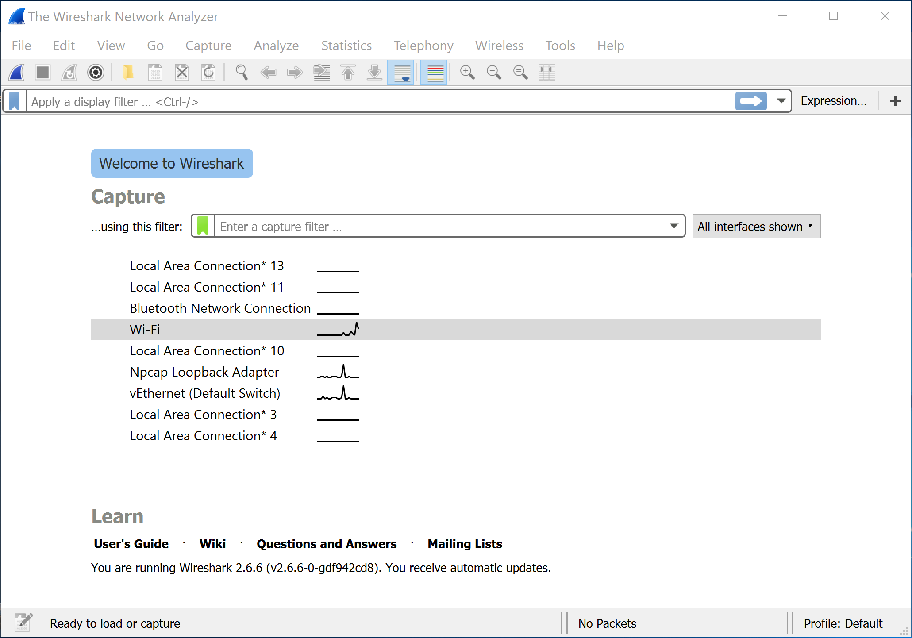

   Opening screen for Wireshark

Wireshark also displays a small graph that shows how much network
traffic is passing through each interface. Double-click the interface
from which you want to capture networking data. In :numref:`wireshark_start`, I've
selected the wireless Wi-Fi interface.

Wireshark may also show an interface labeled *Any*. In my experience,
information gets stripped off from packets captured with Any. Instead,
use the Wi-Fi to capture wireless packets or Local Area Connection for
wired connections.

Once you start capturing, Wireshark will collect data until you click
the stop button. It's best to capture for a short period of time (five
or so seconds), as capturing for longer will store hundreds or thousands
of packets, making it difficult to find the ones you're interested in.
You can filter packets with a Wireshark filter language, though this is
out of the scope of this book.

To test Wireshark's deciphering abilities, find an unencrypted web page
that starts with starts with *http* and not *https*, such as
`http://programarcadegames.com <http://programarcadegames.com>`_.
Start a capture in Wireshark, then
immediately load the web page in a browser and stop the capture. See if
you can use Wireshark to find the frames associated with the web page
download.

For example, take a look at :numref:`wireshark_dataframe`, in which I've used Wireshark to
find part of a web page.

.. _wireshark_dataframe:
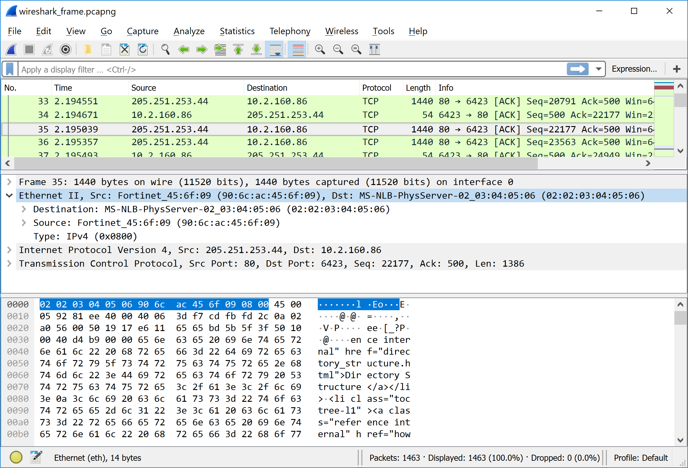

   Layer 2 data frame shown in Wireshark

The top third of the window is a list of every data frame, numbered in
the order it was received. In this example, I selected frame 35,
received 2.19 seconds after I started capturing.

The middle section of :numref:`wireshark_dataframe` allows the user to select what part of
the data frame to look at and helps decode it. Typically, you'll use
Ethernet II for Layer 2. After selecting Ethernet II, Wireshark will
highlight the Layer 2 parts of the data and decode each field.
(Wireshark also has lines for Layer 3 and Layer 4, which I'll describe
in later chapters.)

The bottom section lists the data in the packet. It gives each byte as a
two-digit hexadecimal number and attempts to decode it to text on the
far right. You can see the HTML for the web page there.

For now, concentrate on finding and identifying the information in the
Layer 2 Ethernet II section, specifically the MAC source and destination
addresses. In this section, you can see how often your computer is
receiving data; what data it is sending out; where that data is going;
and the content of that data.

Project: Finding the MAC Address
================================

Computers often have more than one network adapter. Raspberry Pi
computers, for example, typically have three: one for a wired network
connection, one for wireless network connections, and a third if the
computer needs to create a connection back to itself. These adapters are
officially known as *network interface cards (NICs)*. Often, network
adapters are built in, rather than separate cards.

Each network adapter has a default, distinctive Layer 2 MAC address set
by the manufacturer. Remember, this MAC address is an entirely different
address from the IP address. The MAC address gets us from one node
directly to another (Chapter 4). The IP address is used for routing
across multiple hops. You'll learn more about IP addresses in Chapter 6,
which discusses Layer 3.

If you're using macOS or Linux, open a terminal window and enter
``ifconfig`` to find details on your network adapters:

.. code-block:: text
   :caption: Running ``ifconfig`` on a Raspberry Pi
   :linenos:
   :emphasize-lines: 3, 21

   pi@raspberrypi:~ $ ifconfig
   eth0: flags=4099<UP,BROADCAST,MULTICAST>  mtu 1500
           ether b8:27:eb:28:42:66  txqueuelen 1000  (Ethernet)
           RX packets 0  bytes 0 (0.0 B)
           RX errors 0  dropped 0  overruns 0  frame 0
           TX packets 0  bytes 0 (0.0 B)
           TX errors 0  dropped 0 overruns 0  carrier 0  collisions 0

   lo: flags=73<UP,LOOPBACK,RUNNING>  mtu 65536
           inet 127.0.0.1  netmask 255.0.0.0
           inet6 ::1  prefixlen 128  scopeid 0x10<host>
           loop  txqueuelen 1000  (Local Loopback)
           RX packets 29  bytes 4572 (4.4 KiB)
           RX errors 0  dropped 0  overruns 0  frame 0
           TX packets 29  bytes 4572 (4.4 KiB)
           TX errors 0  dropped 0 overruns 0  carrier 0  collisions 0

   wlan0: flags=4163<UP,BROADCAST,RUNNING,MULTICAST>  mtu 1500
           inet 192.168.1.107  netmask 255.255.255.0  broadcast 192.168.1.255
           inet6 fe80::d1ea:5ebd:506e:5ed3  prefixlen 64  scopeid 0x20<link>
           ether b8:27:eb:7d:17:33  txqueuelen 1000  (Ethernet)
           RX packets 35656  bytes 6337537 (6.0 MiB)
           RX errors 0  dropped 0  overruns 0  frame 0
           TX packets 1014  bytes 101325 (98.9 KiB)
           TX errors 0  dropped 0 overruns 0  carrier 0  collisions 0

The MAC address of the wired connection eth0 is at ``b8:27:eb:28:42:66`` (line 3),
and the MAC address for the wireless ``wlan0`` connection is
``b8:27:eb:7d:17:33`` (line 21). Wired connections start with ``eth``, which is short
for Ethernet. For Linux, wireless connections start with wlan, short for
Wireless Local Area Network. The macOS wireless adapters start with ``en``.

The lo connector is a virtual adapter called the *loopback connector*.
It allows a computer to create a network connection with itself, which
can be useful in various scenarios; for example, if you have to run a
web server and connect to it with a web browser on the same computer.

On Windows, use the ipconfig command to find network information. By
default, ``ipconfig`` doesn't show all the information, so you need to add
the ``/all`` option:

.. code-block:: text
   :caption: Running ifconfig on a Windows machine
   :emphasize-lines: 16
   :linenos:

   C:\Users\craven>ipconfig /all

   Windows IP Configuration

      Host Name . . . . . . . . . . . . : livingroom-pc
      Primary Dns Suffix  . . . . . . . :
      Node Type . . . . . . . . . . . . : Hybrid
      IP Routing Enabled. . . . . . . . : No
      WINS Proxy Enabled. . . . . . . . : No
      DNS Suffix Search List. . . . . . : domain.actdsltmp

   Ethernet adapter Ethernet:

      Connection-specific DNS Suffix  . : domain.actdsltmp
      Description . . . . . . . . . . . : Realtek PCIe GBE Family Controller
      Physical Address. . . . . . . . . : 1C-6F-65-3E-6B-82
      DHCP Enabled. . . . . . . . . . . : Yes
      Autoconfiguration Enabled . . . . : Yes
      Link-local IPv6 Address . . . . . : fe80::b551:7120:2f3b:78c2%4(Preferred)
      IPv4 Address. . . . . . . . . . . : 192.168.0.4(Preferred)
      Subnet Mask . . . . . . . . . . . : 255.255.255.0
      Lease Obtained. . . . . . . . . . : Thursday, January 10, 2019 4:09:16 AM
      Lease Expires . . . . . . . . . . : Friday, January 11, 2019 4:09:16 AM
      Default Gateway . . . . . . . . . : 192.168.0.1
      DHCP Server . . . . . . . . . . . : 192.168.0.1
      DHCPv6 IAID . . . . . . . . . . . : 52195173
      DHCPv6 Client DUID. . . . . . . . : 00-01-00-01-1A-BA-AF-CA-1C-6F-65-3E-6B-82
      DNS Servers . . . . . . . . . . . : 192.168.0.1
                                          205.171.3.25
      NetBIOS over Tcpip. . . . . . . . : Enabled

Here you can see the MAC address is ``1C-6F-65-3E-6B-82`` (line 16). Much of the
other information listed is Layer 3 information, which we will cover in
Chapters 7 and 8.

Project: Change Your MAC Address
================================

The manufacturer sets your MAC address automatically. The local network
uses it to identify each computer uniquely—but that individuality can be
used to invade a person's privacy. By tracking one's MAC address, you
can keep tabs on when a person's phone is in range of a network, what
kind of phone or computer they have, and more.

If a MAC address changes each time it connects to a network, the network
can't use that address to track a person across connections. MAC
addresses also have built-in address ranges for each manufacturer, and
changing the address keeps a person from using the address to find what
kind of hardware you are using. You can even replace a network device
and have the new device use the old MAC address; the network can't tell
the device was replaced.

Linux, Windows, and Mac computers include programs to customize a MAC
address. However, there are rules for creating a valid MAC address. The
first byte must have a value other than zero, and it cannot end in a
binary zero. This means you should avoid starting your custom MAC
address with an odd number or 00. Try 02, 04, 06, 08, and so on. Odd
numbers are used for multi-cast addresses when the same data is
broadcast to multiple computers.

On Windows
----------
To change the MAC address on Windows, open the Control Panel, search for
View Network Connections, right-click your active network connection,
and select **Properties** (:numref:`open_network_properties`).

.. _open_network_properties:
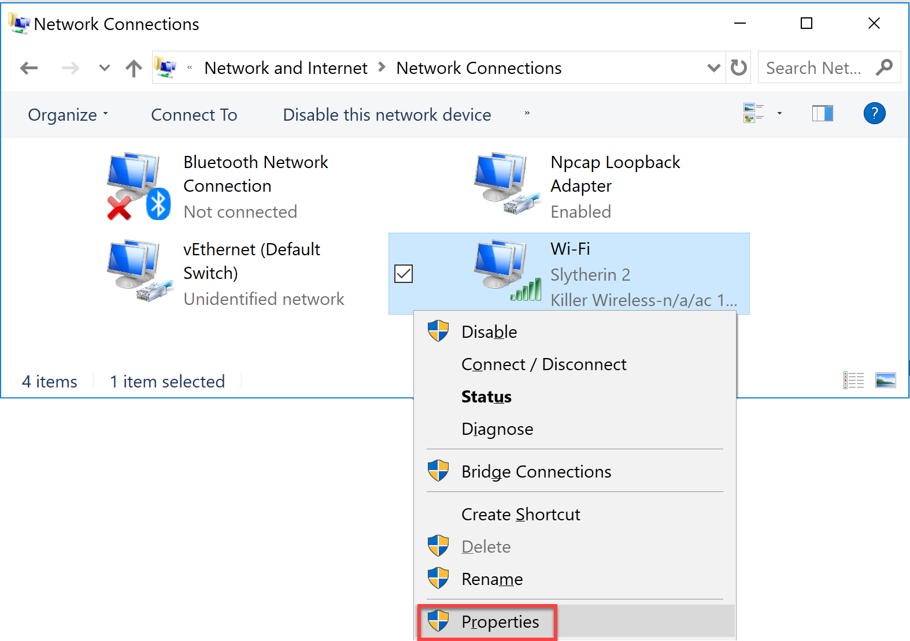

   Opening network properties

A list of different drivers that have hooks into your network connection
appears. Click the **Configure** button (see :numref:`wifi_properties`).

.. _wifi_properties:
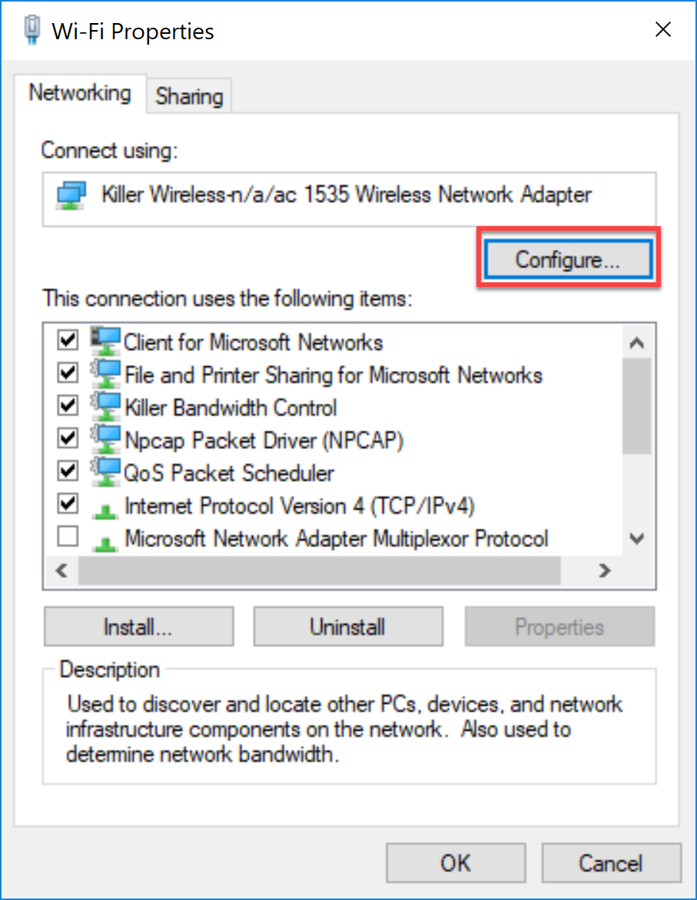

   Network adapter properties

Click the **Advanced** tab, select **Network Address** (:numref:`changing_mac`), and
click the radio button with an empty field next to it.

**NOTE** Depending on your computer's networking hardware, this might be
labeled differently. If there is no item available to change the network
address, the method described here won't work.

Type in your own six-byte address with no spaces, for example:
``AABBCCDDEEFF``.

.. _changing_mac:
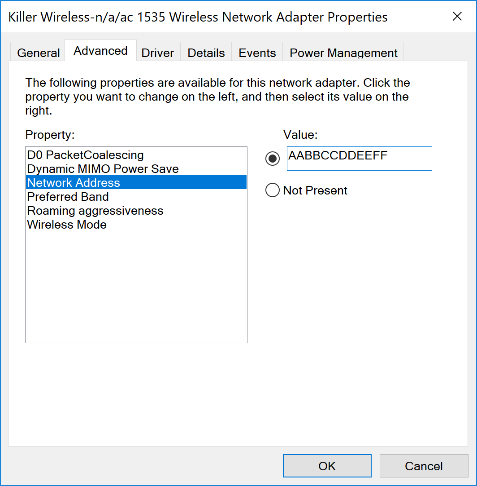

   Changing the MAC address

Click **OK**. Go back to the command prompt and type ``ipconfig /all``
to test. If the MAC address didn't change, make sure you started the
address with an even number, such as 02 or higher. Also try enabling and
disabling the interface, which can be done via the menu shown in
:numref:`open_network_properties`.

On macOS or Linux
-----------------

When you enter ifconfig on a Mac or Linux, the current network
configuration information appears and lists all interfaces. To change
the address we need to turn off the networking device by issuing a
"down" command, adjusting the address, then turn it back on with an "up"
command. To do this on Linux:

.. code-block:: text

   sudo ifconfig wlan0 down
   sudo ifconfig wlan0 hw ether AA:04:05:06:07:08
   sudo ifconfig wlan0 up

For macOS, the procedure is a bit different. Typically, en0 is the
device name instead of wlan0, and you don't need to add the hw
(hardware) parameter. Here are the steps for macOS:

.. code-block:: text

   sudo ifconfig en0 down
   sudo ifconfig en0 ether AA:04:05:06:07:08
   sudo ifconfig en0 up

.. note::

   You can do a lot with the ifconfig command; for example, to get
   its manual, type ``man ifconfig`` at the command line or search
   "man ifconfig"" on the internet.

Project: Sending Raw Ethernet Packets
=====================================

Let's try making our own Layer 2 data frame. We'll have one program send a
frame, and one receive it.

This is easiest on a Linux
computer like the Raspberry Pi since the development tools are built in.
We'll be doing this in the C language.

Sending Raw Packets
-------------------

The code to send a frame is available below:

.. _send_raw_ethernet:
.. literalinclude:: ../code_examples/send_raw_ethernet.c
   :language: c
   :linenos:
   :caption: send_raw_ethernet.c: C program to send a raw ethernet packet

This code can send raw Ethernet packets, and it allows you to set all
the bytes on what is sent out as a message. To run this code, simply
copy it and save it in a file on your computer. Note that C files should
end in ``.c``, so name this file ``send_raw_ethernet.c``. Spend some time
reading through the code and the comments to learn more about how it
works. You can adjust the program to specify the networking interface it
will send the message on. You can also update your destination MAC
address and the data to be sent.

Next, you have to translate the human readable C code to machine code
the computer can understand. This is done with a program called a
*compiler*. Enter ``gcc`` on the Raspberry Pi's command line to use the
GNU C Compiler (gcc). Give it the name of your input C language file,
and the name of the program you want it to output, such as send.

.. code-block:: text

   gcc send_raw_ethernet.c -o send

Check the output to make sure you do not have any errors, which could be
caused by not typing in the program correctly. If there are no errors,
the compiled program will be stored in the **send** file. The compiler
will not print anything if successful.

Running a C Program
-------------------

Normally, you can run a program by simply entering its name, such as
**send** in this case. However to access the networking hardware
directly like this program is, you need to request admin privileges by
using the **sudo** command. Anytime you run a program with admin
privileges, you also have to specify the directory it's in if not a
system directory. We can specify the current directory with a period.
Therefore, to request admin privileges, specify the current directory,
and run the program our command is:

.. code-block:: text

   sudo ./send

Running this command should send our own custom Ethernet data frame over
the network. To ensure this worked, use Wireshark to see the data frame
being transmitted by our program. Inspect the data that was sent, and
see how it compares with the data that the C program sent out. Update
your program to change the data, recompile it, and watch for the updated
data being sent.

Receiving Raw Packets
---------------------

To receive the packets we sent, look at :ref:`receive_raw_ethernet`.
You'll need to update this program with your computer's MAC address and
the name of the adapter you want it to use.

.. _receive_raw_ethernet:
.. literalinclude:: ../code_examples/receive_raw_ethernet.c
   :language: c
   :linenos:
   :caption: receive_raw_ethernet.c: C program to receive a raw ethernet packet

Just like the program to send packets, enter ``gcc`` on your Raspberry
Pi's command line to compile the program:

.. code-block:: text

   gcc receive_raw_ethernet.c -o receive

Once compiled, run the program with:

.. code-block:: text

   sudo ./receive

This program will receive data until you press ctrl-C to stop it. Run
the program that sends raw ethernet packets and see if you can get the
data to be received here. You can run the send program on a different
computer, or you can run it on the same computer if you don't have two
available computers.

Project: Using iperf3 to Test the Network Performance
=====================================================
Part of putting together a high-performance, reliable network is testing
it. By testing each link of a network connection, you can find the
weakest link to improve the network. If the network is running great,
you can prove it by showing measured numbers.

You can test network performance with the iperf3 tool, which will see
what network speeds you can achieve, how many packets are lost, and some
other parameters. The original iperf tool has been rewritten a few
times; iperf3 is currently the most popular re-write.

This experiment works best if you send and receive on different
computers. Using the same computer doesn't test the performance of any
networking.

Installing iperf3
-----------------

If you are using a Raspberry Pi or Linux computer, get iperf3 with the
command:

.. code-block:: text

   sudo apt-get install iperf3

If you're using Windows or Mac, you can download iperf3 from
`https://iperf.fr/iperf-download.php <https://iperf.fr/iperf-download.php>`_.
While iperf3 doesn't come with
easy-to-use installers for Windows or Mac, you can uncompress the files
into a directory, navigate to that directory via the command line, and
run the tool from there.

Setting Up the Server and Client
--------------------------------

Before you start using iperf3, designate one computer as the server and
another as the client; it doesn't matter which is which. On the server,
find the machine's IP address via the command line by entering
``ipconfig`` on Windows or ``ifconfig`` on Mac or Linux. Then start
iperf3 and use ``-s`` to signify it as the server:

.. code-block:: text

   iperf3 -s

On your client, start iperf3 with ``-c`` to tell iperf3 to run as a
client and enter the address of the server computer to which to connect.
For example:

.. code-block:: text

   iperf3 –c 192.168.1.12
   Connecting to host 192.168.1.12, port 5201
   [  4] local 192.168.1.4 port 61233 connected to 192.168.1.12 port 5201
   [ ID] Interval           Transfer     Bandwidth
   [  4]   0.00-1.00   sec  6.38 MBytes  53.4 Mbits/sec
   [  4]   1.00-2.00   sec  6.50 MBytes  54.6 Mbits/sec
   [  4]   2.00-3.00   sec  5.75 MBytes  48.2 Mbits/sec
   [  4]   3.00-4.00   sec  6.25 MBytes  52.4 Mbits/sec
   [  4]   4.00-5.00   sec  6.50 MBytes  54.6 Mbits/sec
   [  4]   5.00-6.00   sec  6.25 MBytes  52.4 Mbits/sec
   [  4]   6.00-7.00   sec  6.50 MBytes  54.5 Mbits/sec
   [  4]   7.00-8.00   sec  6.50 MBytes  54.5 Mbits/sec
   [  4]   8.00-9.00   sec  6.38 MBytes  53.5 Mbits/sec
   [  4]   9.00-10.00  sec  6.38 MBytes  53.5 Mbits/sec
   - - - - - - - - - - - - - - - - - - - - - - - - -
   [ ID] Interval           Transfer     Bandwidth
   [  4]   0.00-10.00  sec  63.4 MBytes  53.2 Mbits/sec                  sender
   [  4]   0.00-10.00  sec  63.4 MBytes  53.2 Mbits/sec                  receiver

   iperf Done.

Running iperf3
--------------

From the output, you can see that in the first second my computer was
able to transmit 6.38MB of data. There are 8 bits in a byte, so that is
51Mb of data. In addition to the data, there's also an inter-packet gap
and a header, which add additional overhead. If we include that, we're
sending information at a rate of 53.4 megabits. Compare the speed of a
wireless connection to a wired. If you're able, compare the speed of a
cheap computer like the Raspberry Pi to a faster notebook or desktop
computer.

To experiment, enter ``iperf3 --help`` for a list of all options:

.. code-block:: text

   iperf3 --help
   Usage: iperf [-s|-c host] [options]
          iperf [-h|--help] [-v|--version]

   Server or Client:
     -p, --port      #         server port to listen on/connect to
     -f, --format    [kmgKMG]  format to report: Kbits, Mbits, KBytes, Mbytes
   --snip--

One of these options is the ``-M`` option. Entering ``-M 90`` attempts to set
the TCP segment size to 90 bytes. This will split the same data across
more individual data frames. Since each frame has additional overhead in
bytes transmitted, it should increase the time it takes to send data.

``iperf3 –M 90 –c 192.168.1.12``

You can set ``-M`` from about 88 up. Going past 1,500 is normally pointless,
as Ethernet has a limit of 1,522 bytes per frame. Despite the request
from the software, the networking hardware might ignore the TCP segment
size request and buffer it to a larger segment, or split it into smaller
segments. Try setting it to small numbers to see if that impacts your
transfer speed. Use Wireshark to see whether it's changing the segment
size; if not, try combining it with the ``-N`` option, which should
immediately send the packet and not let it buffer. I've found that
setting the segment size does not change the throughput of data as much
as I expected, except for very low numbers.

Project: Tracing Bluetooth Connections with the Command Line
============================================================

While you can connect a Raspberry Pi to a Bluetooth device via the GUI,
connecting it from the command line can often speed up your work.

From the Raspberry Pi command line, enter the following to bring up the
Bluetooth control:

``bluetoothctl``

If you get a Command not found error, remember ctl is short for control,
and ends in the letter *l*, not the number *1*. You should get the
following prompt:

``[bluetooth]#``

Check that Bluetooth hardware is on with:

``power on``

Make sure the background software/agent process is running with:

``agent on``

Now Bluetooth is ready to scan and connect to other devices.

Connect from a Raspberry Pi to a Device
---------------------------------------

To search for nearby devices, enter:

``scan on``

You should see all your Bluetooth devices pop up with their MAC
addresses (shown on the screen next to the device name). We can *pair*
with a Bluetooth device, which will open a network connection to send
and receive data. Creating connections is a Layer 4 networking task
we'll cover further in Chapter 8. To pair a device, put it in pairing
mode and note its MAC address, then enter **connect** followed by the
MAC address:

.. code-block:: text

   connect AC:37:43:7D:A7:27

That's all that it takes! You might get disconnected right away by the
other device since you aren't sending it data that it expects, but
that's fine. We're just exploring to see what Bluetooth devices are near
you. Consider trying this project in a crowded area, like a school or
coffee shop, where there are a lot of nearby Bluetooth devices.

Connect from a Device to a Raspberry Pi
---------------------------------------

The prior example connected from your Raspberry Pi to another Bluetooth
device. Let's do the opposite. To create a connection from your
Bluetooth device to Raspberry Pi, enter the following to make your
Raspberry Pi discoverable:

.. code-block:: text

   discoverable on

This causes your Raspberry Pi to broadcast its name so other devices can
see it.

To make your Raspberry Pi open to accepting new connections, we also
need to make it pairable:

.. code-block:: text

   pairable on

In the list of paired devices on your phone, it will show up in with
your machine name—this is probably raspberrypi or similar. Using this
tool, you can get an idea of what Bluetooth devices are near you, even
if they aren't in pairing mode. You can also see how often they send
data. Sitting in my office at a college campus, I can easily see there
are 30 different devices near me.

Project: War Driving to Map Access Points
=========================================

In the early days of Wi-Fi, *war driving* (also called *access point
mapping*) referred to people who drove around their cities with a laptop
searching for SSIDs. It used to be common to have networks that didn't
require a password to access; now, thankfully, few networks are open
like that, but it is still interesting find out how many different
wireless networks there are in your area. By looking at the name of the
network, you can often figure out who has set up the access points. You
can do this war driving as well, and see what networks are in your
neighborhood.

Some smartphone apps make access point mapping easier than before. Apple
has banned many of the war driving apps for iPhone, so to try this task,
you'll need a laptop or an Android phone.

Download an app that can map access points. I recommend an Android app
called WiGLE WiFi :numref:`wigle_1`). For macOS, try MacStumbler, and try
either inSSIDer or NetSpot for PCs.

.. note::

   The app will scan even when you aren't looking at it. If you
   are driving, put the phone away! Be safe.

.. _wigle_1:
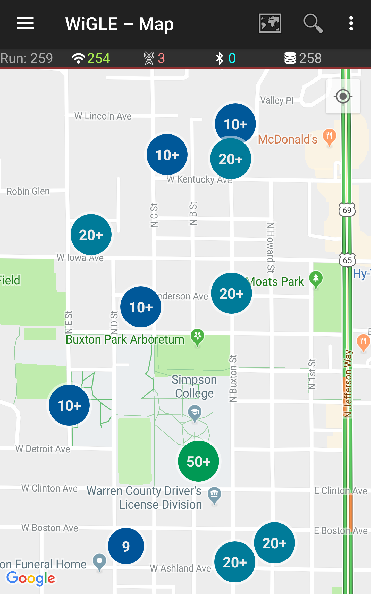

   WiGLE app on Android showing map view

Walk, bike, or drive around your area to map out the access points
(:numref:`wigle_2`). SSIDs will appear on your app's map, pinpointing all the
access points in the area, including open access points with no
security.

.. _wigle_2:
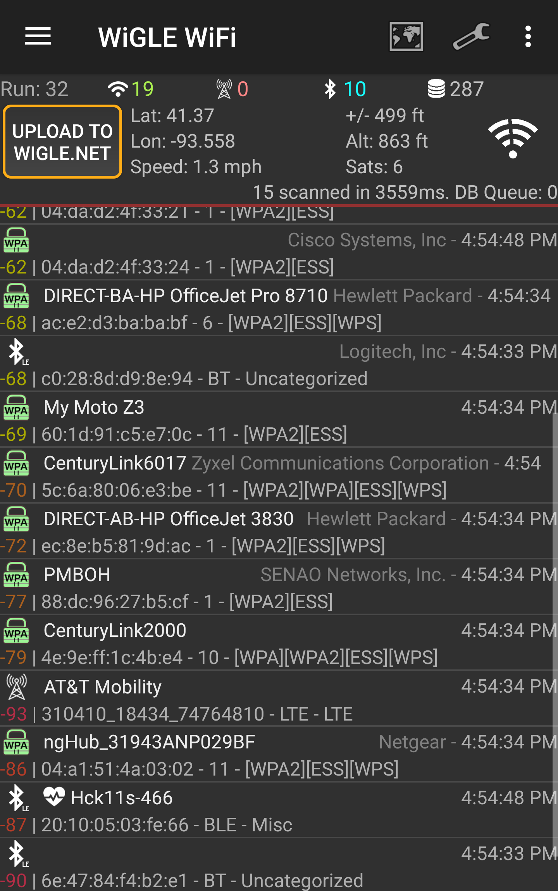

   WiGLE App on Android showing Bluetooth, Phone LTE, and Wi-Fi access
   points

With WiGLE, you can upload the Wi-Fi access points you find to the
public database at `https://wigle.net/ <https://wigle.net/>`_.
Even if you don't contribute to
that database, take a minute to look at its impressive worldwide heat
map of access points.

Project: Using ODB-II to Read Your Car's CAN-Bus
================================================

For this project, you will need an *ODB-II* (also called ODB2)
connector, which is a small device that lets you scan your car. These
connectors cost anywhere from $10 to $30. I suggest avoiding a Wi-Fi
connector because the setup process can be difficult. Bluetooth devices
work well with Android phones. If you have an iPhone, make sure it's
compatible with your ODB-II connector; iPhones work with some Bluetooth
devices, but not all.

.. note::

   The ODB-II scanner I used was the Veepeak OBD, and I also
   recommend the BLE OBD2 Bluetooth Scanner.

Next, download a program that reads ODB-II data. If you have an Android
phone or laptop, Torque Pro by Ian Hawkins works great. You can create
custom dials for monitoring the car's speed, RPM, and temperature; I've
done this with my car in :numref:`torque`. If you have a check engine light
on, these apps can read the diagnostic codes for you. If your car has a
display screen, you can use Android Auto or Apple CarPlay to display
additional information about your engine's performance.

.. _torque:
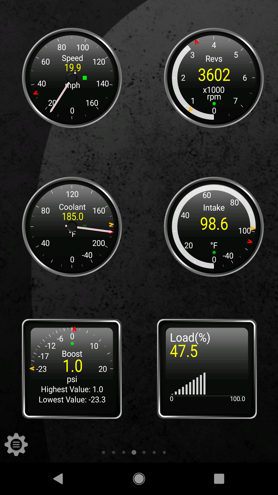

   Torque Pro app showing car data

If you don't want to use someone else's application to read car data,
and would rather program your own, you can get started using Python on
any operating system. Pair your Bluetooth ODB-II connector with the
computer and then start coding a new Python program. You'll need to
download the pyODB library
(`https://python-obd.readthedocs.io <https://python-obd.readthedocs.io>`_).
Their
main web page has detailed installation instructions, but in most cases,
you can simply type pip install obd in the command line.

A program to log how fast the car is going might look similar to
:ref:`pyodb`:

.. _pyodb:
.. code-block:: python
   :caption: Using the pyODB library
   :linenos:

   import obd
   import time

   connection = obd.OBD()
   cmd = obd.commands.SPEED
   while True:
       response = connection.query(cmd)
       print(response.value.to("mph"))
       time.sleep(1.0)

After importing the pyODB library and time, you'll create a connection
(line 4). Next, tell the car you want the reading for the speed (line 5). Then, query
the car (line 7) and print the result (line 8). Besides speed, you can pull data for
the engine RPM, engine temperature, distance travelled, voltage, fuel
level, accelerator pedal position, and more. For a full list, check out
`https://python-obd.readthedocs.io/en/latest/Command%20Tables/ <https://python-obd.readthedocs.io/en/latest/Command%20Tables/>`_.

By writing your own program, you can combine this with other data. For
example, you might use GPS data and car speed to warn you if you're
traveling too fast near a speed camera. You can also use data to get
more performance out of your car.

While the ODB-II device we have only reads data, some cars can use the
connection to modify engine parameters. Devices like COBB Tuning's
Accessport allows high-performance cars to be "tuned" this way to put
out more power, but there's a risk that a tune can impact emissions, gas
consumption, or even damage the engine.

Project: Create Your Own RFID Tags Using Near Field Communication
=================================================================

*Near Field Communication (NFC)* technology, a subset of Radio Frequency
Identification (RFID), has been around for a while, but it hasn't really
taken off due to a lack of popularity and unique features. However, it's
a great and cheap way to learn about the larger world of RFID. NFC
allows two devices to communicate within about 1 inch of each other. In
fact, one device can simply be a sticker with embedded circuitry.
Nintendo uses NFC tags with the physical Amiibo figurines it sells. Each
one has an NFC tag in it that can be waved over the Switch controller to
receive special characters or free in-game items. NFC tags can also make
it easy for a person to wave a phone over a tag and automatically go to
a website, much like QR codes.

For this project, you'll need an Android or iPhone. You can find
different NFC tags to buy online. I used an NFC tag that comes in the
form of a sticker from Adafruit
(`https://www.adafruit.com/product/362 <https://www.adafruit.com/product/362>`_).

Each phone that supports NFC is a bit different. Some phones have NFC
detection turned off by default. Before using NFC on Android, you may
need to enable it.

For Android on Google phones:

1. Open Settings
2. Select **Connected Devices**
3. Select **Connection Preferences**
4. Turn NFC to **On**

For Android on Samsung Phones:

1. Open Settings
2. Select **Connections**
3. Turn on NFC and Payment option

You can use an app like NFC Tools to program an NFC tag. NFC Tools can
both read and write tags. To write a tag, select the **Write** tab at
the top as shown in :numref:`nfc`. Next, create one or more records that
will hold your data. The record can contain data like contact
information, a video link, a small file, an email contact, an SMS
number, or even a GPS location.

.. _nfc:
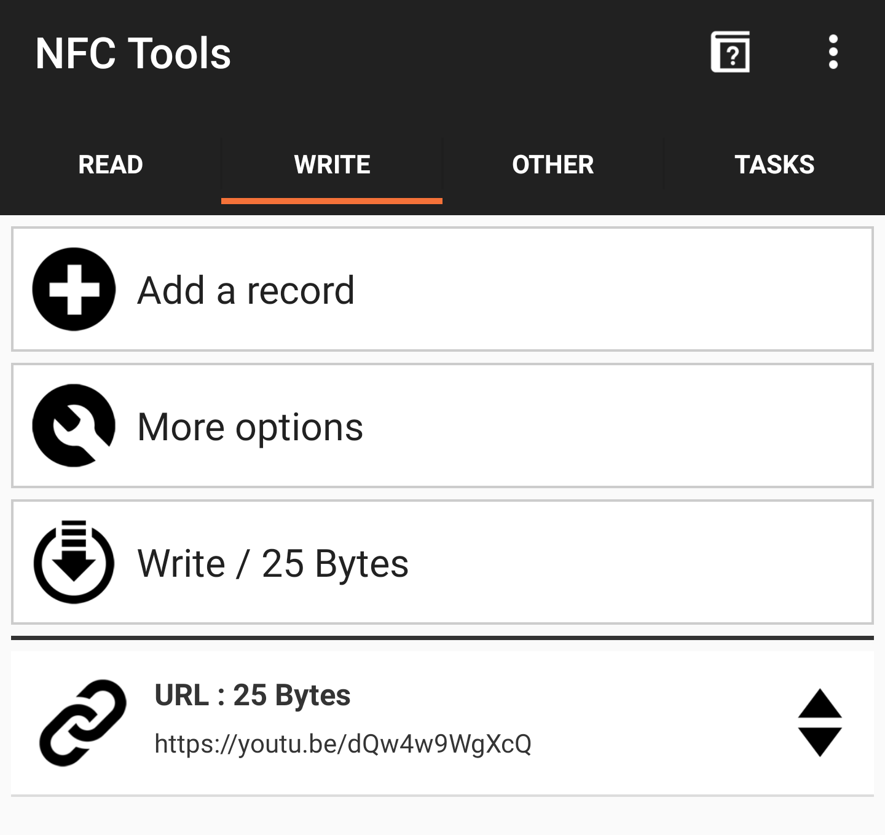

   Using NFC Tools to write to an NFC tag

Click **Add a Record** then select the type of record—I suggest starting
with URL. You should be prompted to enter a web address. After doing
this, click **Write**, unlock your phone, and hold the NFC tag up to it.
It should ask if you want to follow the web link, similar to scanning a
QR code.

Try some of the other record types to share contact information, open a
map to a location, add a social media link, add a phone or SMS number,
or even auto-hook up to Wi-Fi. The steps are the same as for the URL,
just select a different type of record for those actions. For a more
ambitious project, you can embed the NFC tag into a "magic wand" and use
a reader and servo to automatically open a box when you wave the wand.
There are many fun, simple projects you can do with NFC tags.

Project: Read and Control Electronics With I\ :sup:`2`\ C
=========================================================

Have you ever wanted to drive your own LED clock display, control color
LEDs, or read sensor data, like temperature? In this project, we'll use
the inter-integrated Circuit (I\ :sup:`2`\ C) protocol we learned about
in Chapter 4 that lets circuits communicate with each other. We can use
I\ :sup:`2`\ C to make Raspberry Pi communicate with other electronics,
such as sensors or displays. For this project, let's read the current
temperature and output it on an OLED display. You'll need a Raspberry
Pi, a SHIM, a temperature sensor, an OLED display, and a couple Qwiic
cables.

I used the following products:

-  STEMMA QT/Qwiic 4-pin cable:`https://www.adafruit.com/product/4210 <https://www.adafruit.com/product/4210>`_

-  SparkFun Qwiic or Stemma QT SHIM for Raspberry Pi:
   `https://www.adafruit.com/product/4463 <https://www.adafruit.com/product/4463>`_

-  Monochrome 1.3" 128×64 OLED graphic display STEMMA QT/Qwiic:
   `https://www.adafruit.com/product/938 <https://www.adafruit.com/product/938>`_

-  AHT20 Temperature & Humidity Sensor STEMMA QT/Qwiic:
   `https://www.adafruit.com/product/4566 <https://www.adafruit.com/product/4566>`_

The I\ :sup:`2`\ C protocol isn't set up or turned on by default on the
Raspberry Pi. To install I\ :sup:`2`\ C tools and some Python libraries,
enter the commands in :numref:`setup_i2c` at the command prompt.

.. _setup_i2c:
.. codel:block:: text

   sudo apt-get update
   sudo apt-get install -y i2c-tools build-essential python-smbus
   sudo apt-get install –y python-dev python-pip
   sudo apt-get install -y python-pil python-imaging
   pip3 install adafruit-circuitpython-ahtx0
   pip3 install adafruit-circuitpython-ssd1306

Installing i2c tools
--------------------
After you install the tools, you need to turn on I\ :sup:`2`\ C:

1. Enter ``sudo raspi-config`` to access the configuration tool.
2. Select **Interfacing Options** in the configuration tool, followed by
   **I2C**.
3. Select **Yes** to enable the I\ :sup:`2`\ C interface and **Yes** to
   load it by default on boot.
4. Reboot your computer.

Wiring is rather easy. While some I\ :sup:`2`\ C devices require
soldering, these don't. First, Place the SHIM on your Raspberry Pi (see
:numref:`shim`).

.. _shim:
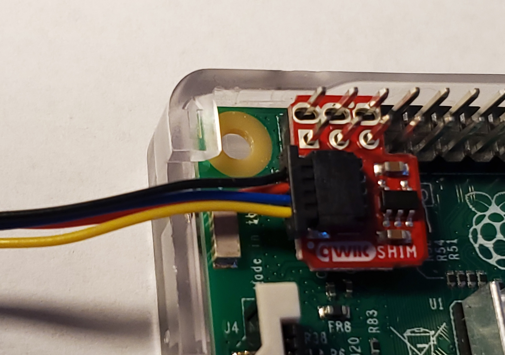

   Installing a SHIM on a Raspberry Pi

Then use a Qwiic cable to connect from the SHIM to the AHT20 temperature
sensor (see :numref:`aht20`).

.. _aht20:
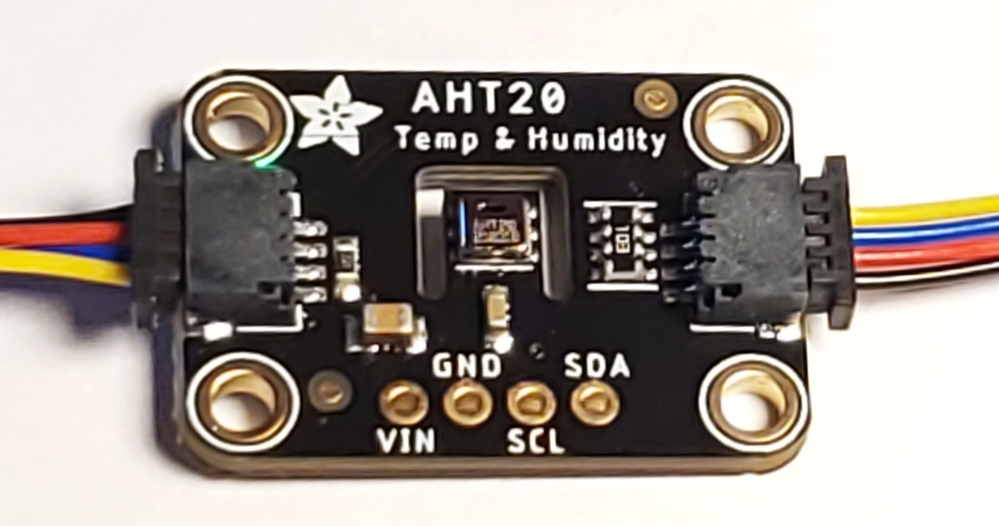

   Connecting the AHT20 Temperature Sensor

Next, plug the sensor into the OLED display (see :numref:`oled`).

.. _oled:
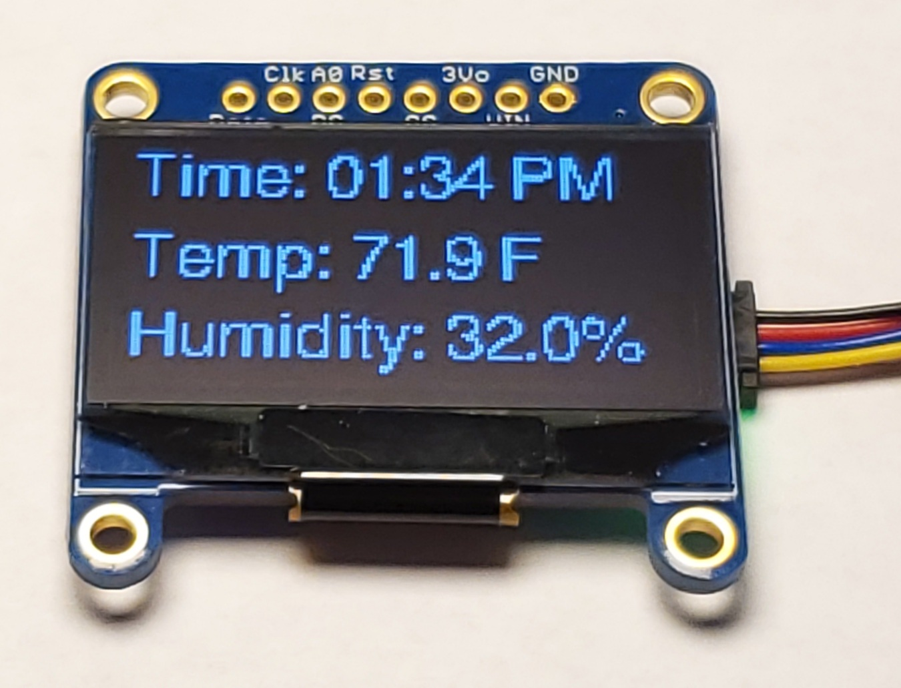

   Connecting the OLED Display

After you reboot, enter the command in :numref:`i2cdetect` to see what comes up:

.. _i2cdetect:
.. code-block:: text
   :caption: Detecting I\ :sup:`2`\ C devices with i2cdetect command

   sudo i2cdetect -y 1
        0  1  2  3  4  5  6  7  8  9  a  b  c  d  e  f
   00:                         -- -- -- -- -- -- -- --
   10: -- -- -- -- -- -- -- -- -- -- -- -- -- -- -- --
   20: -- -- -- -- -- -- -- -- -- -- -- -- -- -- -- --
   30: -- -- -- -- -- -- -- -- 38 -- -- -- -- 3d -- --
   40: -- -- -- -- -- -- -- -- -- -- -- -- -- -- -- --
   50: -- -- -- -- -- -- -- -- -- -- -- -- -- -- -- --
   60: -- -- -- -- -- -- -- -- -- -- -- -- -- -- -- --
   70: -- -- -- -- -- -- -- --

You should see two devices, with the hex addresses of 0x38 and 0x3d. If
nothing comes up, recheck your connections.

With that working, let's write some code that will display the current
temperature and humidity, as shown in :numref:`i2c_temp`.

.. _i2c_temp:
.. literalinclude:: ../code_examples/i2c_temp.py
   :language: python
   :linenos:
   :caption: i2c_temp.py: Reading temperature and humidity

First, we initialize and start I\ :sup:`2`\ C on the computer (line 18). Then,
we open a connection to our temperature sensor (line 19). Next, we get our
temperature and humidity sensor readings (line 33). If you are in the U.S., you
might want to convert the default Celsius to Fahrenheit (line 25). The code
loops and displays the sensor readings every two seconds.

Once that is working, write some code to try out the OLED display, as
shown in :numref:`i2c_oled`.

.. _i2c_oled:
.. literalinclude:: ../code_examples/i2c_oled.py
   :language: python
   :linenos:
   :caption: i2c_oled.py: "Hello World" on an OLED screen

First, a function sets up I\ :sup:`2`\ C and opens a communications
channel to the OLED display (lines 27-39). It returns a class that will manage
commands to the display. Next, the create_image function (line 44) creates an
image to display. It uses the Python Pillow library to create the image
(line 48), clear it to white (lines 53-55), create a black inset rectangle (lines 57-62), and then draw
the centered text (lines 64-71). Finally, we can take that image and display it (line 90).

With these two listings, see if you can write a program that will read
in the temperature and humidity, then display it on the OLED screen.
Example code is available at
`https://github.com/pvcraven/networking_down_under/blob/master/i2c_temp_oled.py <https://github.com/pvcraven/networking_down_under/blob/master/i2c_temp_oled.py>`_.

Summary
=======
In this chapter you learned to run Wireshark to capture network packets.
You learned how to get and change your Layer 2 MAC address. You sent raw
Ethernet packets over the network, and then used iperf3 to test how fast
you can send and receive data over a network connection. You also looked
at scanning and connecting with Bluetooth. Finally, you used the
I\ :sup:`2`\ C to read sensor data and output it via a small OLED
display. You covered a lot of ground on how to pass data directly from
one node to another. In the next two chapters, you'll learn how to build
on this with Layer 3 and route data across a network of nodes. With
Layer 3 you'll no longer be limited to just point-to-point
communications.
