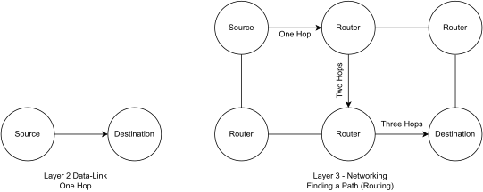
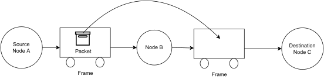
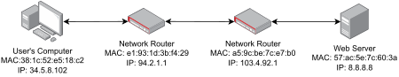
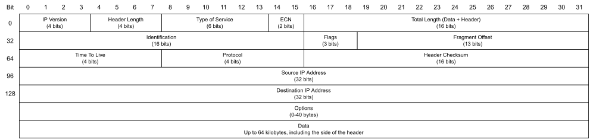
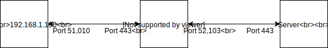

Theory: Networking Layer
************************

It isn't practical to create direct connections between each computer in
the world, so instead we've created a web of interconnected computers
and nodes. We can get our data anywhere on the network by using
intermediary nodes to pass the data. Those nodes act as relay points,
moving the data closer towards the intended destination. The *networking
layer*, also known as Layer 3, is responsible for figuring out how to
route data to the final destination.

In this chapter, you'll learn how the internet can manage to route data
anywhere in the world; this process starts with packets, the fundamental
container of data that moves around the internet. These packets have
their own addresses which differ from the MAC addresses we discussed in
:ref:`chapter_04` and :ref:`chapter_05`. As computers can run multiple programs we'll show how
to send data not just to the right computer, but also the right program.
We'll show how networks are divided into smaller subnetworks and how
data is routed between them. There are important protocols at this
layer, such as the protocol to translate domain names like ``wikipedia.org``
to a network addresses, and a protocol that will automatically set up
your computer for the network as soon as you connect. We'll also talk
about how firewalls work to help secure networks.

Packets
=======

A Layer 3 *packet* is a chunk of data that goes inside the payload area
of a Layer 2 frame. While Layer 2 moves data from
directly from one node to another, at Layer 3 we use a packet to move
across multiple *hops* to deliver data to its final destination. Each
time we transmit our data from one node to another, we add one hop to
our path. As an example, :ref:`2_vs_3` shows where the source is not
directly connected to the destination, and data travel through two
intermediary nodes for a total of three hops.

.. _2_vs_3:

   Data link (Layer 2) vs. networking layer (Layer 3)

We still need Layer 2 data frames to move our Layer 3 packets. To do
this, the packet goes inside the payload area of the data frame. In the
example shown in Figure 6-2, packet starts at of Node A and wants to go
to Node C. The network doesn't have a direct connection from Node A to
Node C, so we need some way to carry the data there. A Layer 2 frame
first carries the packet from Node A to Node B. Then Node B will examine
the packet, and copy it into a new data frame that will go from Node B
to Node C.

.. _packets_in_frames:

   Using frames to move packets

There doesn't have to be a one-to-one mapping of packets to frames. If
the packet is too large, you can break it up and move it using multiple
frames.

How do we know if a packet has arrived at its destination successfully?
Once received, the receiving node sends a special packet called an
*acknowledgement (ACK)* is sent back to the sender. If a packet is
dropped or corrupted a *negative acknowledgement (NACK)* is sent back.

A *datagram* is also a chunk of data at Layer 3. Unlike a packet, the
datagram's receiver doesn't send back an ACK or NACK. This is useful in
streaming live audio or video where if there's an error, we don't
resend, we just keep going.

With the creation of the internet, it was crucial to agree on the same
standard for formatting and using packets. We developed the standard,
TCP/IP, through a process called request for comments (RFC), which is a
publication managed by the Internet Engineering Task Force (IETF) used
to set technical standards for the internet. The RFCs are open, and
anyone can read and use them to create applications that move email,
files, web pages, and more. The official list of RFCs is available at
`https://tools.ietf.org/rfc/index <https://tools.ietf.org/rfc/index>`_.
There's even a standard for moving
data with carrier pigeons (RFC 1149)!

Understanding TCP/IP
====================

TCP/IP is a set of protocols used to move data across the Internet. It
stands for *Transmission Control Protocol*/*Internet Protocol*, and
there's a third protocol as well: the *User Datagram Protocol (UDP)*.
The IP mostly covers Layer 3, and TCP/UDP target Layer 4.

Internet Protocol Addresses
---------------------------

IP addresses identify source and destination nodes; these are different
from MAC addresses, which are concerned with only one hop at a time,
rather than routing across multiple hops. The IP address uniquely
identifies each computer on a network at Layer 3, while the MAC address
is tied to your hardware. If you move your laptop from one network to
another, your IP address will change but your MAC address stays
constant. Each network gets a set of IP addresses that route to it. If
you use the same IP address in a different network, your data won't
route back to you.

.. _ip_addressing:

   Layer 2 MAC addresses and Layer 3 IP addresses

In :numref:`ip_addressing`, we see that each node has two addresses. A Layer 2 MAC
address and a Layer 3 IP address. Both are needed. The IP address is
used to route across multiple hops to get from the user's computer to
the web server. The MAC address is only concerned about one hop at a
time.

Two versions of IP addresses are in use today, with Version 4 (IPv4)
being the most common, though IPv6 is slowly starting to become the new
standard. IPv4 stores each computer's IP address in four byte values
separated by periods, such as ``192.168.1.100``.

A major hurdle for IPv4 addresses going forward is the lack of available
addresses; there simply aren't enough TCP/IP addresses to support all
the network devices out there. With IPv4, there are only 4 billion
possible addresses; while this may seem like a lot, there are over 7
billion people in the world, many with multiple devices Each device
needs its own IP address. While technologies like NAT (explained later)
have prolonged the use of IPv4 addresses by grouping multiple IP
addresses together, the new IPv6 allows 16-byte addresses divided into
eight groups of numbers represented in hexadecimal as
``2a04:4e42:0400:0000:0000:0000:0000:0323``.

.. note::

   Leading zeros can be omitted when writing out IP addresses. If
   all four digits are zero, the entire number can be dropped. Multiple
   sets of ``:0000:0000:`` can be shortened to ``::``, so the same address above
   can be written in a shorter form as ``2a04:4e42:400::323``.

Binary scales exponentially, so expanding from 4-byte to 16-byte
addresses means we now have 2\ :sup:`128` addresses—enough that each
atom on earth can have its own address.

Internet Protocol (IP)
----------------------
IP addresses are part of the larger Layer 3 *Internet Protocol (IP)*.
The IP adds the following data fields for routing a packet to its final
destination:

You don't have to establish a connection before sending data.

If you want to send data longer than the maximum size of the packet,
there's no mechanism to split up the data.

If the data doesn't arrive, there's no mechanism to request the data be
sent again or to check that it was received.

IP *does not* have any way to route data between software programs on
the computer. Because of this, one rarely uses plain IP.

Routing protocols like IP have a mechanism that manages packets that get
"lost" on the network. A ring of routers that can't find a home for a
packet might pass it round forever. These packets would congest the
network, eventually preventing it from working. To avoid this problem,
the originating node sets a *Time to Live* *(TTL)* field in the packet.
For each router the packet passes through, that number decreases by one.
If the counter runs down to zero, the packet is tossed.

A basic IP packet header has 160 bytes. Take a look at :numref:`ip_packet_format`, which
shows how each packet is formatted. Each row of the table shows 32 bits
of data (4 bytes). For example, the first four bits (numbered 0-3) are
the IP version, bits 4-7 hold the length of the header. Starting at the
32\ :sup:`nd` bit on the second row, we have the identification field.

.. _ip_packet_format:

   IP Packet Format

In more detail, the packet contains:

- *IP Version*:
  The first four bits of a packet. The number 4 (in binary 0100) is IPv4.
  The number 6 (in binary 0110) is used for IPv6.
- *Header Length*:
  The length of the header (not the data) in 32-bit chunks. The minimum is
  5, which is 160 bits (20 bytes). If there are options added, this might
  be longer.
- *Diff(erentiated) Services*:
  This is sometimes used for streaming or voiceover IP. When not used,
  it's filled with zeros.
- *Explicit Traffic Congestion Notification (ECN)*:
  This flag can prevent the dropping of specific packets on congested
  networks *if* all the intervening nodes support it. Normally, it's
  filled with zeros.
- *Total Length*:
  This is the total length of the packet, including data. The minimum is
  20 bytes (the header), and the maximum is 64k. Ethernet limits the data
  payload of a Layer 2 frame to 1,500 bytes, so packets greater than that
  will have to be fragmented.
- *Identification*:
  If a large Layer 3 packet goes onto a Layer 2 protocol that can't
  support packets of that size, the packet must be fragmented into smaller
  parts. For example, Ethernet only supports data frames that hold 1,500
  bytes of data. If our packet is 2,000 bytes, then we'll need to split it
  into a 1,500 byte data frame and a 500 byte data frame. Each part of the
  fragmented packet will contain the same unique identifying number in
  this field so the receiving computer knows they go together. If the
  packet isn't fragmented, the field is filled with zeros.
- *Flags*:
  This is a three bit field. The first bit is not used for anything, and
  must always be zero. The second bit determines whether the packet can be
  fragmented into multiple parts by Layer 2. If it can't be fragmented,
  and Layer 2 doesn't hold enough data for the packet, the packet will be
  dropped. The third bit is set if the packet is fragmented, and there are
  more parts coming.
- *Fragment Offset*:
  If the packet is fragmented, this field helps reassemble it in the
  correct order. If the packet isn't fragmented, or if it is the first
  part of the packet, this field is filled with zeros.
- *Time to Live (TTL)*:
  8 bits for a maximum hop count of 256.
- *Protocol*:
  8 bits for which IP protocol is being used. For example, ``0x06`` is TCP and
  ``0x11`` is UDP.
- *Header Checksum*:
  16 bits used to see if the header is valid. This is optional, and can be
  set to zeros if not used.
- *Source*:
  IP address of the packet's original source.
- *Destination*:
  IP address of the packet's final destination.
- *Options / Padding*:
  Depending on the protocol used and the header length set, there may be
  optional information. This field is rarely used or even supported with
  modern equipment. Its original intent was to allow a packet to specify
  or record its route across the network.

We rarely use a plain IP packet by itself; in fact, you must be an
administrator on your machine to have permission to send or receive raw
IP packets. Typically, we use a plain IP packet as a base in Layer 3 and
add additional information at Layer 4 to form TCP or UDP packets. Both
of these add support for *networking ports*, which we'll start
discussing in this chapter (we'll delve more deeply into networking
ports in Chapters 8 and 9).

Reserved IP Addresses
---------------------
Not all IP addresses are used for computers on the open internet. Some
are reserved for special purposes. The local loop-back link, private
subnets, and disconnected computers each have their own special sets of
IP addresses.

The local loop-back link is used anytime you want to create a network
connection back to your own computer. This address, ``127.0.0.1``, is called
*localhost* and is considered your "home" address.

If you type ``127.0.0.1`` or localhost in your web browser, it will check
whether you have a web server running on your computer and pull web
pages from that. Computers will always have this home address for local
loop-back connections. A networked computer will have additional
addresses to move data between other computers.

Sometimes you might want to create private networks where not every
computer on the network is directly reachable on the internet. This is
how administrators typically set up computers for local users; it's part
of NAT (Network Address Translation), which we'll later in this chapter.
Any computer with NAT IP addresses can't be directly accessed on the
internet without first going through an intermediary node.

It is possible to have a computer not hooked to any network at all, but
your computer can still get an IP address! When you don't have an
outside link, your computer uses a local link connection. A laptop that
doesn't have a Wi-Fi connection may have an address in the range
``169.254.0.0`` to ``169.254.255.255``.

*Multicast addresses* send the same packet to multiple destinations.
These addresses are used in protocols for routing, advertising
availability of a resource (like a printer), and sending out a time for
all the machines to set their clock to. For example, you can send one
packet that states, "It is 10AM" and all 100 computers in your network
can pick up that same packet. That's better than sending 100 copies of
the same thing. Certain addresses are standardized for use with
particular protocols. Multicast addresses are any address in the range
``224.0.0.0`` to ``239.255.255.255``.

Any IP address ending in .255 is a *broadcast address*, although it
could end with another number. Broadcast addresses are similar to
multicast addresses in that they send the same packet to multiple
computers. Exactly what the broadcast address is depends on the netmask,
which we will discuss in the next section. By convention, addresses
ending in ``.1`` are usually a gateway/router. This isn't a requirement, but
most people follow this convention.

Aside from these ranges, other blocks of IP addresses (aside from the
private subnets, discussed below) are owned by the Autonomous System it
is assigned to; all IP addresses are owned by someone. We'll talk more
about Autonomous Systems later in the chapter.

Subnets and Netmasks
^^^^^^^^^^^^^^^^^^^^

Networks are divided into *subnets* as a quick way to group IP addresses
to see who owns an address and where it is located. The subnet a node
connects to is its *local subnet*. This local subnet and the other nodes
on that same subnet are the node's local area network (LAN). Talking
with any local computers means using a switch or a hub instead of
multiple hops. Any computers or networks outside the local area network
are considered to be in the wide area network (WAN).

How do you figure out what computers are local? It depends on their IP
address and a *netmask*, sometimes called *subnet mask*. For example,
you may have 254 computers on the local subnet numbered ``192.168.1.0`` to
``192.168.1.255``. Why 254 instead of 256? The first address in the range
(``192.168.1.0``) is the network address, used to identify the network as a
whole while routing. That can't be used as an address for a computer.
The last address (``192.168.1.255``) in a sequence is the broadcast address.
Every computer listens to that address. That leaves 254 addresses. To
find whether an address is local, check the netmask to see what part is
local and what part is routing, splitting the IP address into a network
prefix and a host portion.

:ref:`subnet_mask` shows an example computer's IP address both in binary and
decimal.

.. _subnet_mask:
.. code-block:: text
    :caption: Subnet Mask

    What           Binary form                         Dot-decimal notation
    IP address     11000000.10101000.00000101.10000010 192.168.  5.130
    Subnet mask    11111111.11111111.11111111.00000000 255.255.255.  0
    Network prefix 11000000.10101000.00000101.00000000 192.168.  5.  0
    Host part      00000000.00000000.00000000.10000010   0.  0.  0.130

The subnet mask is shown on the next line. The part of the IP address
that lines up with the 1s of the subnet mask makes up the network
prefix. The part of the IP address that lines up with the 0s of the
subnet mask makes up the host portion of the address. The more 1s that
are part of the subnet mask, the more network domains you can have. The
fewer 1s, the more local computers can be in our networking block.

We often show a subnet's routing properties using the *classless
inter-domain routing* (CIDR) form. Following the CIDR model, the subnet
above would be ``192.168.5.0/24``, where the ``192.168.5`` is the network
prefix. The ``24`` comes from the fact there are 24 1s in binary form of the
subnet mask, ``255.255.255.0``. (``255`` is ``1111 1111`` in binary.)

Table 6-2 shows different CIDR values and how they relate. For example,
192.0.0.0/8 would have the first eight bits be one, making a netmask of
255.0.0.0. The last 24 bits of the address would be for local computers,
leaving 2\ :sup:`24` (16,777,216) different numbers that could be
assigned to local nodes in your network. Remember, two of these
addresses are reserved. The address ending in binary zeros (192.0.0.0)
is used to identify the network as a whole, and the address ending in
binary ones (192.255.255.255) is reserved for broadcast.

CIDR Form

+-------+--------------+--------------------+-------------------------+
| CIDR  | Nodes        | Usable Nodes       | Netmask                 |
+=======+==============+====================+=========================+
| /8    | 16777216     | 16777214           | 255.0.0.0               |
+-------+--------------+--------------------+-------------------------+
| /9    | 8388608      | 8388606            | 255.128.0.0             |
+-------+--------------+--------------------+-------------------------+
| /10   | 4194304      | 4194302            | 255.192.0.0             |
+-------+--------------+--------------------+-------------------------+
| /11   | 2097152      | 2097150            | 255.224.0.0             |
+-------+--------------+--------------------+-------------------------+
| /12   | 1048576      | 1048574            | 255.240.0.0             |
+-------+--------------+--------------------+-------------------------+
| /13   | 524288       | 524286             | 255.248.0.0             |
+-------+--------------+--------------------+-------------------------+
| /14   | 262144       | 262142             | 255.252.0.0             |
+-------+--------------+--------------------+-------------------------+
| /15   | 131072       | 131070             | 255.254.0.0             |
+-------+--------------+--------------------+-------------------------+
| /16   | 65536        | 65534              | 255.255.0.0             |
+-------+--------------+--------------------+-------------------------+
| /17   | 32768        | 32766              | 255.255.128.0           |
+-------+--------------+--------------------+-------------------------+
| /18   | 16384        | 16382              | 255.255.192.0           |
+-------+--------------+--------------------+-------------------------+
| /19   | 8192         | 8190               | 255.255.224.0           |
+-------+--------------+--------------------+-------------------------+
| /20   | 4096         | 4094               | 255.255.240.0           |
+-------+--------------+--------------------+-------------------------+
| /21   | 2048         | 2046               | 255.255.248.0           |
+-------+--------------+--------------------+-------------------------+
| /22   | 1024         | 1022               | 255.255.252.0           |
+-------+--------------+--------------------+-------------------------+
| /23   | 512          | 510                | 255.255.254.0           |
+-------+--------------+--------------------+-------------------------+
| /24   | 256          | 254                | 255.255.255.0           |
+-------+--------------+--------------------+-------------------------+
| /25   | 128          | 126                | 255.255.255.128         |
+-------+--------------+--------------------+-------------------------+
| /26   | 64           | 62                 | 255.255.255.192         |
+-------+--------------+--------------------+-------------------------+
| /27   | 32           | 30                 | 255.255.255.224         |
+-------+--------------+--------------------+-------------------------+
| /28   | 16           | 14                 | 255.255.255.240         |
+-------+--------------+--------------------+-------------------------+
| /29   | 8            | 6                  | 255.255.255.248         |
+-------+--------------+--------------------+-------------------------+
| /30   | 4            | 2                  | 255.255.255.252         |
+-------+--------------+--------------------+-------------------------+

How do you know what IP addresses you can set a node/computer on a
subnet? First, take the gateway's IP address as shown in Table 6-3. Then
take the subnet mask and do a bitwise *and* with it. What is left over
is the network address. Everything not covered in 1s can be changed. In
Table 6-3's example, there are eight 0s in the netmask, so computers can
be numbered from 1 to 254 (Binary 0000 0001 to 1111 1110). Valid IP
addresses for that subnet go from 192.168.3.1 up to 192.168.3.254. The
CIDR is 192.168.3.0/24 as there are 24 1s in the netmask.

CIDR Form

+----------------------+----------------------+-----------------------+
| Gateway address      | 192.168.3.1          | 11000000.10101        |
|                      |                      | 000.00000011.00000001 |
+======================+======================+=======================+
| Netmask              | 255.255.255.0        | 11111111.11111        |
|                      |                      | 111.11111111.00000000 |
+----------------------+----------------------+-----------------------+
| Network Address      | 192.168.3.0          | 11000000.10101        |
|                      |                      | 000.00000011.00000000 |
+----------------------+----------------------+-----------------------+

Table 6-4 shows a more complex example where the netmask doesn't fall
right on the byte boundaries. 10.1.21.16 is the network address,
10.1.21.31 is the broadcast address, and 10.1.21.17 to 10.1.21.30 are
valid IP addresses for nodes on the subnet.

CIDR Form

+-------------------+--------------------+-----------------------------+
| Gateway address   | 10.1.21.17         | 00001010                    |
|                   |                    | .00000001.00010101.00010001 |
+===================+====================+=============================+
| Netmask           | 255.255.255.240    | 11111111                    |
|                   |                    | .11111111.11111111.11110000 |
+-------------------+--------------------+-----------------------------+
| Network Address   | 10.1.21.16         | 00001010                    |
|                   |                    | .00000001.00010101.00010000 |
+-------------------+--------------------+-----------------------------+
| Broadcast Address | 10.1.21.31         | 00001010                    |
|                   |                    | .00000001.00010101.00011111 |
+-------------------+--------------------+-----------------------------+

The rules for subnet masks are the same with IPv6, just with its larger
128-bit address pool. For example, consider the address
2620:12a:8001:0:0:0:0:0/112. In this address, the first 112 bits are
part of the netmask with our network address, and the last 16 bits are
left as addresses for our local area network.

NAT
---
Most business and home networks will combine a firewall with *NAT
(Network Address Translation)*, which allows you to have many client
computers served by only one IP address. This has permitted the internet
to continue with v4 addresses long after it should have run out.

For example, the organization in :numref:`NAT` has one IP address,
``123.1.21.2``, and a router that uses NAT. It creates a private subnet so
that multiple computers—in this case numbered ``192.168.1.100`` to ``104`` hook up
to the router with the address ``192.168.1.1``. The router will translate
the address so everything looks like it is coming from ``123.1.21.2``, which
allows those five computers to share one internet address.

.. _NAT:

   Network address translation

NAT uses a private subnet within one of the following address ranges:

-  ``10.0.0.0`` to ``10.255.255.255``
-  ``172.16.0.0`` to ``172.31.255.255``
-  ``192.168.0.0`` to ``192.168.255.255``

Since these addresses are reserved for private subnets, you don't have
to worry that a computer on the internet has one of them. If that
address was on the internet, it would cause confusion because the router
wouldn't know if data was intended for our local subnet, or a different
computer on the internet. The NAT will have two IP addresses: one to
send/receive packets on the private subnet and another to communicate
with the internet. The NAT can transmit/receive multiple independent
messages from different computers and use just one network connection.
This is called *multiplexing*. The NAT will multiplex all connections
created in the private subnet to its one outside internet address. Each
connection on the private subnet gets its own port, so the NAT can sort
through the traffic.

Chances are, you're behind a NAT right now. You can test it and see:

1. Take two devices on the same network such as your local Wi-Fi.
2. Launch a web browser on both devices and connect to a service like
   `www.whatismyip.com <https://www.whatismyip.com>`_, which displays your assigned IP address. If
   both devices show the same IP address, you're using a NAT.

You can also check your local IP address with ipconfig or ifconfig and
compare it to the IP address seen by the internet to see if it is
translated.

Because of NAT, you can't assume each person that connects to your
server has their own IP address. For example, say a student at a
university connects to your website. The next time a person connects to
your website from that same IP address, they could be anyone else at
that university.

TCP/UDP Networking Ports
------------------------
Because multiple programs may be running on the same computer, how do
you determine which program running on your computer gets the networking
data? Does an incoming data packet go to your web browser or instead an
on-line game? The base Internet Protocol has no extra data for what
program you should be sending the data to. To add this functionality,
the TCP and UDP protocols use *networking ports* to route networking
data to the proper program running on a computer. A program on a server
"listens" for incoming data on certain ports. Ports are numbered 0 to
65,535. Common ports for popular protocols include:

- *22*: Secure Shell (SSH, for opening a remote console/command line)
- *25*: SMTP (mail)
- *53*: Domain Name System
- *80*: Unencrypted web (http)
- *443*: Encrypted web (https)
- *636*: Encrypted LDAP (Lookup for login information)

If a program is listening for connections on those ports, it is ready to
take connections for SSH, serve up web pages, or whatever that port maps
to.

A program on a *client* (such as a web browser) will open a connection
to the server and listen for return data on a random unoccupied port
from 49152–65535. This short-lived port used to receive return traffic
is called an *ephemeral port*. For example, a web browser may connect to
google.com on port 443 (encrypted web). The IP address and port at
Google might be: ``216.58.192.206:443``. Google will connect back to the
client computer on an "ephemeral" port, and return packets going to the
client address might look like ``192.168.1.101:51010``. Notice how we write
the IP address with periods, followed by a colon and the port number.
The IP address gets you to the computer, the port gets you to the
correct program running on that computer.

UDP
^^^
The UDP sends a packet of data across the network. It is built on top of
IP, and adds support for the common ports discussed in TCP/UDP
Networking Ports.

Like IP, UDP is also connectionless, which means you don't have
establish a connection before sending data. If you want to send data
longer than the maximum size of the packet, there's no mechanism to
split up the data. If the data doesn't arrive, there's no mechanism to
request the data be sent again or to check that it was received. UDP
*does* have a way to route data between software programs on the
computer. These are the ports we talked about.

A UDP datagram can be 65,535 bytes long. With an 8-bit UDP header and a
20-byte IP header, that leaves 65,507 bytes for data. Since a UDP
datagram can be larger than an Ethernet frame it can be fragmented into
parts. Ideally, we don't want to fragment our packets because
disassembly and reassembly takes time.

TCP

Most connections on the internet happen with TCP, which is built on top
of IP and offers notification of delivery failure; retransmission;
breaking a large message into parts; reassembly in the proper order; and
network congestion. Most of these features are Layer 4 features on the
OSI model, so we'll table our discussion of TCP until Chapter 8.

Hubs, Switches, and Routers
===========================

The star topology (discussed in Chapter 4) is the most common method for
local wired network connections using Ethernet. In this topology,
multiple computers hook up to a central node. This device can be a hub,
switch, or a router, each of which have important differences.

If the central node is a *hub*, it repeats any data sent to it. If you
have ten nodes hooked up to a hub, and node 1 says something to node 2,
the hub sends it to nodes 3 through 10 as well. A hub is the simplest
type of central node device and only operates on Layer 1.

A *switch* is a more intelligent device that only repeats data to nodes
that are supposed to receive it. If node 1 only wants to send data to
node 2, a switch doesn't repeat the data to nodes 3 through 10. This
moves traffic faster and improves data privacy and security. Switches
operate at Layer 2, and know the MAC address for each port. Hubs aren't
common anymore now that switches are just as cheap while improving
traffic speed and security.

A *router* is more advanced than a switch, as it can switch packets of
data between computers and route them to other networks. This makes a
router a Layer 3 device. The simplest routers determine if received data
is for the local network or the outside network. Simple routers aren't
much more expensive than a switch, and better routers can switch between
multiple outside connections and help plan the route a packet takes.
However, routers that can support terabit-per-second speeds are
expensive and insist on charging high support fees.

The *gateway* is another name for your local router. If a packet isn't
intended for the LAN, the router picks it up and forwards it to the WAN.
A gateway/router has connections for connecting to local computers on
the LAN and for connecting to the WAN outside network.

How Routing Works
=================

Knowing how routers work is important in understanding how data can move
anywhere in the world. To understand how packets find the best path to
their destination, let's take a high-level look at the internet.

The internet is divided into multiple *autonomous systems (AS)*. Each AS
is a collection of routers controlled by a single administrative entity.
As I write this, there are around 100,000 autonomous systems, each with
their own autonomous system name (ASN). You can download a huge text
file with all of the ASNs from: `ftp://ftp.arin.net/info/asn.txt <ftp://ftp.arin.net/info/asn.txt>`_.

Each of these ASNs owns one or more blocks of IP addresses. When we
route traffic to an IP address, we figure out what ASN it is part of,
then route the traffic to that ASN. Several tools exist to quickly
figure out who owns block of IP addresses, such as Mx Toolbox
(`https://mxtoolbox.com/arin.aspx <https://mxtoolbox.com/arin.aspx>`_).

The Exterior Gateway Protocol routes packets between each of these
autonomous systems; the current version of this protocol is version 4 of
the *Border Gateway Protocol (BGP)*.

Interior Gateway Protocols route packets within each autonomous system.
The most common of these protocols are IS-IS, EIGRP, OSPF, and RIP. It's
up to the administrator of the autonomous system to decide which
interior gateway protocol to use and how to route packets inside of it.

Figure 6-4 shows a semi-fictional example of how these routing protocols
come together. In the upper left is New York University. Their AS number
is 12. The short name of their ASN is NYU-DOMAIN. (While this name is
descriptive, not all short names make it easy to guess their owner.)
Since it has a TCP/IP address of 129.122.0.0/16, the BGP protocol will
route all traffic with TCP/IP addresses that start with 129.122 to that
ASN. Each AS might have one or more TCP/IP groupings assigned to them.
New York University has about six, although I only listed two in the
diagram.

|Diagram Description automatically generated|

Autonomous systems and routing protocols

Internally, NYU might use a routing protocol like IS-IS. Externally it
must use BGP. In the image, NYU has two internet connections to outside
fictional entities. The internet consists of these ASNs that use BGP to
pass traffic.

Routing Protocol Categories
---------------------------
When multiple routes exist between nodes or autonomous systems, you can
find the best way there by using a *routing protocol*. The following
list shows the main kinds of routing protocols in use.

Distance-vector routing protocol
^^^^^^^^^^^^^^^^^^^^^^^^^^^^^^^^
With this protocol, a router periodically sends info about known routes
only to neighboring routers. As neighbors share with neighbors, each
router eventually builds a routing table. This protocol takes less CPU
and, if there are poorly behaved routers, is more robust than the
link-state protocol. Examples of the distance-vector protocol include
Routing Information Protocol (RIP), RIPv2, Interior Gateway Routing
Protocol (IGRP), Enhanced Gateway Routing Protocol (EIGRP).

Link-state routing protocol
^^^^^^^^^^^^^^^^^^^^^^^^^^^
With this protocol, routers send info about the state of their links to
the entire network of routers it knows about, not just to neighbors.
This allows link-state to converge on paths faster than distance-vector.
That means, if there is a change in the network, link-state routing will
figure out a new path faster than distance-vector protocols. Link-state
requires each node to be cooperative, so it works best when all the
routers are managed by the same entity. Examples of link-state routing
protocol include Open Shortest Path First (OSPF) and Intermediate System
to Intermediate System (IS-IS). For large internal networks, IS-IS is
the most common protocol in use.

Path-vector routing protocol
^^^^^^^^^^^^^^^^^^^^^^^^^^^^

This protocol is similar to distance-vector, but is used for exterior
routing. Routing between exterior systems is complex, as there might be
business networks that aren't reliably online all the time, or are
misconfigured and send bad routing data. A network owner might have
business arrangements where one link is cheaper than the other. Border
Gateway Protocol (BGP) uses a path-vector routing protocol. If your data
goes outside your local AS, it's being routed with BGP version 4.

The exact algorithm for how each of these protocols calculates a path
between nodes is beyond the scope of this book. If you'd like to know
more consider studying Dijkstra's shortest path algorithm and Routing
Information Protocol.

Popular Layer 3 Protocols
=========================

Along with the base TCP/IP protocols, there are many other related
protocols you should know about. Before we delve into each protocol,
here's a quick overview:

The Domain Name System allows us to use names like twitter.com instead
of IP addresses.

ICMP notifies us if our packet can't reach the destination.

ARP is the bridge between Layer 2 and Layer 3 addresses.

DHCP lets us hook a computer up to a network without manually setting
its address.

Finally, firewalls can help us stay safe on the network.

Domain Name System
------------------
A TCP/IP address might look like 104.20.209.3, but we typically type a
name like *nostarch.com* into a web browser. In order to go from the
computer-readable address to one that humans can understand, we use the
*DNS (Domain Name System)*.

A domain name has several parts, separated by periods. A domain name
reads right-to-left. For example, take the domain *www.nostarch.com*.
The right side specifies all addresses that end in *com*, then we move
left and narrow that down to all computers owned by *nostarch*, and
finally down to the computer named *www* at *nostarch*. The last part is
called the *top-level domain (TLD)*. The *.com* domain being one of the
most popular TLDs. The authoritative list of all TLDs is available from
the Internet Assigned Numbers Authority (IANA) at
*https://www.iana.org/domains/root/db*.

You can buy a domain on many of these TLDs. For example, you could buy a
domain called *my-domain* from the *example* TLD. You would then own
*my-domain.example*. You can set up your own domain name server that
allows you to list IP addresses for computers in your domain. To do
this, prepend another name followed by a period before the domain you
own. For example:

mail.my-domain.example => 192.168.1.100

www.my-domain.example => 192.168.1.101

sam.my-domain.example => 192.168.1.102

Once the web became the standard internet protocol, most network
administrators dropped the additional *www* in front of the domain and
had the domain, such as *my-domain.example*, resolve directly to the web
server.

The servers at the top of the DNS hierarchy are TLD *root servers.* You
can query these servers to find out what computers hold all the name
server addresses for TLDs like *.com* (see
*https://www.iana.org/domains/root/servers* for the list). These
computers contain the IP addresses of domain name servers, not the IP
addresses for a domain name. Therefore, my-domain.example would have one
or more domain name servers associated with it where you can find an
address.

Looking up an address via DNS is a multistep process that typically
works like this:

1. The local computer requests the IP address for the computer from the
   router.

2. The router asks for the IP address from the ISP.

3. The ISP asks the root server for TLD name servers. (Who owns
   .example?)

4. The ISP asks the TLD servers who owns the domain. (Who owns
   my-domain.example?)

5. The ISP asks the domain name server for the IP of the computer in the
   domain. (What IP is www.my-domain.example?)

6. The ISP passes the address back to the router.

7. The router passes the address back to the local computer.

8. Now the local computer has the IP address.

The local computer and the DNS can cache the IP address of a domain name
in memory. The TLD servers can also be cached. Using the cached values
speeds up connections since the address doesn't need to be looked each
time, but if the address changes, it will take a while to figure that
out. When you set up a domain name record, you can specify a Time to
Live (TTL) in seconds. If you put in 600 seconds, the IP address lookup
will be cached by the clients for 10 minutes. Thus, if you change a
domain name record from one IP to another, it will take at least 10
minutes for all clients to switch to the new address.

The domain name servers aren't listed by IP address, but by a DNS
record. For example, you can use the nslookup tool (which we'll use in
Chapter 7) to look up the domain arcade.academy, which might show it has
a DNS of ``ns10.dnsmadeeasy.com``. If you look up ``ns10.dnsmadeeasy.com``,
you'll receive an IP record, which you can use to connect and get an IP
address.

Multiple name server record types can be stored on a DNS server:

State of Authority (SOA)

This record holds the primary name server for the domain, an e-mail
address of the person responsible for the domain, and how long each
record should be cached, before clients should get an updated copy.

A

This associates an address like www.mydomain.example to 192.168.1.100.

AAAA

This is just like an A-record, but for IPv6 addresses.

Domain Name Alias (CNAME)

This allows you to point a computer like www.mydomain.example to a
different domain like www2.myotherdomain.example.

Mail Exchange (MX)

This record entry contains the IP addresses of a domain's e-mail
servers. Sending mail to mary@my-domain.example will cause the mail
server to look up the MX record for my-domain.example and open a
connection to send the mail there.

Name Server (NS)

This identifies the computers that will manage all the name server
records for the domain. If a computer wants to look up the IP address of
www.my-domain.example, it first finds the server for the .example TLD,
then when asks that server who owns my-domain.example. It will then get
the NS record so it can look up the IP address for computers such as
www.my-domain.example.

**NOTE** Addresses can also be hardcoded in a *hosts file* stored on the
local computer. With the hosts file you can override any address. You
can change google.com to go to a different IP address. On Unix and macOS
systems, you can find the file at */etc/hosts*; on Windows, the file is
found at *C:\\Windows\\System32\\Drivers\\etc\\hosts*.

It's also possible to find a domain name record with an IP address,
which is called a *reverse look-up*. If you do a Wireshark packet trace
during one of these lookups, the request will look weird. For example, a
reverse lookup on 192.168.1.100 gives a lookup request for
192.168.1.100.in-addr.arpa. ARPA is a special top-level domain used for
reverse lookups and a few other items. It is a left-over from the
original ARPANET that predated the internet.

If you don't have a DNS you can hook up to, you can use the two Google
Public DNS Servers at the addresses of ``8.8.8.8`` and ``8.8.4.4``.

WINS
----
Aside from naming TCP/IP with the DNS, there is the Windows Internet
Name Service (WINS). When working on a home network, you are likely to
run into this method, which is only used on local networks. If you are
on a Windows computer, open the File Explorer to browse files by
clicking Window+\ **E**. Select the Network item in the list on the left
to see other items on your local network. If there are computers that
show up, your system is using WINS to find these local computers and
computer names.

*NetBIOS* was one of the first methods for naming and discovering
computers over the network, originally created by a company called Sytek
in 1983 for IBM, and later implemented by Microsoft in 1985 for their
computers. NetBIOS limits computer names to 15 characters.

WINS is Microsoft's version of the NetBIOS Name Service. WINS is related
to the Server Message Block (SMB), a higher-level protocol that helps
set up network file shares.

When you set up a new computer, you can name it as part of a workgroup,
or the domain if your computer is part of a larger company network. You
will need an account with permissions from that domain to rename or add
computers.

When a computer is on the domain, a domain admin can force certain
computer settings onto all the computers that are members of the domain.
This is handy for administrators, so they do not need to individually
bring in each computer and set it up, or worry about users or software
programs unexpectedly changing those settings.

ICMP
----
*ICMP (Internet Control Message Protocol)* sends a response message back
to a computer if the router is unable to forward a packet to its
destination. It will also send a message back if the TTL expires on a
packet. This type of packet is often used in creating a trace route,
which we'll talk about in Chapter 7.

ARP
---
The network maps MAC addresses to IP addresses on the local subnet with
the *ARP (Address Resolution Protocol)*. Each computer keeps a table of
IP to MAC address mappings for its local network. To see this table,
enter arp on the command line. If you need to send data to a local IP
address and the computer doesn't know the MAC address, it will send an
*ARP probe*. This is a broadcast ARP packet with the IP address filled
in, and a MAC address of all zeros. The node with that IP address will
then reply with a broadcast ARP packet that has both the IP and the MAC
address filled in. You'll try this out in a Chapter 7 project.

DHCP
----
When a new computer is connected to a TCP/IP network, *DHCP (Dynamic
Host Configuration Protocol)* figures out how to set the computer's IP
address and DNS. Most routers have built-in DHCP servers.

Figure 6-5 shows a screen from my DSL modem. The modem starts giving out
IP addresses at 192.168.0.2 and goes up to 192.168.0.254. With DNS set
to Dynamic, the router will pass along the same DNS servers that the ISP
sets.

|Graphical user interface, text, application, email Description
automatically generated|

DHCP router settings

When a computer receives an IP address from DHCP, it gets a lease that
allows the computer to use the address for a certain time period. After
the lease expires, the computer asks for a new IP address. It might get
the same address, but there is no guarantee. The lease keeps DHCP from
running out of addresses. For example, a coffee shop that has 200
available IP addresses for customers can quickly run out of IP addresses
if the leases are for 24 hours and more than 200 people use their Wi-Fi
each day. Having a shorter lease helps ensure they don't run out.

Firewall
--------
A firewall is a software or hardware device that physically (or
virtually) sits between a computer and the outside network, or between a
subnet and the outside network.

An administrator can use a firewall to filter network traffic going into
or out of a device. Figure 6-6 shows an example of a firewall that I set
up with Amazon Web Services.

|Graphical user interface Description automatically generated|

AWS firewall settings

This firewall will allow incoming unencrypted web traffic and encrypted
web traffic from any source. That is, anyone can access my web server.
The firewall will allow incoming SSH traffic (remember, SSH lets you
open a terminal window and enter commands) only from one computer with
an IP address of 75.167.86.253. Not only do I need to know my username
and password to log in to that computer, for extra security I can log in
only from one computer on the internet.

Firewalls are configured either to block traffic or let it through. A
firewall does not filter viruses, but it can filter out a rogue program
on a computer that tries to open up a new network port or connect to the
outside world.

Most home routers have built-in firewalls that filter out any incoming
traffic by default. The one exception is if the network connection was
initiated by a computer inside that network. For example, if a computer
inside the network opens a connection to a web server, then return
traffic is allowed to flow back. Otherwise, web browsing would be
pointless.

To get past firewalls, malicious sites will try to trick people into
installing software onto their home computers. Once bad software is
installed, it can initiate a connection and get past the firewall.

What You Learned
================

In this chapter we learned about the networking layer. The most common
protocol used at this layer is the Internet Protocol. All data at this
level is grouped together in packets. Each node at this layer has its
own IP address, the standard for addresses is currently in the middle of
moving from an IPv4 format to an IPv6 format. Networks are broken into
different routable groups. We can see if a network address is part of
our local group (subnet) by using a subnet mask. Networks on the
internet are broken into Autonomous Systems, and we route between them
with the Border Gateway Protocol.

In the next chapter, we'll take what we've learned and apply it to
several projects. We'll learn how to find and change the TCP/IP settings
on our computer. We'll capture and inspect packets with Wireshark. Next,
we'll write programs that send and receive data over the network. There
are a lot of tools at this layer we'll learn how to use. For example,
tools that test for connectivity, and tools that can scan a computer and
see if it is accepting network connections. We'll also learn how to
trace and even map the nodes and ASNs that your computer uses to pass
traffic to websites.

