.. include:: <isonum.txt>

.. _chapter_07:

Projects: Networking Layer
**************************

In :ref:`chapter_06`, you learned about the networking layer, including how
packets are routed and how the TCP/IP protocol works. The networking
layer is the key between connecting a few computers in your home, and
connecting with a world-wide network. The best way to understand the
magic of the internet is to put some of this theory around the
networking layer into practice.

In this chapter, you'll learn to set the IP address, DNS info, and
hostname on different types of computers. You'll use example code to
send and receive data packets between different computers, use Wireshark
to capture those packets, and then adjust the program to see how a Layer
3 packet can fragment across multiple Layer 2 Ethernet frames.

You'll learn to test your network response time and trace the computers
and routers your packet goes through to reach its destination. You'll
examine the table of MAC to IP addresses your computer keeps, and use
Wireshark to see the packet addressing. With tools commands already
built into your computer you'll examine the details of a DNS records
like google.com and see the address records that allow web mail
delivery. You'll also practice reverse DNS lookup to get a computer name
from an IP address.

Every wonder who your computer is talking to in the background? You'll
learn the commands to find that out. You'll scan a network and identify
the connected computers and which networking services they have running.

Finally, you'll trace the path your data takes across the internet.
You'll learn to look up ASNs to see what companies move your data.
You'll create graphs as to visually see how your data travels through
the network and the companies that own each section.

Project: Finding the Layer 3 TCP/IP Information
===============================================

To create a network connection between computers, you need to know their
IP addresses. The method you use depends on the operating system a
computer is running.

On Windows, enter ``ipconfig`` on the command line. If you want even
more information, you can type ``ipconfig /all``, as shown in :numref:`ip_config`:

.. _ip_config:
.. code-block:: text
    :linenos:
    :caption: Getting network information from a Windows computer

    C:\>ipconfig /all

    Windows IP Configuration

       Host Name . . . . . . . . . . . . : MYCOMPUTER
       Primary Dns Suffix  . . . . . . . : local.example
       Node Type . . . . . . . . . . . . : Hybrid
       IP Routing Enabled. . . . . . . . : No
       WINS Proxy Enabled. . . . . . . . : No
       DNS Suffix Search List. . . . . . : local.example

    Ethernet adapter Ethernet:

       Connection-specific DNS Suffix  . : sc.loc
       Description . . . . . . . . . . . : Intel(R) Ethernet Connection (7) I219-V
       Physical Address. . . . . . . . . : 00-D8-61-33-8C-B9
       DHCP Enabled. . . . . . . . . . . : Yes
       Autoconfiguration Enabled . . . . : Yes
       Link-local IPv6 Address . . . . . : fe80::d177:2318:812e:9bb2%13(Preferred)
       IPv4 Address. . . . . . . . . . . : 10.10.20.40(Preferred)
       Subnet Mask . . . . . . . . . . . : 255.255.254.0
       Lease Obtained. . . . . . . . . . : Monday, September 30, 201921 8:20:14 AM
       Lease Expires . . . . . . . . . . : SaturdayTuesday, October August 12, 201923 8:16:58 AM
       Default Gateway . . . . . . . . . : 10.10.21.254
       DHCP Server . . . . . . . . . . . : 172.16.99.2
       DHCPv6 IAID . . . . . . . . . . . : 335599713
       DHCPv6 Client DUID. . . . . . . . : 00-01-00-01-24-A3-AD-FE-00-D8-61-33-8C-B9
       DNS Servers . . . . . . . . . . . : 198.206.243.21
                                           198.206.243.31
       NetBIOS over Tcpip. . . . . . . . : Enabled

The host name is your computer's name and should be unique for your
local domain (line 5). To find this on Linux/macOS, enter ``hostname``, as it
isn't part of the ``ifconfig`` output. The Primary DNS Suffix is your local
domain (line 6). If your hostname is my_computer and your domain is
``my_domain.example``, your local domain is my_computer.my_domain_example.
Type ``hostname -d`` on Linux/macOS to find your local domain. If
nothing appears, it isn't set. Later in the :ref:`project_set_hostname`
section we'll show you how to set it.

The MAC address, or Physical Address, is your six-byte layer 2 address
(line 16). The IPv4 address is your four-byte Layer 3 IPv4 address (line 20),
while IPv6
is your 16-byte address (line 27). The subnet mask is for IPv4 (line 21).

The DNS servers are those your computer will contact to find the IP
address for a domain name (line 28). Lease obtained lets you know when you
received your IP address from DHCP (line 22), and lease expired says when you're
due to get another IP address from your DHCP server (line 23).

On Linux and macOS, the equivalent command is ``ifconfig``, as shown in
:numref:`get_network_info`. You'll need a couple more commands to get all the
networking information. You can get the host name by typing hostname and
you can get your DNS servers by typing ``cat /etc/resolv.conf`` on Linux and
``scutil --dns`` on macOS:

.. _get_network_info:
.. code-block:: text
    :caption: Getting network info from a Linux computer

    pi@raspberrypi:~ $ ifconfig
    eth0: flags=4163<UP,BROADCAST,RUNNING,MULTICAST>  mtu 1500
            inet 10.10.20.42  netmask 255.255.254.0  broadcast 10.10.21.255
            inet6 fe80::19de:e4c9:5bf1:9b3  prefixlen 64  scopeid 0x20<link>
            ether b8:27:eb:23:67:85  txqueuelen 1000  (Ethernet)
            RX packets 517377  bytes 65154536 (62.1 MiB)
            RX errors 0  dropped 294  overruns 0  frame 0
            TX packets 91823  bytes 11223652 (10.7 MiB)
            TX errors 0  dropped 0 overruns 0  carrier 0  collisions 0
    
    pi@raspberrypi:~ $ cat /etc/resolv.conf
    # Generated by resolvconf
    domain my.example
    nameserver 198.206.243.21
    nameserver 198.206.243.31
    pi@raspberrypi:~ $ hostname
    raspberrypi

The second method on macOS and Linux is to enter ip addr show, which is
the newer way to work with the networking adapters, but you might find
the ifconfig output easier to read.

In addition to just listing information, these commands can also turn on
and off your interfaces, temporarily set your IP address, and more.

Project: Set the IP Address
===========================
You can set up computer networks to give out IP addresses automatically.
This is great for wireless networks where devices come and go. However,
for computers that serve or receive information (for example, web
servers) you need to set a static, non-changing IP address. You can't
connect to a computer if you don't know the address, and a constantly
changing address makes this difficult. This project great if you are
setting up your own web server, or even a server on your local home
network. For example, I have a computer on my home network that controls
the lights in my house. This section covers how to set your IP address
manually in Windows, Linux, and macOS.

Windows
-------
To access the settings for TCP/IP in Windows, open **Control
Panel** |rarr| **Network and Internet** |rarr| **Network and Sharing Center**.
See :numref:`network_and_sharing_center`.

.. _network_and_sharing_center:
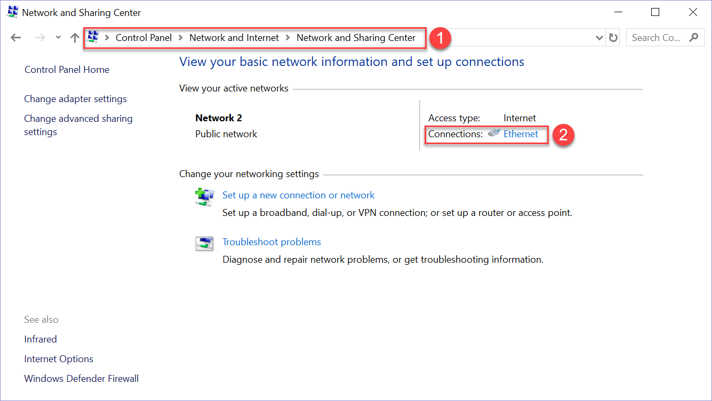

   Network and sharing center

Under *View Your Active Networks*, click the active connection you want
to change to open it. Once you open the network connection, you'll get a
dialog box shown on the left of :numref:`ip`.

.. _ip:
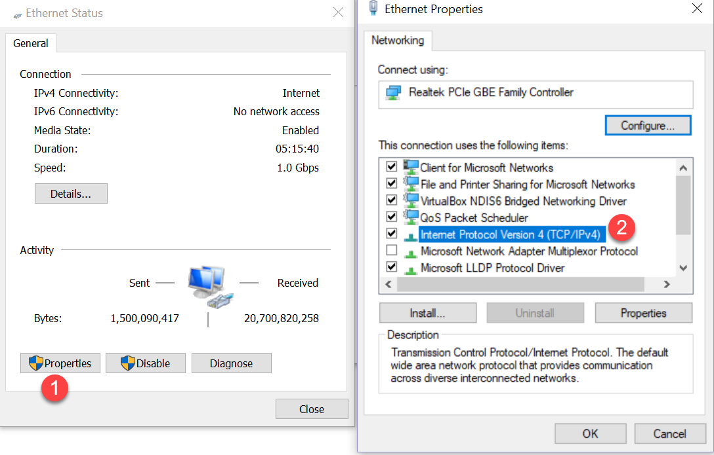

   Finding the Internet Protocol settings on a Windows computer

Click **Properties** to open the properties dialog box, shown on the
right side. Select **Internet Protocol Version 4** on the Networking tab
and then click **Properties**. When you open the IPv4 box, you should
see field where you can set the IP address, subnet mask, gateway, and
DNS server, as shown in :numref:`set_static_ip`.

.. _set_static_ip:
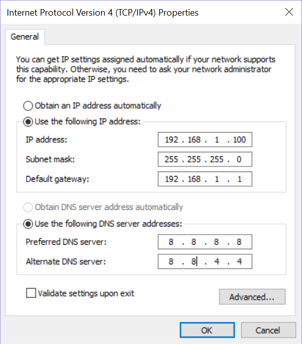

   Setting Static IP and DNS

After setting the IP address, confirm that it has changed. You may need
to reboot the computer for the changes to take effect. After you've
completed this project, don't forget to go back into your computer
settings and switch it back to Obtain an IP Address Automatically so
your computer goes back to normal.

Linux
-----

There are many different types of Linux operating systems, and
unfortunately, they don't all set up a static IP address the same way.
Your operating system's official documentation will describe how to set
the IP. If you're using a Raspberry Pi, to set the IP address manually,
edit the ``/etc/dhcpcd.conf`` file from the command line with the nano
text editor and enter ``sudo nano /etc/dhcpcd.conf``. You need to edit
only four lines. The rest of the file is mostly commented out lines to
help you learn how it works. At the end of the file, you can add your
network specifications.

First, specify the interface you want to set up, as shown in
:numref:`set_static_ip_linux`:

.. _set_static_ip_linux:
.. code-block:: text
   :caption: Setting a static IP address with Linux

   interface eth0
   static ip_address=192.168.0.10/24
   static routers=192.168.0.1
   static domain_name_servers=8.8.8.8 8.8.4.4

The eth0 interface on the first line is for wired ethernet; for
wireless, you would change it to ``wlan0``. The next line specifies the IP
address along with the netmask in the CIDR form (see Chapter 6). This
example shows an IP address of ``192.168.0.10`` with a netmask of
``255.255.255.0`` (24 bits). The gateway/router is next, followed by the DNS
to use. Google also maintains public DNSs at the addresses of ``8.8.8.8``
and ``8.8.4.4``.

Reboot the computer and confirm your changes went through using the
steps you did in the prior project to check your IP address. After that,
you should restore your computer to its original settings by removing
those four lines from ``dhcpcd.conf``.

Mac
---
To set the address on a Mac:

1. From the Apple menu, select **System Preferences**.
2. Select **Network**.
3. Select your network interface, such as Ethernet or Wi-Fi.
4. Click **Advanced**.
5. Click **TCP/IP**.
6. Select the option to configure IPv4 manually.
7. Type in your IP address, mask, and router.
8. Select the DNS tab to enter the DNS information.

Reboot the computer and confirm your changes went through. After that,
remove the manual network settings so that your computer can go back to
automatically setting itself up.

.. _project_set_hostname:

Project: Set Hostname
=====================

Your hostname is the friendly text-name of your computer. This name is
associated with the computer's IP address. Rather than memorizing your
IP address, you can instead use the hostname and the computer will look
up the IP address for you. Each computer on your network should have a
different hostname. Enter ``hostname`` on the command prompt to find
your computer's hostname. You might want to change your hostname. For
example, my home computer is named DESKTOP-SE6D5FB. This isn't easy to
remember. I might instead want to call it DESKTOP-PAUL.

Windows
-------
To change your hostname on Windows, open the Windows Control Panel.
Select **System and Security**, then select **System**. If you are using
Windows 11, they've made it easy to find. The option to change the
computer's name is via a button at the top titled **Rename this PC**. If
you are using Windows 10 you'll see details about the computer, and
you'll want to look for the section titled *Computer name, domain, and
workgroup settings*. Under that will be as **Change Settings** button.
After clicking that a new dialog will pop up and you can click
**Change** at the bottom of it

You can then set the computer name. If you don't have admin privileges
on the computer (for example, if it is part of a school or work
network), the network administrator may have the computer set up to
prevent changing the name.

Linux
-----
On Linux-based systems, the hostname is contained in two files:
``/etc/hostname`` and ``/etc/hosts``. The first file sets the hostname,
while the second maps the IP ``127.0.0.1`` back to your hostname. Like
before, you can edit from the command line using nano, with
``sudo nano /etc/hostname``. Once updated, the change doesn't take effect until you
reboot the computer.

In addition to editing the host files manually, most Linux distributions
also have a GUI you can use. In the case of the Raspberry Pi, click the
Raspberry menu in the upper left and select
**Preferences** |rarr| **Raspberry Pi Configuration** to access the
configuration GUI for changing the hostname (:numref:`configure_name_1` and
:numref:`configure_name_2`).

.. _configure_name_1:
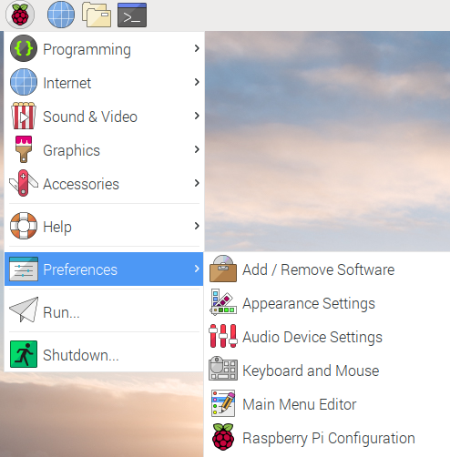

   Accessing Raspberry Pi Configuration

.. _configure_name_2:
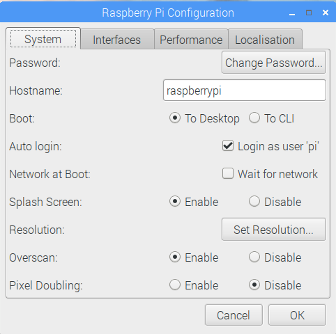

   Setting Raspberry Pi Configuration

The GUI is a lot more friendly to use, but what you see may change
depending on the version of operating system you are using. Editing the
text files has works for any version you are on.

macOS
-----
The Mac requires three commands. Say your local domain is
``mydomain.example``, and you want to change the computer name to newname.
Open the Terminal program (under Utilities) and enter:

.. code-block:: text

    sudo scutil --set HostName newname.mydomain.example
    sudo scutil --set LocalHostName newname.local
    sudo scutil --set ComputerName newname

Then reboot your Mac.

Project: Send and Receive Datagrams
===================================
The real purpose of a network is to send and receive data. How do you
send data at Layer 3 so that it can pass across the internet? In this
section, you'll learn to send and receive TCP/IP *datagrams*—a basic
type of Layer 3 packet for transferring data on a network. While most
packets include additional information for Layer 4 functionality you'll
cover in Chapters 8 and 9, the datagram is simpler and a easier to get
started with. However, unlike a Layer 2 data frame from Chapters 4 and
5, a datagram lets a person send data across the full internet, rather
than be limited to one hop. With this project you can send datagrams
between two computer on the internet, and it is a step towards being
able to send longer streams of data and large files.

.. note::

    You can find the code listings throughout this chapter at
    `https://github.com/pvcraven/networking_down_under <https://github.com/pvcraven/networking_down_under>`_.

Send Datagram
-------------
Sending a datagram in a Python program is a straightforward process.
:numref:`datagram_send` shows the necessary code:

.. _datagram_send:
.. literalinclude:: ../code_examples/datagram_send.py
   :language: python
   :linenos:
   :caption: datagram_send.py: Python program to send a datagram

You first import a Python library called socket for working with the
network. Next, you specify the address and the port that your datagram
is going to travel to. Pay close attention to the destination address
and destination port. You'll need to change the destination address from
``127.0.0.1``, unless you are receiving and transmitting on the same
computer. For the port, I arbitrarily picked 10,000. The port number that
you send to should be the same as the port number you receive from.

Next, you need a message to send, and that data must be in an array of
bytes. You'll use a byte array to get a string of text that is limited
to one byte per character (see Chapter 3) by putting a b before the
quote that starts a string.

Then, you initialize a *socket* for the network connection; a socket is
essentially a virtual plug where you will connect your data stream. The
AF_NET means the code is using IP, and the SOCK_DGRAM means it will send
using User Datagram Protocol (UDP). These are names that come from the
early days of the internet before networking settled on using TCP/IP, so
they may seem oddly named now. You'll always use ``AF_NET``, and in Chapter
9 we'll show how stream packets instead of using datagrams. The next
line of code sets up a variable to hold both the desired destination and
port (lines 5 and 8).

Everything we have done so far is just setup. In the case of simple
datagrams, no network data has been sent even when the connect command
is done executing. Datagrams don't build a connection and all the
connect command does is tell the computer what address and port we'll be
sending the data to.

Finally, we send data with the send command, which causes the datagram
to go out over the network. We close our socket with the ``s.close()``
command. Until we close it, the operating system keeps track of the
socket, and holds onto those networking resources.

You can run this program to send the data to any computer you specify,
even if that computer is not listening. You can use Wireshark, which we
first used in Chapter 5, to capture and confirm the data is being sent.
The next step is to write a program to receive the data.

Receive Datagram
----------------
The whole point of computer networking is to send and receive data
between devices. We can send sensor data, video shorts, status updates,
thumbs up, and more. But sending data isn't very useful without being
able to receive it. How you write code that will grab the data we sent
from the previous section? Code to receive data can be structured one of
the following ways:

**Blocking**:
Use a command to receive data. The program pauses and won't continue
until data is received. While this is the easiest to code, the program
can't do anything as it waits for the data, causing it to hang if it
fails to receive anything.

**Non-blocking**:
Use a command to receive data. Unlike blocking, if no data is available
the command doesn't wait. It returns immediately.

**Time-out**:
Wait for a certain number of milliseconds for data. If there's no data
after a specified number of milliseconds, then time out and keep
running. For example, the code could wait for a couple seconds for data,
then give up if it doesn't receive anything. This keeps the program from
hanging.

**Callback**:
Register a function that we write which will get called when we receive
data. This is particularly popular in JavaScript.

Let's cover the first two methods, as they are the most fundamental to
understanding how the networking is happening. Using time outs isn't
very popular, but callbacks are very popular in web programming.
Callbacks are created using non-blocking calls as a building block.

Blocking
^^^^^^^^
Blocking networking commands are the easiest to understand and get
started coding with. :numref:`datagram_receive_blocking`
shows receiving a datagram with
blocking. To end the program, you'll need to press CTRL-C or otherwise
force it to terminate.

.. _datagram_receive_blocking:
.. literalinclude:: ../code_examples/datagram_receive_blocking.py
   :language: python
   :linenos:
   :caption: datagram_receive_blocking.py: Receiving a datagram with blocking

Like ``datagram_send.py``, ``datagram_receive_blocking.py``
also has a spot for an address and port (lines 8 and 11). This should be the
address of the computer that the code is running on. If you are running
the sending and receiving on the same computer, you can use ``127.0.0.1``;
otherwise, you'll need to change it. The same address of the receiving
computer should be used for both the sending and receiving code. Do not
put the sending computer's address here. Both the sending and the
receiving program will have the receiving program's address.

Next, the code sets up a buffer size (line 14). This will be the largest number
of bytes that we can receive at once. Since a TCP/IP packet is limited
to 64 kilobytes, it should comfortably fit inside 66,000 bytes. Our
program then creates a socket (line 18). You then *bind*
that socket so that it will start listening using our specified address
and port. The program will error out if this is not our address, or if
another program is using that port.

Finally, the code loops forever. Each time through the loop, it grabs
data from the network (line 25) and prints it (line 29). The main problem with this code
is that the program will block waiting for input (on line 25),
not allowing your
program to process anything else or react to user input.

.. note::

    For people familiar with how computers can use multiple treads
    to execute code simultaneously, a common question at his point is if a
    program could run blocking networking code in a different thread. The
    problem is that even threads are supposed to be shut down nicely when
    your program ends. You can't shut down a thread if it is blocked waiting
    for input, so we still will need to learn about non-blocking network
    calls.

Non-Blocking
^^^^^^^^^^^^

The code in :numref:`datagram_receive_nonblocking` is more complex,
but unlike :numref:`datagram_receive_blocking` you can
add additional code that will execute while we are waiting for
information coming in on the network. It is also possible to stop
listening to the network and end gracefully.

.. _datagram_receive_nonblocking:
.. literalinclude:: ../code_examples/datagram_receive_nonblocking.py
   :language: python
   :linenos:
   :caption: datagram_receive_blocking.py: Receiving data without waiting for the network.

In this listing, we set the socket to non-blocking (line 24). Then, when we try
to receive data (line 29). If there is no data, the code will throw a
``BlockingIOError`` exception. We can catch that exception (line 35) and continue
processing. In a more advanced application, we might have code run our
user interface. In this example, we just pause using Python's sleep
command. Don't set up a loop to continually check for input with no
pause, or the computer will use a lot of unnecessary CPU checking the
network for data thousands of times per second.

Datagram Structure
------------------

What exactly are we sending are receiving tin these examples?
Back in :ref:`chapter_05`, we introduced the program *Wireshark*.
:numref:`data_structure_01` shows a datagram
created and sent by the send-datagram code in :numref:`datagram_send` captured by
Wireshark.

.. _data_structure_01:
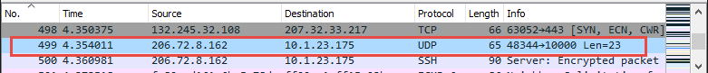

   Selecting the UDP

The protocol is listed as UDP. Let's deconstruct the IP and UDP parts of
the packet. Being able to "lift the hood" and inspect packets, plus see
how your program makes the packets is important. It is just as important
as being able to inspect and upgrade the engine of your car if you want
it to go faster. These packets are what drives any network connection
you have.

Internet Protocol
^^^^^^^^^^^^^^^^^

After clicking the captured packet, Wireshark should show the details of
the packet (see :numref:`data_structure_02`).

.. _data_structure_02:
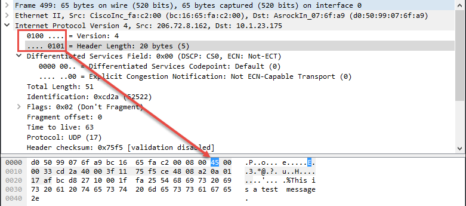

   IP Version and Length

The window has a line for Internet Protocol Version 4; clicking it
should highlight the IP portion of the data. In :numref:`data_structure_02`, the first
byte of the IP portion is 0x45, which holds two pieces of data. The
first four bits represent the version of TCP/IP used (TCPv4) and the
next four bits say how long the header is (20 bytes). Note that this is
length of the header, not the entire message.

Next are fields for prioritizing traffic. Differentiated services allow
some packets to take priority over others. For example, video might be
prioritized over web requests, so video can keep streaming without
skips. They aren't used in this case, so they are all left at zero
(:numref:`data_structure_03`).

.. _data_structure_03:
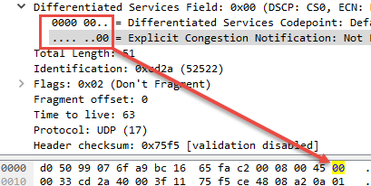

   Differentiated Services

:numref:`data_structure_04` shows the total length of the IP portion of the packet is 51
bytes (0x33 in hexadecimal). This does not include the extra data added
as part of the Ethernet frame. This allows us to separate what is part
of the Layer 2 Ethernet protocol and what is part of the Layer 3
Internet Protocol.

.. _data_structure_04:
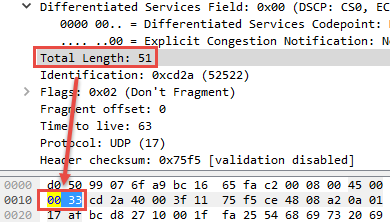

   Packet Length

Next is a packet ID field, shown in :numref:`data_structure_05`, which is used if a
packet is fragmented so it can be reassembled based on the ID. It
doesn't have much use otherwise. While TCP/IP packets can be large, we
often try to keep them small so that fragmentation does not occur.
Because the TCP protocol can split data up into small parts, there is no
need to do it again at Layer 2. Doing it twice is inefficient and slow.
Therefore we try to keep packets small enough it only happens once.

.. _data_structure_05:
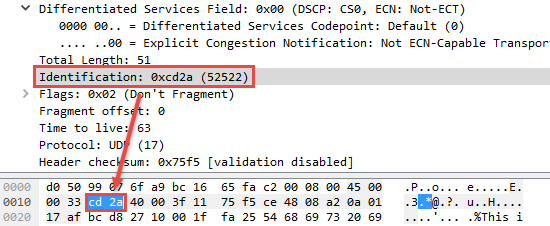

   Identification Field

In :numref:`data_structure_06`, the Fragment field is set to *Don't Fragment*, which tells
the network not to fragment this datagram into parts. Therefore, if this
datagram has more data than one Layer 2 data frame can hold, the
datagram will be dropped and not routed (rather than be broken into
parts).

.. _data_structure_06:
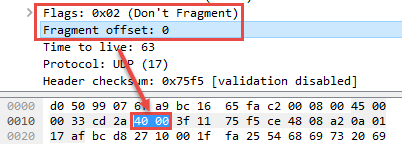

   Fragment Field

The Time to Live (TTL) starts by default at 64. Each time the datagram
makes a hop on the network, the TTL field subtracts 1 as shown in
:numref:`data_structure_07`. When it hits 0, the packet is dropped.
This keeps the system from
endlessly forwarding the packet.

.. _data_structure_07:
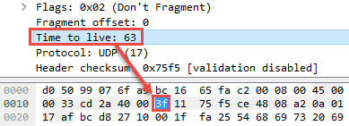

   Time to Live

The next byte, Protocol, says that this is a UDP packet (:numref:`data_structure_08`).

.. _data_structure_08:
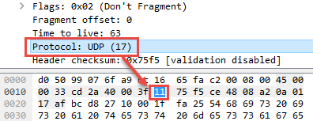

   Protocol

The header checksum (:numref:`data_structure_09`) is an additional two bytes of data
used by the networking layer to ensure the header is valid and the data
hasn't been corrupted.

.. _data_structure_09:
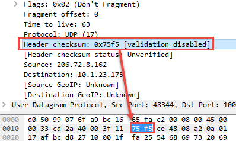

   Header Checksum

By default, Wireshark doesn't validate that the checksum is correct;
this can be changed in the Wireshark preferences window, under
*Protocols* and *IPv4*. Corrupted packets will be dropped by the
networking layer.

Next up, the source IP address appears in hex, as shown in :numref:`data_structure_10`.

.. _data_structure_10:
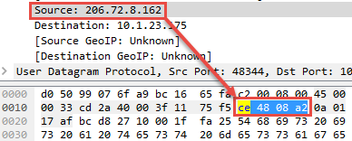

   Source IP Address

The destination is highlighted in :numref:`data_structure_11`.

.. _data_structure_11:
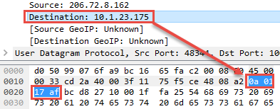

   Destination IP Address

Those four bytes are the key for routing this data to its final
destination across the entire internet.

User Datagram Protocol
^^^^^^^^^^^^^^^^^^^^^^

Now that we're done with the IP part of the packet, we can move on to
the UDP part.

The first field in the UDP is the networking port that sent the data
(:numref:`data_structure_12`).

.. _data_structure_12:
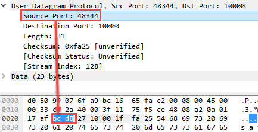

   Source Port

This is an ephemeral, randomly opened port somewhere between
1025 to 65,535. Return traffic goes here for connection-based protocols. In
this case, UDP is connectionless so it doesn't expect return traffic.
However for consistency with other protocols it is still filled in.

Next is the destination port number (:numref:`data_structure_13`), which was selected in
the send-datagram program from :numref:`datagram_send` with the variable
``destination_ip_port``.

.. _data_structure_13:
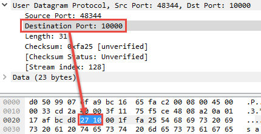

   Destination Port

The receiving computer needs to have a program listening to the port to
pick up the data, as we did in :numref:`datagram_receive_blocking` with ``listen_ip_port``.

The length of the UDP portion of this packet (:numref:`data_structure_14`); the number
displayed in this field does not include the length of the Ethernet
frame header or IP packet header.

.. _data_structure_14:
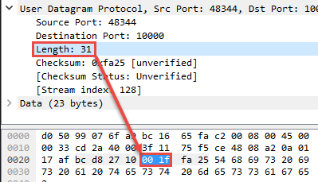

   UDP Length

To ensure the data isn't corrupted, you'll use a checksum. Two bytes are
dedicated to that, as shown in :numref:`data_structure_15`.

.. _data_structure_15:
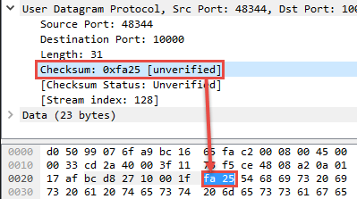

   Checksum

Finally, you get to see the data in :numref:`data_structure_16`.

.. _data_structure_16:
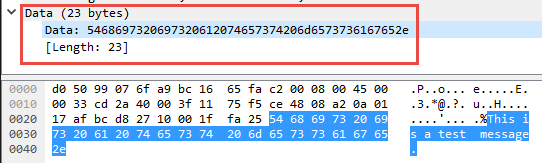

   Data

As our data is not encrypted, you can see it in clear text right in
Wireshark. This is why encrypting sensitive data is important.

Project: Use Basic Networking Tools to Gather Information
=========================================================

Networking tools can help you understand how your network is put
together and debug why things aren't working right. Common tools include
ping, getmac, arp, nslookup, and whois.

ping
----

The ping command is used to see if you can connect to another server,
and how long it takes to get a response. Ping sends an ICMP packet to a
server and times how long until it gets a response. The format is a
little different between Windows and Linux/macOS. The official Windows
documentation for ping is available here:

`https://docs.microsoft.com/en-us/windows-server/administration/windows-commands/ping <https://docs.microsoft.com/en-us/windows-server/administration/windows-commands/ping>`_

Documentation for the Linux version of ping can be found at

`https://vitux.com/linux-ping-command/ <https://vitux.com/linux-ping-command/>`_

On Windows, the command below sets the number of packets to send with
the ``-n`` option, and this example sends them to ``google.com``:

``ping -n 10 google.com``

On Linux and macOS, the command uses ``-c`` instead of ``-n``:

``ping -c 10 google.com``

You'll get a response like this:

.. code-block:: text

    Pinging google.com [172.217.4.78] with 32 bytes of data:
    Reply from 172.217.4.78: bytes=32 time=17ms TTL=118
    Reply from 172.217.4.78: bytes=32 time=16ms TTL=118
    Reply from 172.217.4.78: bytes=32 time=16ms TTL=118
    Reply from 172.217.4.78: bytes=32 time=16ms TTL=118
    Reply from 172.217.4.78: bytes=32 time=16ms TTL=118
    Reply from 172.217.4.78: bytes=32 time=16ms TTL=118
    Reply from 172.217.4.78: bytes=32 time=16ms TTL=118
    Reply from 172.217.4.78: bytes=32 time=16ms TTL=118
    Reply from 172.217.4.78: bytes=32 time=16ms TTL=118
    Reply from 172.217.4.78: bytes=32 time=16ms TTL=118

    Ping statistics for 172.217.4.78:
        Packets: Sent = 10, Received = 10, Lost = 0 (0% loss),
    Approximate round trip times in milli-seconds:
        Minimum = 16ms, Maximum = 17ms, Average = 16ms

From this I can tell which IP address I am connecting to, that all my
data arrived and was sent back successfully, and it took about 16ms for
that to happen. If I can't connect to another computer, the ping command
is the first thing I try.

Keep in mind that if congestion occurs, the ICMP packets like those ping
sends are the first to get dropped. Some computers are set up to
automatically drop ping requests, so dropped ping packets don't always
mean a connection is down.

getmac
------

To quickly get your MAC address on Windows machines, ``getmac`` will list
out all MAC addresses the machine has. It is a quicker, smaller list
than ``ipconfig`` provides.

arp
---

You can use arp to view your computer's table of IP to MAC addresses. On
macOS and Linux, type ``arp`` at the command prompt. On Windows, use
``arp -a`` at the command prompt. You can even add and remove entries
manually, if you feel the need to do so.

nslookup
--------
If you have a DNS address and want its associated IP address, use the
nslookup command on a command prompt. If you are on a Linux machine that
doesn't recognize nslookup as a command, you may need to install a
package that has it. For Raspberry Pi, type:

``sudo apt-get install dnsutils``

An example of using the command is as follows:

``nslookup arcade.academy``

Notice the trailing period. If you don't put this period on the address,
nslookup will first append your local domain. In my case, I've got a
local domain of ``home``, so doing an nslookup without the trailing period
will first query ``arcade.academy.home``. When that fails, it will fall back
and look up ``arcade.academy``. The output from this command might look
like:

.. code-block:: text

   Server:  snowflake.sc.loc
   Address:  198.206.243.21

   Non-authoritative answer:
   Name:    arcade.academy
   Addresses:  52.85.117.97
             52.85.117.31
             52.85.117.113
             52.85.117.198

The first item, Server, refers to the server that looked up the IP
addresses, which is the local DNS server (*not* the IP address of the
local DNS server). Non-authoritative answer means that the local DNS
server is not the nameserver that is the authority for ``arcade.academy``.
It's passing us the information second-hand because it needed to go and
look up the info. Finally, the IP address for the domain is listed.

In the case above, four IP addresses are listed; the computer could
connect to any of them. A one-to-one mapping of domains to IP addresses
doesn't always happen. If my web browser can't connect with the first
address, it can try connecting with the next address on the list. The
administrator of a DNS record can set it up for round-robin where the
server will give out one IP, then the next, and continue until it wraps
around. This helps distribute load across multiple servers. An
administrator can also use geolocation to give out one IP address in
Europe and a different IP in North America, so that client computers can
connect to a close resource for faster response times.

Multiple types of records can be stored in a domain name system. For
example, an MX record type holds the IP address for a computer that can
receive email destined for a domain. You can use an interactive session
with the nslookup command to get more information, like so:

1. Type ``nslookup`` to enter the interactive mode of nslookup.
2. When a ``>`` prompt appears, enter ``set type=mx`` to look for MX (mail)
   records.
3. Enter the domain you want to look up, like ``gmail.com``.
4. When done, type ``exit`` to leave the interactive mode.

If you get a time-out looking up a record, try again.

You can sometimes reverse lookup an IP address and get a domain by
typing ``nslookup 52.85.117.97``.

This version of the command will try to find a domain address to match
that IP. For example:

.. code-block:: text

   Name: server-52-85-117-97.ind6.r.cloudfront.net
   Address: 52.85.117.97

In this example, notice that it didn't send back ``arcade.academy``, which
is the name used to look up that IP address! There can be multiple
domains associated with a single IP address, just as there can be
multiple IP addresses per domain. We just get back the first one
nslookup found. Reverse look up is a bit flaky, so don't be too
concerned if you don't get anything back. Just try a different IP.

whois
-----
On Linux and macOS, you can sometimes find who owns a domain with the
``whois`` command. For example:

``whois my-domain.example``

Often the real information is hidden to prevent people from spamming
site owners. There are also many websites that let you use online
lookups to get an idea who owns a domain; I happen to like this one from
MxToolbox:
`https://mxtoolbox.com/DNSLookup.aspx <https://mxtoolbox.com/DNSLookup.aspx>`_.
There are a lot of
cases where this is useful, such as allowing a person to find the
current owner of a network domain if they are receiving a lot of spam
e-mail from it.

Tutorial: Netstat
-----------------
The netstat program shows how the system determines which program
receives data. On my work computer, I have programs like Google Drive,
the file browser (which can look at network drives), Microsoft Outlook,
Moba XTerm, SourceTree, and Steam. Each of these programs is listening
to a different port, and netstat shows you which program is listening to
which port.

To see the current network connections on your machine, run the netstat
command. The output can be long and a bit confusing because it includes
local loopback connections, which is your computer connecting to itself.

Type ``netstat -?`` to see command line options for ``netstat``. Some of my
favorite options on Windows are:

- Show how many bytes sent/received by the computer since start:
  ``netstat -e``
- Show what process created each network connection (requires you to be
  in a command prompt run as administrator):
  ``netstat -b``
- On Linux, you can enter ``netstat --tcp`` to filter the output to show only
  TCP/IP connections.

:numref:`netstat` shows a shortened list of what my computer displayed from
the ``netstat`` command:

.. _netstat:
.. code-block:: text
   :caption: Output of the netstat command
   :linenos:

   C:\>netstat -b

   Active Connections

     Proto  Local Address          Foreign Address        State
     TCP    10.1.23.175:15319      ord30s25-in-f10:https  CLOSE_WAIT [googledrivesync.exe]
     TCP    10.1.23.175:43450      ord30s25-in-f205:https CLOSE_WAIT [googledrivesync.exe]
     TCP    10.1.23.175:46136      fileserve:microsoft-ds ESTABLISHED Can not / obtain ownership information
     TCP    10.1.23.175:46170      162.254.193.47:27021   ESTABLISHED [Steam.exe]
     TCP    10.1.23.175:46174      jd-in-f125:5222        ESTABLISHED [Explorer.EXE]
     TCP    10.1.23.175:46658      65-52-108-208:https    ESTABLISHED / ShellHWDetection
    [svchost.exe]
     TCP    10.1.23.175:48688       207.32.33.199:59234   ESTABLISHED [OUTLOOK.EXE]
     TCP    10.1.23.175:48696      207.32.33.199:59234    ESTABLISHED [CompanionApp.exe]
     TCP    10.1.23.175:62396      ord36s04-in-f10:https  CLOSE_WAIT [motty.exe]
     TCP    10.1.23.175:65125      cs:ssh                 ESTABLISHED [MobaXterm.exe]
     TCP    10.1.23.175:65127      bitbucket:ssh          TIME_WAIT
     TCP    127.0.0.1:4172         cvr1834b:65001         ESTABLISHED [NvStreamNetworkService.exe]
     TCP    127.0.0.1:6000         cvr1834b:65121         ESTABLISHED [XWin_MobaX.exe]
     TCP    127.0.0.1:6000         cvr1834b:65122         ESTABLISHED

I can see that Google Drive is using port 15319, and that connection is
waiting to be closed (line 6). My computer is using a network drive (line 8). I have
Steam running in the background, and connected to their servers (line 9).
Microsoft Outlook is keeping an eye on incoming email (line 13).

The Mac implementation of netstat isn't that great, but macOS has a
command called ``lsof`` to list open files. Network connections are treated
like files, so you can show open network connections with ``lsof -i``.

Tutorial: Scan a Network with Nmap
----------------------------------

Nmap scans computers for open ports, which is very useful in securing an
individual computer and even auditing an entire network.

You can install nmap on most Linux computers by typing:
``sudo apt-get install nmap zenmap``. Download and install it for Windows and macOS
from `https://nmap.org/download.html <https://nmap.org/download.html>`_.

You can scan a single computer by using the nmap command and the
computer's IP address. For example, if you have a computer with the IP
address of ``192.168.1.1`` you can scan it with ``nmap 192.168.1.1``.

Nmap has a lot of options for scanning, such as a fast scan to determine
what computers or devices are attached and a slow scan that checks every
single networking port on a computer. It can also look at the responses
to try to figure out the computer's operating system.

You can scan a range of addresses with the CIDR form to identify what
computers are connected to a network. The ``nmap 192.168.1.0/24`` command
does a scan of ``192.168.1.0`` to ``192.168.1.255``.

The output lists any open port, and the service that may be running on
that port:

.. code-block:: text

   Starting Nmap 7.40 ( https://nmap.org ) at 2019-02-24 14:41 CST
   Nmap scan report for DeviceDHCP.Home (192.168.1.1)
   Host is up (0.019s latency).
   Not shown: 994 closed ports
   PORT     STATE    SERVICE
   21/tcp   filtered ftp
   22/tcp   filtered ssh
   23/tcp   filtered telnet
   80/tcp   open     http
   443/tcp  open     https
   5431/tcp open     park-agent

The example above shows that the computer ``192.168.1.1`` (my gateway) is up
and is receiving data on *open ports* 80, 443, and 5431. If Nmap tries
connecting to a port, and the computer responds back that a connection
isn't possible, the port is considered *closed*. Closed ports aren't
listed. Ports 21, 22, and 23 are filtered, meaning we aren't getting any
response. It's possible filtered ports are open, but a firewall is
dropping the connection requests before they get there.

Certain ports are tied to certain services. Nmap lists the common
service on each of those ports. For example, SSH normally runs on port
22. If port 22 is open, I can try to connect to the port with SSH. In
the example, 80 and 443 are open; this likely means a web server is
running, and I can try to connect to it with a web browse by typing the
address in the address bar. Port 53 would indicate I can use the node as
a domain name server.

To quickly see what computers are on the network, you can do a fast
``ping scan`` with ``-sn``, which skips scanning ports to check if a computer
is up. The command below will scan all computers from ``192.168.1.1`` to
``192.168.1.254`` to see what computers are on the network:

``nmap -sn 192.168.1.0/24``

The -sV command won't just see what ports are open, but will also try to
guess what software and what version that software is running. This can
take a while even for just one machine! Scanning a whole network this
way would be a test of patience.

``nmap -sV -O 10.10.20.45``

Nmap also has a GUI called Zenmap. Sometimes a command line works best,
and sometimes it's more convenient to run Nmap from a point-and-click
GUI. The command line option is great when you want to quickly run an
exact scan because all the parameters are listed as part of the command;
if you want to include it as part of a script; or if you want to use the
output as input to another program. The GUI is better when you want to
explore and click an interface that shows different options, without
trying to memorize or look up them up.

Project: Capturing and Processing Output
========================================
Command line tools make it easy to capture the output. We can save the
output in a log file to track changes over time, and can send the output
of one command into another command to further refine our results.

For example, we can capture output from Nmap in a text file and have a
log of which computers are up and running on a local subnet. To redirect
output from a Nmap scan to a file, add the greater-than sign (``>``) to the
nmap command. The ``nmap 192.168.1.0/24 > scan1.txt`` command redirects the
output from nmap to a file called ``scan1.txt``.

To redirect output to another command, use the *pipe* symbol by hitting
SHIFT-**\\**.

On most Linux distributions, the grep command can search for not only
specific text, but also text patterns such as phone numbers and email
addresses. You can filter the output to just the important parts. For
example, the following command runs ifconfig and shows only the lines
that have inet and a space:

``ifconfig \| grep "inet "``

By piping the output from ping to grep, you can pull out the timings and
save the output to a text file that you can use for graphing. We can
save that information to a file we can later create a graph with the
following command:

``ping -c 20 google.com \| grep -o "[0-9]*\\.[0-9] " > data.txt``

If you want to learn more about how regular expressions work, the best
way is through an interactive tutorial. I highly recommend RegexOne:
*https://regexone.com/*.

Project: Lookup ASNs
====================

As discussed in Chapter 6, the internet routes traffic between large
networks, each of which has an Autonomous System Number (ASN). You can
look up an ASN by first finding your public IP address. This likely
isn't your machine IP address. You can go to the following page to get
your public IP address: `https://www.whatismyip.com/ <https://www.whatismyip.com/>`_.

Visit
`https://mxtoolbox.com/SuperTool.aspx <https://mxtoolbox.com/SuperTool.aspx>`_
to use MXToolbox; plug in
your IP address and select ASN Lookup.

Next, find the ASNs of several other websites you are interested in. To
do this, first enter the website server name in the MXToolbox and select
DNS Lookup. Copy the IP address from the DNS lookup and paste it back
into the lookup field. Then select ASN Lookup.

Now you can look up the ASN you are on as well as other computers. What
companies handle your data when you connect to another machine? To know
that, we need to know what path the data takes. We can find that out by
doing a traceroute.

Project: Trace Data Across the Internet
=======================================

To trace the route your data takes over the network, use the
*traceroute* command. On macOS and Linux, this command is traceroute; on
Windows, tracert. By understanding the hops from one computer to
another, we can get insight into why some connections are faster than
others, where data might get lost, what companies are moving our data,
and the structure of how the internet is put together.

Traceroute constructs a packet with a short TTL value, starting with
one. The packet goes one hop, then expires. That node sends a negative
acknowledgement (NACK) packet back saying that your packet didn't make
it. You can identify the computer that made the NACK and assume it is
one hop out. Then you repeat the process with a TTL of two.

The process isn't perfect. Some nodes will destroy a packet when the TTL
times out, but not send a NACK back. These nodes will show up as an \*
on the traceroute. You know the nodes are there because the packet went
away, but you don't know what node did it.

.. note::

    At the school where I work, we have a router that will take TCP
    packets and rewrite the TTL so it looks like all packets magically reach
    their destination at four hops. Oddly enough, it doesn't rewrite the TTL
    of ICMP packets. With this in mind, it can be a good idea to try a
    traceroute with both TCP and ICMP packets.

To use traceroute on Windows, type tracert followed by the IP address or
DNS name of the computer you want to trace to. :numref:`netstat_output_windows`
shows an example:

.. _netstat_output_windows:
.. code-block:: text
   :caption: Output of the tracert command on Windows
   :linenos:

   C:\>tracert simpson.edu

   Tracing route to simpson.edu [23.185.0.3]
   over a maximum of 30 hops:

        1    <1 ms    <1 ms    <1 ms  DeviceDHCP.Home [192.168.1.1]
        2     3 ms     2 ms     3 ms  100.66.16.1
        3     2 ms     2 ms     2 ms  b224.cr1.ind.imufiber.net [199.66.12.132]
        4     2 ms     2 ms     2 ms  b201.ar1.ind.imufiber.net [199.66.12.195]
        5     2 ms     2 ms     2 ms  b201.cr1.ind.imufiber.net [199.66.12.193]
        6     1 ms     2 ms     2 ms  69.57.197.2
        7     7 ms     6 ms     7 ms  vl1141.core7k1.cf-noc.cfu.net [24.149.0.164]
        8     6 ms     6 ms     7 ms  ae0-1101.agg3.cf-noc.cfu.net [24.149.31.16]
        9     7 ms     7 ms     7 ms  vl1122.gw-core.cf-noc.cfu.net [24.149.0.241]
       10    13 ms    13 ms    13 ms  loopback0.chi-edge1.cf-noc.cfu.net [24.149.0.133]
       11    30 ms    11 ms    10 ms  eqix-ch2.fastly.com [208.115.136.62]
       12    13 ms    13 ms    13 ms  23.185.0.3

The trace shows that my packet first goes to my router at ``192.168.1.1`` (line 6)
and then hops to ``100.66.16.1`` (line 7). Next you can see each hop as it heads to
its final destination, simpson.edu, at ``23.185.0.3`` (line 17). The computer runs
the route three times, and shows how long it takes to get to that hop in
three different columns. If the computer can, it does a reverse DNS
lookup on each address, which helps you get an idea of what that node
is. In :numref:`netstat_output_windows`, the address ``199.66.12.132`` is the same as the DNS
address ``b224.cr1.ind.imufiber.net``.

On Linux or macOS, traceroute can be done with traceroute followed by
the IP or DNS address. By default, traceroute runs differently on
Windows vs. Linux systems, as Windows uses ICMP packets and Linux uses
UDP packets. If running a traceroute isn't working well with one type of
packet, try the other type. You can run a packet trace with ICMP instead
by using ``-I``, which also requires admin privileges. The command looks
like so:

``sudo traceroute -I google.com``

With the Linux version of traceroute, adding the -A parameter will look
up the ASN of each hop. Note there's no valid ASN for a private subnet
that sits behind a NAT. :numref:`netstat_output_linux` shows the output from a Linux
``traceroute`` that includes the ASN lookup:

.. _netstat_output_linux:
.. code-block:: text
   :caption: Output of the traceroute command on Linux
   :linenos:

   sudo traceroute -I -A simpson.edu
   traceroute to simpson.edu (23.185.0.3), 30 hops max, 60 byte packets
    1  DeviceDHCP.Home (192.168.1.1)1 [AS198949]  2.157 ms  2.277 ms  2.339 ms
    2  100.66.16.1 (100.66.16.1)2 [*]  5.050 ms  5.730 ms  6.165 ms
    3  b224.cr1.ind.imufiber.net (199.66.12.132)3 [AS30169]  4.254 ms  4.737 ms  / 4.636 ms
    4  b201.ar1.ind.imufiber.net (199.66.12.195) [AS30169]  3.554 ms  3.799 ms  / 3.750 ms
    5  b201.cr1.ind.imufiber.net (199.66.12.193) [AS30169]  5.011 ms  5.173 ms  / 5.586 ms
    6  69.57.197.2 (69.57.197.2) [AS13855/AS10464]  5.587 ms  2.918 ms  4.367 ms
    7  vl1141.core7k1.cf-noc.cfu.net (24.149.0.164) [AS7029/AS13855/AS10464]  9.222 / ms  9.468 ms  9.675 ms
    8  ae0-1101.agg3.cf-noc.cfu.net (24.149.31.16) [AS7029/AS13855/AS10464]  8.610 / ms  8.722 ms  9.115 ms
    9  vl1122.gw-core.cf-noc.cfu.net (24.149.0.241) [AS7029/AS13855/AS10464]  9.718 / ms  10.117 ms  10.401 ms
   10  loopback0.chi-edge1.cf-noc.cfu.net (24.149.0.133) [AS7029/AS13855/AS10464]  / 16.015 ms  16.220 ms  16.307 ms
   11  eqix-ch2.fastly.com (208.115.136.62) [AS30159]  14.250 ms *  14.234 ms
   12  23.185.0.3 (23.185.0.3) [AS54113]  14.096 ms  15.212 ms  18.032 ms

The first ASN shown is part of our local subnet, because it starts with
``192.168.x.x`` (line 3). This isn't a valid ASN, so we can ignore the result. The
computer wasn't able to look up the next ASN (line 4), but the following ASN (line 5)
is AS30169.

Hurricane Electric Internet Services's tool for looking up information
on ASNs (at `https://bgp.he.net/ <https://bgp.he.net/>`_)
can be used to see what other ASNs
are connected to the ASN you search for. It even shows graphs on how
many other ASNs were hooked up to it in the past so you can see if that
number has gotten larger or smaller over time. If this number is going
up over time, we can see that the ASN is becoming a more capable hub for
routing traffic.

Project: Traceroute Graphing
============================
The Python project scapy has a lot of tools for sending and receiving
custom-built packets. Scapy is great for low-level hacking, security
testing, and performance testing. The following commands set up the
libraries scapy needs along with scapy itself:

.. code-block::

   sudo apt-get update
   sudo apt-get install texlive-latex-base whois python3 python3-pip
   sudo apt-get install graphviz tcpdump
   sudo pip3 install matplotlib pyx scapy

Once installed, create a Python program to do a traceroute as shown in
:numref:`traceroute_scapy`. To run this program, you have to run it as an
administrator with sudo python3 traceroute_scapy.py.

.. _traceroute_scapy:
.. literalinclude:: ../code_examples/traceroute_scapy.py
   :language: python
   :linenos:
   :caption: traceroute_scapy.py: Code that will generate a graph of how traffic to Google, YouTube, and Wikipedia travels to your computer

Update the program to contain a list of websites you want to trace to.
If you list more than one, you can see what paths they have in common
and where the traffic splits off. The traceroute command runs the
traceroute; if it doesn't work well, try to use ICMP packets instead.
Now that we have a traceroute, we can graph it with the res.graph
command. Graphs can be in vector-graphics format (SVG), or can be saved
as a raster-graphic image like PNG.

An example run of the code in :numref:`traceroute_scapy` is shown in :numref:`graphical_traceroute`.

.. _graphical_traceroute:
.. figure:: media/graphical_traceroute.svg
   :alt: Scapy graphical traceroute
   :width: 100%

   Scapy graphical traceroute

:numref:`graphical_traceroute` shows that all three websites take the same path through the
first seven hops. There are boxes drawn around the nodes in each ASN.
The nodes beginning with ``199.66`` all belong to AS30169. Once the traffic
hits ``24.149.31.16`` it finally splits into different locations.

What You Learned
================
In this chapter, we've learned to write programs to send and receive
packets over TCP/IP, and to capture, decode, and understand packets
using Wireshark. You learned to use commands like ipconfig, netstat, and
nmap to inspect open and in-use networking ports not only on your
computer, but your entire network. Using trace-routes, we can see every
hop our data takes as it travels across the internet, and even look up
who owns and manages those hops.
