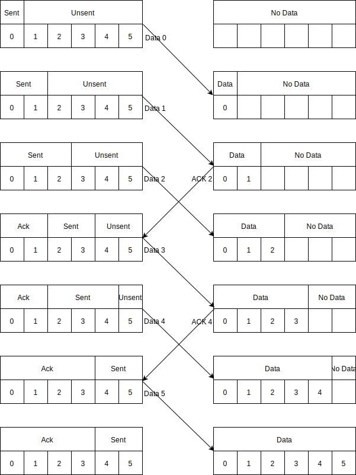

.. include:: <isonum.txt>

.. _chapter_08:

Theory: Transport Layer
***********************

The networking layer routed packets of data across the Internet to their
final destination. But how do we know the data got there? That someone
was listening? What if we have more data than we can fit in one packet?
What if there is an error and we need to resend the data? How do we
manage all that, and still transfer our data as fast as possible? This
is the responsibility of the fourth layer of the OSI model, the
transport layer.

The transport layer ensures the large web pages, video files, and
documents get broken into packets of manageable size, transmitted, and
reassembled by the receiver. The first transport protocol we'll learn
about is the *Transmission Control Protocol* (TCP). Web page requests,
documents, messages, almost all data on the Internet is transmitted
through a TCP connection. There are additional transport protocols that
are built on top of TCP. The web uses HTTP, email both SMTP and IMAP,
and file transfers use FTP.

If you plan on managing networks, creating networked programs, or be a
technical manager, understanding these how these transport protocols is
necessary to keep networks up, add functionality to your programs, and
collaborate with your coworkers.

TCP Connections
===============

As networks have standardized on TCP/IP, this is the place to start for
learning how to transport large files across the internet. You can use
everything you learn here and expand on it to understand how we
transport data for the web, email, and files.

To learn TCP, you'll first need to understand how to open a connection.
After the connection is open, we'll learn how to move data, and confirm
its safe arrival. Finally, when done, you'll need to close the network
connection.

Create a Connection – TCP Handshake
-----------------------------------

Before you pass data over a TCP connection, you must set up the
connection. With TCP, this is a three-step process as shown in
:numref:`open_connection`.

First, the client that wants to create a connection generates a *TCP
synchronize packet* (SYN) and sends it to the server. The SYN packet
includes a randomly generated 32-bit *sequence number*. The sequence
number identifies client-to-server data packets, so you can tell which
packets have arrived. In the "sliding window" section, discussed later
in this chapter, you can see the sequence number at work.

Second, the server sends back a two-in-one packet known as a
*synchronize acknowledgement packet* (SYN-ACK). It acknowledges the
client's SYN packet and combines this acknowledgement with a SYN packet
of our own. Data sent from the server-to-client gets a completely
different sequence number to clearly identify packets of data traveling
in the opposite direction, from the client back to the server.
Therefore, our TCP connection will track two different sequence numbers.

Finally the client sends an ACK back to the server to let the server
know its SYN-ACK packet was received. The connection is now established.

.. _open_connection:

   TCP Handshake for opening a new connection

ACK Packets and Sliding Windows
-------------------------------

The transport layer's job is to offer reliable transmission of data in
the same order it was sent. The networking layer can lose packets, and
it is up to the transport layer to find the missing data and ask for it
again. In addition, packets can occasionally travel the network using
different routes and arrive out-of-order. The transport layer must be
able to handle that possibility by either reordering the packets, or
resending them.

The simplest method to address these problems is to send an
*acknowledgment packet* (ACK) each time you receive data. As shown in
:numref:`window_one_no_loss`, each time a packet is sent, you wait for an ACK. For
simplicity, this example uses a sequence number that alternates between
0 and 1.

.. _window_one_no_loss:

   Using ACK Packets

What happens if the data doesn't arrive? :numref:`window_one_loss` shows that if the
data packet doesn't arrive, eventually the sender will time out waiting
for the ACK, and resend the data. The longer the timeout, the slower it
takes to recognize we are missing a packet and start transmitting data
again. If the timeout is too short, however, the computer might resend
data unnecessarily, thinking the data was lost.

The timeout calculation for TCP depends on the average round trip time
and the amount keeps doubling for each successive timeout. In fact, TCP
can wait about ten to thirty minutes before completely giving up on a
connection after about fifteen retries.

If instead the ACK gets lost, the sender will still time out and resend
the data. The data packets need the ACK sequence number, so the receiver
can identify when a duplicate packet arrives that needs to be discarded.
We don't want to add duplicate data to the receive buffer.

.. _window_one_loss:

   (left) Data Packet Loss (right) ACK Loss

This protocol ensures that your data gets to its destination. But you
can't transfer data very fast this way. Remember doing *ping* times from
the tutorial on networking tools in Chapter 7? It often takes more than
10 ms to get to another computer and receive the acknowledgement. At
that rate you could exchange 100 packets per second. If each packet is
limited to around 1500 bytes of an Ethernet frame, that makes for 150
kilobytes/second (kB/s) or 1.2 megabits per second (Mbps). It would take
about seven seconds to download a one-megabyte image on a web page, just
because of how long it takes to acknowledge the data packets.

Remember, there are eight bits to a byte. You abbreviate byte with a
capital B, and bit with a small b. So Mbps is always eight times the
value of MBps. One MBps equals eight Mbps.

With this approach, you are spending most of your time waiting for
packets and not enough time transmitting data. How can you improve this?
Since it is not common for a network to lose packets, you can send
multiple packets and use additional sequence numbers, as shown in
:numref:`two_packets_one_ack`. When you have received Data 1, you send an ACK 2 showing you are
ready for Data 2 and that everything up to, but not including Data 2 has
been received ok.

.. _two_packets_one_ack:

   Two Packets Per ACK

This approach is better, but a delay still happens as the computer waits
for ACK packets. What if the code behind the transport layer did not
wait? Compare :numref:`two_packets_one_ack` with :numref:`window_of_two_sliding`, where the system does not wait
for the ACK on data packet 0 and data packet 1, but continues to
transmit data packets 2 and 3. While there is still a round-trip delay,
we no longer wait for it.

.. _window_of_two_sliding:

   Overlapping ACK and Data Packets

This method requires a bit more work on the sender, as the
transport-layer code must track what part of the message has been sent,
and what part acknowledged. Overlapping in this way is called a *sliding
window*, which is illustrated in :numref:`sliding_window`:

.. _sliding_window:

   Sliding Window

In :numref:`sliding_window` each packet is numbered sequentially. TCP numbers its
sliding window a bit differently: that is, rather than number each
packet, TCP numbers by the byte count. If the first packet is numbered 0
and you transmit 700 bytes, the next packet will be numbered 700 rather
than 1. Then if you transmit 1,001 bytes, the next packet will be
numbered 1,701. TCP stores the sequence number in four bytes, or
:math:`4 \cdot 8 = 32` bits. The maximum sequence number is :math:`2^{32}-1=4,294,967,295`.
When you go beyond that four billion max number, you "roll over" back to
zero. TCP can send both data and an ACK at the same time. In the earlier
examples, data flowed only one way. It can flow both ways, and you can
combine your data and ACK packets together.

One of the best ways to understand the sliding window is to view it as
an animation. Johnannas Kessler has a nice interactive animation
available at the link below. This animation allows you to control
different parameters as well. I recommend watching the animation both
with the default end-to-end delay of 5000 ms, and trying 2000 ms.

http://www.ccs-labs.org/teaching/rn/animations/gbn_sr/

The sliding window is key to unlocking the full speed of a network.
Remember from the start of this section, if we wait for an ACK on each
packet, have a ping time of 10 ms and packet size of 1,500 bytes, we'd
be limited to 1.2 Mbps, even if we had a fast gigabit (1,000 Mbps)
connection. Our data would only be transmitted at 0.1 percent of the
maximum speed. That sliding window eliminates the round-trip wait and
makes it possible for our video, web pages, and files to be downloaded
1,000 times faster.

Buffering and Pushing Data
--------------------------

If you are writing networking code, it's important to understand how the
data is buffered up and sent, because it impacts both the timing on when
data is sent, and how the data is grouped together. For example, if you
executed the following networking code in Python:

.. code-block::

   my_socket.sendall(b"1")
   my_socket.sendall(b"2")
   my_socket.sendall(b"3")

Based on these three lines of code, there are at least two logical
guesses on how the code would group the data into packets. One, the
program could send three packets, each with a different number in it. Or
two, the program could keep storing data until the buffer is full and
then send "123" as one packet.

What happens in reality? Neither. Python will send the 1 to the
transport layer. The transport layer bundles up the 1 into a packet, and
the computer will start sending it. The 2 and 3 arrive immediately
after, but we can't change the packet in the middle of being sent.
Therefore the transport layer will queue up the 2 and 3 into the same
packet and send "23" when the network is ready again. Depending on your
networking back-end, you might have different behavior. Some computer
languages will queue the data until there is enough for a full packet,
or until you explicitly flush the data. This can cause unexpected
results, for example a line of code to send data, may not immediately
send the data. Instead the code would just queue it up and only send the
data once there's a full 1,500 bytes to send. It is a good idea to
experiment with simple test cases and observe with a program like
Wireshark to see what happens.

In the case of the three-line example above, we can use our
understanding of networks to buffer up all three numbers and send them
out as one packet using one sendall command:

.. code-block::

   my_socket.sendall(b"123")

This will only transmit one packet instead of two, resulting in the
entire message arriving twice as fast. Remember, moving data in one
large packet is more efficient than multiple smaller packets.

Some computer languages work differently. For example, sending data with
Java will put the data in a buffer, but not immediately send it. Data
will be sent when the buffer is full, or when the program calls a
``flush()`` function. This can prevent the unnecessary fragmenting of our
data across two packets as shown in our Python example. The disadvantage
is that if we forget to flush the buffer, we might be stuck waiting for
a response to data that was never sent.

The exact same thing can happen in reverse. Data received can be
buffered and only passed up to the destination program once the buffer
is full. For cases where we don't want to wait, a TCP/IP packet can have
a *push flag* (PSH) set. This tells the receiver to not wait for more
data, but to go ahead immediately pass it to the receiving application.

Close a Connection
------------------

The last step when sending data between clients and servers is closing a
connection. One side will send a *finalize packet* (FIN), stating it
will not be sending any more data, as shown in :numref:`finalize_connection`. This doesn't
mean you can close the connection yet! The other side may not have
successfully received all of the data; it may still need to send ACK
packets or request rebroadcast of any missing data. After the other side
has sent all of its ACK packets, it will *also* send a FIN packet. That
second FIN packet must be acknowledged, and then the connection can
close.

.. _finalize_connection:

   Finalize connection

Popular Internet Transport Protocols
====================================

Web - HTTP
----------

*Hyper-Text Transport Protocol* (HTTP) is the protocol to transfer data
by a web browser. It runs on top of TCP, usually connecting to port 80.

*Hyper-Text Markup Language* (HTML) is the code used to mark up a web
document, so HTTP and HTML are related, but different despite sharing
some of the same acronym letters. HTTP can also transfer style sheets,
images, PDF documents, and more. It isn't limited to HTML. We'll talk
more about HTML in chapters 12 and 13, which cover the presentation
layer.

The original HTTP versions 0.9 and 1.0 opened a connection, retrieved a
file, and then closed the connection. Modern web pages often have a
hundred files to pull, and opening a connection takes time; therefore,
modern versions of HTTP keep the connection open so that multiple
requests can be made.

HTTP has *response codes* for requests. There are many different codes;
I recommend you memorize at least these five:

* **200 OK** – Success. If you ask for a document and get it, this is the code
  you see.
* **304 Not modified** – If you ask for a document and it hasn't been modified
  since the last time you asked for it, you get a 304 code. The document
  is not sent, as the server will assume your browser has cached it for
  reuse.
* **3XX Redirect** – Many of the codes starting with a 3 (but not 304) direct
  the browser to a different page. Therefore, if you ask for page "A" it
  will redirect you to page "B" instead. In the past, this code was used a
  lot. Why? Good program design separates logic from user interface. You'd
  have one page that processed a user form or input while not showing the
  user anything. The code redirected the user to the proper page showing
  the output. Now with the heavy use of JavaScript and JSON, redirect
  codes aren't used quite as much.
* **404 Not Found** – You've probably heard of this one. This code is returned
  when the user asks for a document that isn't there.
* **500 Server error** – If you have an application server processing the
  user's requests, there might be an unhandled error. If so, the user sees
  a 500 server error. Chances are, you need to look in the server log and
  find a copy of the error.

The basic HTTP protocol isn't complex. In fact, you can use a terminal
window to "telnet" directly to a web server and request a document just
by typing in the commands. It is easy to write a program to serve up, or
request, documents over the web.

Upon opening a TCP connection to port 80, the client computer will
request a web page via HTTP by sending a *HTTP request header*. See the
example in :numref:`http_header`.

.. _http_header:
.. code-block:: text
   :caption: Client requesting a web page via HTTP over a TCP connection

   GET / HTTP/1.1
   Host: mysite.example
   User-Agent: Mozilla/5.0 (Windows NT 10.0; Win64; x64; rv:95.0) Gecko/20100101 Firefox/95.0
   Accept: text/html,application/xhtml+xml,application/xml;q=0.9,image/avif,image/webp,*/*;q=0.8
   Accept-Language: en-US,en;q=0.5
   Accept-Encoding: gzip, deflate
   Connection: keep-alive
   Cookie: SESSID=k4hd2hakmigjcfam5020p9blbl;

This request contains what web page we are asking for, on what website,
what language we'd prefer, and information as to how we are logged in
stored in a "cookie." The server will look at that information, and
respond back using HTTP as shown in :numref:`http_body`.

.. _http_body:
.. code-block:: text
   :caption: Server responding to client request with a web page via HTTP over a TCP connection

   HTTP/1.1 200 OK
   Date: Fri, 17 Dec 2021 17:47:17 GMT
   Server: Apache/2.4.41 (Ubuntu)
   Expires: Thu, 19 Nov 1981 08:52:00 GMT
   Cache-Control: no-store, no-cache, must-revalidate
   Pragma: no-cache
   Vary: Accept-Encoding
   Content-Encoding: gzip
   Content-Length: 9959
   Keep-Alive: timeout=5, max=100
   Connection: Keep-Alive
   Content-Type: text/html; charset=utf-8

   <html>
     
Sample HTML Page

   </html>

This response has our HTTP response code (200 OK) along with what kind
of document it is (text/html), how long to cache it before asking for a
new copy (don't) and some other information. That is followed by a blank
line, and then the HTML document. The initial information is called the
*HTTP response header*. This can be confusing, as the HTML document can
also have a "head" section, and even a "header" section. These are not
the same as the HTTP headers.

HTTP is not encrypted, and not secure. *Hypertext Transfer Protocol
Secure* (HTTPS) is an encrypted version of HTTP. Everything you learned
with HTTP still applies, we just encrypt it with HTTPS. It can still be
useful to use HTTP when a programmer is doing development and wants see
and understand traffic being passed over the network. However, there are
so many malicious people and programs on the Internet, all web traffic
now should be encrypted. We'll talk more about encryption in the session
layer in chapters 10 and 11.

Email - SMTP, POP3, IMAP
------------------------

E-mail gets moved from one place to another by the *Simple Mail Transfer
Protocol* (SMTP). If you have Microsoft Outlook, or e-mail on your
phone, it can use SMTP to move mail from one location to another.

Basic SMTP is very simple. You can use a terminal to connect, and even
type in a simple e-mail without using a client. An example of SMTP in
action is shown in Listing 8-3.

What the original SMTP didn't plan for was misuse. When you connect to
an SMTP server, you don't have to authenticate who you are. A person can
use any "open" SMTP server and use it to send mail to anyone else. The
"from" line on an e-mail is just a blank. You can put anything in there.
There's no authentication. It is as easy to make an e-mail look like it
came from the President of the U.S. as anyone else.

This lack of foresight quickly made e-mail a mess. People created
"blacklists" that identified email servers that send out spam. Over 100
of these blacklists exist, and if your e-mail server lands on one, no
one will accept your e-mail. (You can research these.) Even with
blacklists, spam was starting to make e-mail unusable. Eventually
algorithms advanced to become reasonably effective in filtering spam,
making e-mail usable again.

Your company, school, or ISP might have an SMTP server you can use to
send email. You can also rent a mail server from cloud-computing
companies like Amazon or Microsoft. Keep in mind, though, that these
companies maintain a lot of rules around spam; they will ban you without
mercy.

.. code-block:: text
   :caption: Example of sending e-mail via SMTP

   Server: 220 smtp.theirsite.example ESMTP Postfix
   Client: HELO relay.mysite.example
   Server: 250 Hello relay.mysite.example, I am glad to meet you
   Client: MAIL FROM:<sam@mysite.example>
   Server: 250 Ok
   Client: RCPT TO:<natasha@theirsite.example>
   Server: 250 Ok
   Client: DATA
   Server: 354 End data with <CR><LF>.<CR><LF>
   Client: From: "Sam Smith" <bob@example.org>
   Client: To: "Natasha Romanoff" <alice@example.com>
   Client: Date: Tue, 15 Jan 2022 16:00:00 -0500
   Client: Subject: Test message
   Client:
   Client: Hello Natasha.
   Client: I'll send my grandma's secret cookie recipie in exchange for an infinity stone?
   Client: Sincerely,
   Client: Sam
   Client: .
   Server: 250 Ok: queued as 12345
   Client: QUIT
   Server: 221 Bye
   {The server closes the connection}

SMTP assumes that everyone is online to pass e-mail. Most end-users
don't have their computer on all the time, so they connect to a server
that is on all the time. To pull e-mail down from a server, the original
popular protocol was called POP3. Now most e-mail clients pull down mail
with either the open *Internet Message Access Protocol* (IMAP), or the
proprietary Microsoft Exchange.

File - FTP
----------

One of the original methods of transferring files over the Internet was
the *File Transfer Protocol* (FTP). If you want to connect to an FTP
server, you can with a web browser just by using FTP instead of HTTPS in
the URL. However, there aren't too many FTP servers out there anymore.
It is an insecure system, and you should try your best to avoid using
it. However, since it was one of the original ways to transfer files,
you'll still hear (perhaps older) people use a phrase like "FTP the file
over" even if FTP is no longer the protocol of choice.

A more secure version of FTP now exists, called SFTP. This protocol uses
Secure Shell (SSH) to transfer files between computers. The S in SFTP
can stand for either SSH or Secure. Because HTTPS is more flexible and
popular, I recommend using that protocol over SFTP.

If you don't want to set up a web server, but you are using SSH, you can
use the *secure copy command* (`scp`) to move files. This protocol runs on
top of SSH and allows you to securely copy files between computers.
We'll show you how to do that in Chapter 9.

Conclusion
==========
At the networking layer, we learned how to move individual packets of
data across the network. Here, in the transport layer, we learned how to
use those packets to set up a TCP connection to efficiently and
accurately transfer larger files worth of data. We can build on those
TCP connections to transport email via SMTP and web pages with HTTP.
Most networking connections on the internet use the transport protocols.
In the next chapter, we'll use this theory to create TCP connections
between programs. We'll build on that to create our own program that can
take a simple visualization of a bouncing ball, and have it bounce from
one computer to another by using a TCP network connection.
