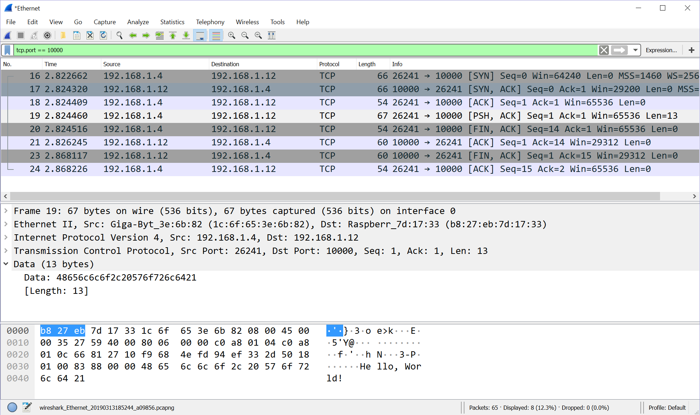
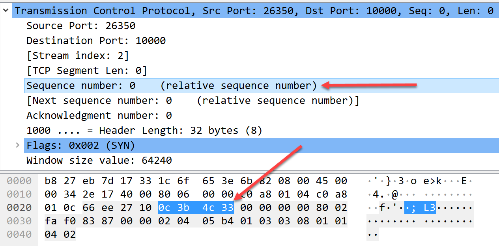
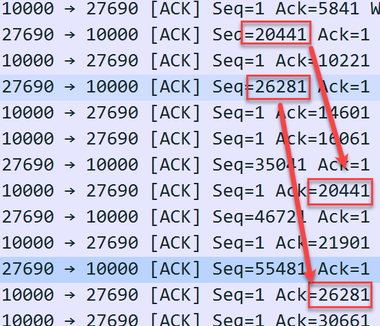
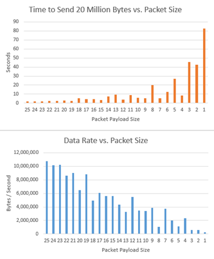
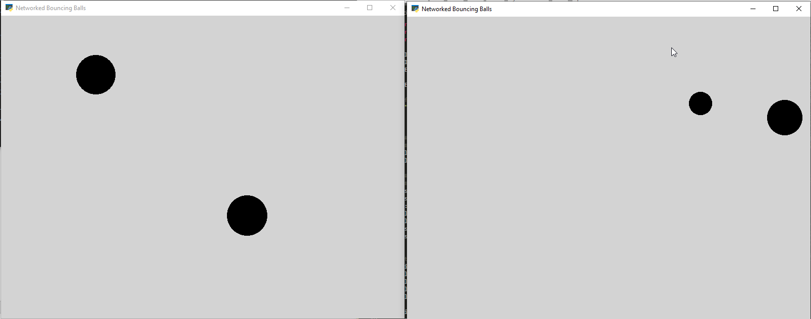

Projects: Transport Layer
*************************

A common first computer graphics program is to bounce a ball around the
screen. In this chapter, you'll take that classic program and have the
ball bounce from one computer to another by using the network! It is the
simple beginnings of a networked game. As we work our way to that goal,
you'll start by learning to make a TCP connection and send data using
Python. Then we'll learn multiple ways of receiving that data. After
that, you'll do the same thing, but using the Java programming language.
The first two tutorials work with single packets, but in the third
project, Multi-packet Messages, you start to work with sending and
receiving messages that must be broken apart due to their size. Finally
at the end of the chapter is one of my favorite projects: create an
animated bouncing ball that will use the network to pass the ball from
one computer to another.

Tutorial: Make and Capture a Simple TCP Connection
==================================================

In this project you get to learn the steps for making and monitoring
connections on a network:

* Write code to send a TCP message in Python
* Write code to receive a TCP message in Python
* Capture the exchange in Wireshark
* Examine the process packet-by-packet

This tutorial works best if you have two different computers hooked up
by a network. If only one computer is available, you can still have the
computer create a virtual connection to itself. However, if you are
using only one computer and running Windows, Wireshark will not be able
to capture the packets. Mac and Linux don't have this limitation.

Write Code to Send a TCP Message
--------------------------------

With the code in :numref:`tcp_send` you can send a message via TCP to another
computer. If you don't want to retype the code, you can download it from
GitHub.

When creating a network connection, we have both a server and a client.
The *server* is the computer that listens for a new network connection
request. The *client* is the computer that sends that request to the
listening server. In this example, :numref:`tcp_send` acts as the client, while
:numref:`tcp_receive_blocking` acts as the server.

In :numref:`tcp_send` (the *client* code) after the line of code that says
``server_ip_address =``, you need to update that with the IP address and
port of the computer that will be running the *server* code (line 4). Don't
enter the client IP address. (Although you can connect back to your own
computer using ``127.0.0.1`` and run both the server and client on the same
machine.)

The program stores our message to be sent in the ``my_message`` variable (line 9).
The computer assumes the message will arrive in the form of an array of
individual bytes. If you'll remember from :ref:`chapter_03` Python strings are
in Unicode format and support characters that might take multiple bytes.
You can pre-pend a string with "b" to force a one-byte-per-letter
string. If your program needs to convert regular text to a byte array,
you can use the built-in encode function and something called UTF-8
encoding:

.. code-block::

   my_byte_array = my_string.encode("utf-8")

Then to convert from a byte array back to a string:

.. code-block::

   my_string = my_byte_array.decode("utf-8")

The line that defines my_socket creates a variable that holds your
networking socket (line 13). It does not create the connection; it gets a
variable ready to manage it. The constants ``AF_INET`` and ``SOCK_STREAM`` come
from the original UNIX networking code written in C.

With (line 18) you set up the socket connection. A socket connection occurs
between two IP addresses and two ports. The client specifies the server
address and port. For example, you might connect from your client at
``192.168.1.100:51236`` to your destination server at ``192.168.1.101:10000``.
The client uses a random open port number for the connection (ephemeral
port, see :ref:`chapter_06`), but must specify the exact port number of the
server. The server must be listening on that same port or no connection
will be made. This call performs the TCP handshake discussed in
:ref:`chapter_08` to create the connection.

We use ``my_socket.sendall()`` to send the message (line 21). The statement
``my_socket.close()`` ends the connection (line 24). If you forget this step and
simply end your program, you leave connections open on the server side
as it waits for a response that will never come. This omission wastes
resources.

Use ``my_socket.sendall()`` instead of ``my_socket.send()``. The ``send`` command is
a lower-level command that does not guarantee the command will send all
of the data, forcing the program to check and attempt to re-send the
parts that were not sent.

.. _tcp_send:
.. literalinclude:: ../code_examples/tcp_send.py
   :language: python
   :linenos:
   :caption: tcp_send.py (client)

GitHub also has the program ``tcp_send_timings.py`` that is the same code,
with additional code to time each network step. Here's my computer
connecting to another on my same home network:

If you run both the client and the server on the same computer, the
connection happens crazy-fast and the computer will tell you everything
happens in zero time. Instead, run the client and server on different
computers so that you can see the time it takes to send the messages.

.. code-block:: text

   Setting up the connection took 0.064599 seconds
   Data sent in 0.000031 seconds
   Closed connection in 0.000039 seconds

Notice that setting up the connection takes a long time compared to
sending the data? If you plan to make multiple calls, it is a good idea
to keep the connection open. In fact, setting up the connection is so
slow, it limits you to about 10-20 calls per second if you do them
sequentially.

Write Code to Receive a TCP Message
-----------------------------------
Sending data doesn't do much good without a program to receive it. Let's
write code to do just that. This first code sample uses a **blocking**
call where the code will wait until it has a connection, and wait until
it receives data. The wait blocks the code from doing anything else,
like respond to the user or even decide to quit. While we don't normally
program this way, it is the easiest code understand and therefore the
best place to start.

First, the code specifies the size of our buffer to receive the data (line 5)
This will be the maximum number of bytes we will process at one time.
Since the max size of a TCP/IP packet is 64 kilobytes, we use
:math:`64 \cdot 1024 = 65,536` bytes for our buffer size.

Next, we specify the IP address and port the server will listen to (lines 13-14).
This should be the address of the server. Both :numref:`tcp_send` and
:numref:`tcp_receive_blocking` should use the *same* address, the IP of the server. The server
should use the *same* address, the IP of the server. The server
listens to that address, and the client connects to that address. The
most frequent mistake I've seen people make is to use the client address
for one of those programs. (If you are running both sending and
receiving code on the same computer, you can use ``127.0.0.1`` for
everything.)

This server code creates a socket just like the client code in :numref:`tcp_send`,
but instead of requesting a connection, we listen for a connection
by "binding" the socket to the address and port we are listening on ,
followed by the listen command. The listen command takes a parameter
indicating how many connections it will accept at once. We'll just
accept only one connection at a time in this example.

The code starts listening at  with the accept command. It will run no
further until a new connection comes in. Once we have a connection, we
will read in data with the recv command , figure out the address of who
sent the data , then convert from an array of bytes to a regular Python
string . Finally, we print the results and close the connection to the
client . This code assumes we'll get all the data in one packet. We'll
handle multiple packets in a later example. We stop listening for new
connections by closing the socket .

.. _tcp_receive_blocking:
.. literalinclude:: ../code_examples/tcp_receive_blocking.py
   :language: python
   :linenos:
   :caption: tcp_receive_blocking.py (server)

If you get the error "Requested address is not valid in its context" you
may be trying to listen on an IP address that isn't your own. The
receiving code should listen to its own address, which we learned how to
do at the beginning of :ref:`chapter_07`. The sending code will send to that
same server address. The sending code's address doesn't appear in either
program; the receiving IP appears in both programs. Just like mailing a
letter, you write the destination address on the envelope, not your own.

While :numref:`tcp_receive_blocking` isn't hard to understand, you don't typically program
by using blocking calls as the program will stay in a waiting state
until it receives something. In this situation, there is no way to
gracefully end the program. The program is "hanging" and you'll have to
force it to quit.

If you are familiar with using *threads* while programming, you might
think to put this code in a separate thread. This approach lets you
perform other tasks, but it isn't a good solution. You still can't tell
the threads to gracefully shut down and must force them to quit.

You need a better way.

Receive TCP Message, Non-Blocking
---------------------------------
Behold! A better way has arrived. To write code that doesn't hang
waiting for input, you set up a loop to constantly look for new data
from the network. You can use this loop to not only process incoming
network data, but also check for user input and do anything else you'd
like. The code is a bit more complex to write.

In :numref:`tcp_receive_nonblocking` we have updated code for the server. This code defines
how long to wait between checks for new data from the network (line 21). In this
case, we'll check every 0.1 seconds. If we don't include this delay, the
computer can check for new input thousands of times each second, wasting
CPU resources. Next, we have to keep track of the state that we are in
(lines 23-28). Specifically, are we connected to a client computer, or do we have no
connection? We start off with no connection.

To keep the code from blocking when we receive data, we need to set a
timeout (lines 33-34). By setting the timeout to zero, the code will immediately
continue if there is no data and not pause at all.

Once our variables are set up, we start the main event loop, looping
over and over to either receive a new connection or process data (line 54). If
no client is currently connected, we see if there is one waiting (lines 57-62). If
not, we wait and try again (lines 64-65). If a client is connected we try to receive
a packet of data . If there is data, we close the connection and wait
for the next connection, otherwise we pause and next loop through we'll
see if the data has arrived.

The astute reader will notice that with an infinite loop, the socket
close will not happen . This is a simple example without a user
interface. If you expand this example and use it with a program that has
an interface, make sure to close the socket properly when the program
ends.

.. _tcp_receive_nonblocking:
.. literalinclude:: ../code_examples/tcp_receive_nonblocking.py
   :language: python
   :linenos:
   :caption: tcp_receive_nonblocking.py (server)

To get these code samples working, put tcp_send.py and possibly
``tcp_send_timings.py`` on a computer you designate as your client. Then put
``tcp_receive_blocking.py`` and tcp_receive_nonblocking.py on the computer
designated to be the server. Update the IP addresses in the examples to
contain the server address. If you are using one computer for both the
server and the client, use ``127.0.0.1`` as the address.

Start the server program first, then start the client.

Capture the Packets
-------------------

After you have the code examples working, use Wireshark to examine
precisely what data goes across the network. (Remember, due to a
limitation with Windows, you can't capture packets using Windows if both
the client and server are the same computer.) You can filter the results
to see only the packets you care about by entering ``tcp.port == 10000`` for
the filter, and clicking the arrow at the far right, as shown in :numref:`send_trace`.
You should end up with about eight packets. In :numref:`send_trace` the
client computer was ``192.168.1.4`` and the server was ``192.168.1.12``.

.. _send_trace:

   Capturing a TCP message in Wireshark.

How does the theory we learned in Chapter 8 match up to the data we
captured? Opening a connection is a sequence of three packets, a SYN, a
SYN-ACK, and a ACK. You should be able to find those three in your
capture.

The data is sent in one packet. You can click on the packet and see the
data as shown at the bottom of :numref:`send_trace`. It should also be the only
packet that has a data length of more than zero. In the example, I sent
"Hello World!" which added up to 13 bytes. Because it isn't a full
buffer, the packet might be marked as being pushed, with a PSH.

After sending the data, both the client and the server will signal they
are ready for to close the connection with a FIN packet. Both those
packets must be acknowledged before the connection is considered closed.

Notice that Wireshark shows a *relative* sequence number as shown in
:numref:`sequence_number`. The random sequence number that TCP starts with (``0c 3b 4c 33``
in this example) is automatically subtracted out. This 32-bit sequence
number is the same sequence number we talked about in Chapter 8.

.. _sequence_number:

   Sequence Numbers in Wireshark are Relative

Keep experimenting to see if data is really buffered before it is sent;
for example, you can try multiple send commands in a row:

.. code-block::

   my_socket.sendall(b"1")
   my_socket.sendall(b"2")
   my_socket.sendall(b"3")

Does the receiving program get these all as one packet? Or three
different packets? Or two? As explained in Chapter 8, you should see two
packets. The first one has a 1, the next packet holds the 2 and 3.

Tutorial: Send Data via Java
============================
Not all code is written in Python, and we don't want to be limited to
only one language. This example shows how you can use the same concepts
we learned with Python and apply them to another language. There are
some differences though, and it is worth learning how languages can
handle things differently. In this case we'll look at Java. In this
tutorial we'll perform the same network operations using Java. The
procedure for sending code with Java is as straightforward as the one
you used in the first project in this chapter to send code with Python.

To get started, we need to install Java. If you are working on the
Raspberry Pi, you can install the Java language with:

.. code-block:: text

   sudo apt update
   sudo apt install default-jdk

Java code can be compiled with:

.. code-block:: text

   javac SendData.java

Once compiled, a file can be run with:

.. code-block:: text

   java SendData

The Java program in :numref:`send_data_java` specifies what server and port to
connect to (lines 9-10), just like the Python program in :numref:`tcp_send`. The program
specifies the message to be sent, but doesn't need to explicitly worry
about Unicode strings and byte arrays like Python does (line 11). Java sets up
the socket without requiring separate steps to create and bind (line 13) like
Python does. The line of code saved there is lost as we set up a
PrintWriter for output.

Next, we print the data which causes it to be sent (line 17). Note that we need
to specifically "flush" the print writer. If autoFlush is set to false,
Java will keep buffering data until the buffer is full (which might not
happen with short messages), or when we call the print writer's flush()
method. If autoFlush is set to true, we don't need to call flush, the
data will automatically get sent after each print even if the buffer
isn't full.

Just like in Python, we need to close the socket when done (line 20).

.. _send_data_java:
.. literalinclude:: ../code_examples/SendData.java
   :language: java
   :linenos:
   :caption: SendData.java

You can receive data using Java as well. The code in :numref:`receive_data_java` is
equivalent to the blocking version of the Python program in :numref:`tcp_receive_blocking`:

.. _receive_data_java:
.. literalinclude:: ../code_examples/ReceiveDataBlocking.java
   :language: java
   :linenos:
   :caption: ReceiveDataBlocking.java

If you run the Java code on a Mac, you might get an error related to
permissions. If so, get around the error by compiling the file on the
command-line and running it as a super-user:

.. code-block:: text

   javac ReceiveDataMultipleMessages.java
   sudo java ReceiveDataMultipleMessages

The data sent does not depend on the language. You can send from Java
and receive in Python or vice-versa. Give it a try.

Tutorial: Multi-Packet Messages
===============================
The prior tutorial assumed you were sending and receiving a message that
would fit in one packet. However, if you sent a message larger than one
packet in size, you'd receive only the first packet of data when you do
a ``connection.recv()``. Instead, you need to loop and keep receiving data
until the end of the message. This tutorial shows you how to do that.
Also, by working with multi-packet messages, you also get to see the
*sliding window* in action.

First, you need to adjust the code in the client program which sends
data, and instruct it to send *lots* of data. That's easy to do. See
:numref:`tcp_send_big_message`. We create a constant to specify how many bytes we want our
message to be. From there, you can use Python's string-multiplication
to quickly create an array filled with the letter X which we do in the
next line. Also in that line, you need some way to signify the end of
the message. Typically we do this with a special character that
signifies "end of message." In this case, you'll signify the end of a
message with a line feed \\n character. That's the only thing we need to
modify on our client program.

.. _tcp_send_big_message:
.. code-block:: python
   :caption: Code segment from tcp_send_big_message.py at https://github.com/pvcraven/networking_down_under

    message_size_in_bytes = 600000
    my_message = b"X" \* (message_size_in_bytes - 1) + b"\\n"

Now the server code receiving the message needs to be updated. Because
our data doesn't come all at once, Listing 9-7 creates a full_message 
variable that we will use to store the entire message. While it isn't
necessary, we are keeping track of how many different "chunks" we
receive the data in . We receive data just like before , keep a count
of each chunk of data received , and add it to the full message . We
then check the end of the message (in Python, you can use negative one
as a list index to get the last character) to see if that character is a
line feed (ASCII value 10, or \\n) . That's the signal that we are done
sending the message and there's no need to wait for more data.

.. _tcp_receive_big_message:
.. literalinclude:: ../code_examples/tcp_receive_big_message.py
   :language: python
   :linenos:
   :caption: tcp_receive_big_message.py (server)

Run this program and see if it works. This example works best if the
client and server are on different computers. If we run server and
client on the same computer, the computer does not have a need to break
the message into parts.

Use Wireshark to capture the packets. As before, there can be a lot of
unrelated packets that make it difficult to only see the data we are
interested in. Apply a filter to only look for packets at the port we
are interested in: tcp.port == 10000

In your packet capture, do you get one ACK packet per data packet or
does one ACK cover multiple data packets? In the example shown in Figure
9-3, there is an ACK for each data packet sent. Depending on the speed
of the network, the speed of the computer, and the delay you might get
different results. If there are errors, you might find multiple ACKs for
one data packet.

Notice the data in Figure 9-3 with sequence number 20441 being sent. The
acknowledgement isn't seen until six packets later. Try spotting the
same thing in your own packet captures. This is the sliding window we
learned about in Chapter 8 in action.

.. _overlap:

   Overlap in Sending Data and Acknowledgements

Note: Ethernet limits packets to about 1500 bytes. When you capture
packets with Wireshark, do you see packets larger than this? If you do,
a process called *TCP segment offloading* may be happening, where the
network card automatically recombines multiple Ethernet packets into one
TCP packet. This process saves time, but it can be confusing when doing
packet traces in Wireshark, because what you see isn't actually what hit
the wire. It is possible to turn this off, but that will slow down your
system.

Continue to look at the trace you captured in Wireshark for the process
of closing the connection. After the client sends the FIN to close the
connection, is everything done, or do you still have acknowledgements
that need to be processed? Depending on the speed of your computer and
network, you may or may not see several packets after the first FIN is
sent. Either is normal. See how the close connection process captured
under heavy traffic compares with when we just sent a few bytes.

Tutorial: Data Transmission Rates and Packet Sizes
==================================================
For this project, you'll find out how packet size affects transmission
rates and how keeping a connection open can speed up data transmission.

First, create a program that will send data in different sized chunks,
starting at one byte of data per packet, as shown in Listing 9-8. This
listing has a function that takes in the total number of bytes to send,
along with how large each message should be . From that, it calculates
how many messages to send and constructs a message of appropriate size
.

Our code then loops and attempts to send our message over and over .
When we are done with the message, we sent a \\n instead of an X to
signify to the receiver we are done .

Unfortunately for our test, the networking layer may choose to ignore
this and group multiple messages together anyway. In my experience, the
slower the computer, the greater the chance of this happening. By using
Wireshark, we can see how the messages were grouped.

.. _tcp_send_multiple_messages:
.. literalinclude:: ../code_examples/tcp_send_multiple_messages.py
   :language: python
   :linenos:
   :caption: tcp_send_multiple_messages.py (server)

Code to receive the data is shown in Listing 9-9. If the receiver finds
a \\n at the end of the message, the connection will be closed . (We
also check for a Y, which we'll use this in the next section, for
Listing 9-10.) Once we find the end of the message, and we print the
timings and reset the message buffer .

.. _tcp_receive_multiple_messages:
.. literalinclude:: ../code_examples/tcp_receive_multiple_messages.py
   :language: python
   :linenos:
   :caption: tcp_receive_multiple_messages.py (server)

Run the code through several different sizes by changing
message_size_in_bytes. You can adjust the total amount of data sent by
message_size_in_bytes. Notice that while you try to send data in
one-byte chunks, the computer doesn't always listen to you. For example,
on one of my runs I sent 50,000 bytes in 10-byte groupings. That should
have been 5,000 groups sent. But on one of my runs, the receiver got the
data in 2,318 groupings. Somewhere while sending or receiving, the data
got buffered and merged together.

Try graphing the timings using a spreadsheet, as I did in Figure 9-4.
This makes it obvious that I can get better data rates when I send
multiple bytes at a time.

If you run this program on a Raspberry Pi you will get different results
than you will from a fast laptop or desktop computer. The Raspberry Pi
doesn't run fast enough, and packets are more likely to get merged. The
graph from a Raspberry Pi will look flat compared to a graph created
with packets sent on desktop computers.

.. _speed_graph:

   Graphing speed vs packet size

Tutorial: Open/Teardown Transmission Rates
==========================================
For this project, you will run the data transmission program from
Listing 9-8, but adjust it to use a new connection for each "chunk" of
data. This lets you see the impact of opening and closing a connection.
The code for sending data via opening/closing the connection for each
chunk is the same as Listing 9-8, except for an updated send_data
function which is shown in Listing 9-10.

Both the sender and receiver need to know when to close the connection,
so this example code adds a Y to the end of the string of X's . Next,
we pull the code for creating  and closing  the connection into the
for loop. When the entire message is sent, we'll send a \\n to let the
receiver know .

Try just one data point, and see the difference in the time it takes to
send/receive the same amount of data. The difference can be huge. For
example ,on my machine, sending 5,000 bytes in 100 byte chunks, when I
open and close the connection each time it takes 8.03 seconds. If I
leave the connection open it takes 0.005 seconds.

Managing network connections is important. If you have a web application
that connects to the database, you can significantly speed up your
application by keeping a pool of database connections open.

.. _tcp_send_multiple_messages_open_close:
.. literalinclude:: ../code_examples/tcp_send_multiple_messages_open_close.py
   :language: python
   :linenos:
   :caption: tcp_send_multiple_messages_open_close.py (server)

Tutorial: Data Rates with Java
==============================
You can use what you learned in the earlier Project: Data Transmission
Rates and Packet Sizes, and create the same program in Java.

I covered code to send and receive data using Java in prior chapters;
and it is available in the SendData.java and ReceiveDataBlocking.java
files. (Non-blocking code in Java is much more complex than the Python
code we covered earlier. We'll stick with a blocking version.) There are
example files ``SendMultipleMessages.java`` and ``ReceiveMultipleMessages.java``
that are Java equivalents to the Python code. See:

https://github.com/pvcraven/networking_down_under

Look at the example and comments to understand how it works. The concept
is the same as the Python version. You might wonder, is one language
faster than the other? To create benchmark timings in Java, you can use
code like the following to create an elapsed time in Java:

.. code-block:: python

   long start = System.currentTimeMillis();
   // ...
   long finish = System.currentTimeMillis();
   long timeElapsed = finish - start;

Try doing a packet trace for sending and receiving in Java on different
computers. If you ask to send 250,000 two-byte packets, does Java also
queue up the data and send it in fewer packets? If you ask to "flush"
the buffer after every chunk of data, does that change the output? Does
it operate faster or slower when the effective packet sizes are the
same? The network should run the same no matter what language is used,
but there's no way to know for certain without trying. Practicing how to
do comparison benchmarks will be useful when the next new language,
framework, or networking technology comes along. Make your selection
process depend on science, not sales-talk.

Tutorial: Secure Copy
=====================
In the earlier days of the internet, files were copied from one computer
to another with the File Transfer Protocol (FTP). The modern way to do
this is with a protocol called Secure Copy (scp). Most operating systems
now have the scp command built in. This tutorial will show you how to
copy files from one computer to another via scp.

Secure copy works over SSH. For this to work, one of the computers needs
to be running an SSH server. This is easy on the Raspberry Pi, and we
covered it on Chapter 3 Remote Access. So you might already have it
running. If your SSH server is running on "computer A", then you can use
scp on "computer B" to copy files to and from "computer A."

The format of the command is this:

.. code-block:: text

   scp sounce_file destination_directory

The files can be local on your computer, or remote. The destination can
also include a file name if you want to rename the file as you are
copying it. If you want to copy a file to your current directory, you
can use a single period as a shortcut to mean "current directory." You
can also use a tilde (~) to specify the user's home directory.
Specifying local files works just like any other command-line command.

Specifying remote files or directories looks like this:

.. code-block:: text

   username@my_server.my_domain.example:/path/to/myfile.txt

First, specify your user name, followed by an @ character. Then specify
the server name, followed by a colon. Finally, specify the file. If you
don't enter a path, it will default to the home directory of the
specified user.

This example will try to copy my_file.txt from the local computer, to a
remote computer named with the user Sam's home directory:

.. code-block:: text

   scp my_file.txt sam@webserver.coffee-store.example:~

This command will download my_file.txt from Sam's home directory to the
current directory:

.. code-block:: text

   scp sam@webserver.coffee-store.example:my_file.txt .

After entering the command, the computer will connect to the server and
ask for the password. Like most command-line password entries, as you
type the password you will not see any characters or even round circles
to the screen as you type. It looks like the computer is ignoring you.
It is not, just type the password and hit <enter> when done.

If you want a list of files in a directory, there isn't a built-in
command with scp to do that. However you can use SSH to do so. This
command connects, runs the ls command to list all the files in the
user's home directory, and then disconnects:

.. code-block:: text

   ssh same@webserver.coffee-store.example ls -l ~

If you do not want to type all of this to transfer files, there are GUI
clients that allow the easy point, click, and drag functionality you are
used to. FileZilla is a very popular program used to handle file
transfer. You can also use MobaXTerm, as it allows not only file
transfer, but is also an excellent SSH client.

Tutorial: Python Bouncing Balls
===============================

One of my favorite projects while learning to program was to take a
classic bouncing ball animation and extend it across multiple computers.
Start with a circle that moves across the screen, bouncing when it hits
the edge. Then update the program so that when a ball that reaches the
right edge of the screen it does not bounce, but instead appears on the
screen of the computer to the right. If you have a row of computers, you
can pass the ball all the way down.

:numref:`bouncing_ball_image` shows running the program on the same computer, which is also
possible if you don't have multiple computers available.

.. _bouncing_ball_image:

   Creating a Networked Bouncing Ball Program

To network the program, instead of bouncing on one of the edges, we'll
open a network connection and pass the ball information to a different
computer. They'll pick up the ball and run with it. Get a jump-start on
this project with the template bouncing_balls_template.py from GitHub:

https://github.com/pvcraven/networking_down_under

In the comments, read the "to do" parts, and fill in the information
from the tcp_send.py and tcp_receive_nonblocking.py programs. Work to
get the program passing the balls across multiple screens. If you get
stuck, a working program is available in the same directory
``bouncing_balls.py``.

Tutorial: Threaded Bouncing Balls
=================================
One issue with the program is that there can be a slight pause when a
ball hits the edge of the screen. This is because the program needs to
stop and attempt to send the data over the network. One way around this
is to use **threads**. Threads allow computers to run multiple sets of
code at the same time. You can use a separate thread to receive data in
your bouncing ball program. Threads can make it easier to keep different
code functions separate, and you can avoid slowdowns when you are
waiting for the network.

Listing 9-11 shows the basics of creating threads in Python. Below is an
example of using threads in Python. We use the threading library  and
create our own child class of Thread . The main processing is done in a
method called run. In this case, we have a loop that just counts up
every quarter second. This can be replaced with networking code that
receives ball information.

To create the threads, we create an instance of our thread class and
call the start method. Note that we don't call the run method directly.
The threading class will open up a new thread and call run for us.

.. _thread_example:
.. literalinclude:: ../code_examples/thread_example.py
   :language: python
   :linenos:
   :caption: thread_example.py

See if you can move your networking code to a separate thread. If you
get stuck, you can look at the program bouncing_ball_threaded.py to see
an example of how to do it.

Tutorial: Java Bouncing Balls
=============================
We can also create the bouncing ball program in Java. In fact, you can
run a bouncing ball program in Python, and have it pass a bouncing ball
to our Java program. This is a great demonstration that the network
doesn't care what computer language you are using. A common protocol for
passing data allows implementations

To get started, see the example BouncingBall.java to show how to bounce
a ball in Java. Then look at the ReceiveOneShot.java example for code on
receiving data in Java in a non-blocking manner. Both can be found at
the GitHub site:

https://github.com/pvcraven/networking_down_under

See if you can adapt those examples to create a Java program that will
inter-operate with our Python program and bounce balls from one computer
to another by passing the data over the network.

